# 통합 CMS 상세 아키텍처 설계

## 📋 문서 정보

- **문서명**: 통합 CMS 상세 아키텍처 설계
- **버전**: 2.0.0
- **최종 수정일**: 2024-03-25
- **상태**: 최신

## 1. 프로젝트 개요

### 1.1 목적 및 목표

본 문서는 기존 단일 CMS 시스템을 **다중 서비스 통합 관리**가 가능한 고도화된 CMS 플랫폼으로 전환하기 위한 아키텍처 개요를 제공합니다.

#### 🎯 핵심 목표

- **통합 관리**: 여러 CMS 서비스를 하나의 관리자 화면에서 통합 관리
- **서비스 분리**: 각 서비스별 독립적인 데이터베이스와 보안 정책
- **유연한 배포**: 온프레미스 단일 서버 또는 클라우드 다중 서버 지원
- **확장성**: 새로운 서비스 추가 시 최소한의 수정으로 확장 가능

#### 📊 기대 효과

- **운영 효율성**: 관리 작업 시간 50% 감소, 장애 대응 시간 60% 단축
- **보안 강화**: 보안 사고 위험 70% 감소, 규정 준수율 100% 달성
- **사용자 경험**: 서비스 가용성 99.9% 달성, 응답 시간 40% 개선

### 1.2 배포 시나리오

#### 🏢 시나리오 A: 온프레미스 통합 배포

- **환경**: 단일 서버, 동일한 클라이언트 IP
- **용도**: 기업 내부 통합 관리, 소규모 서비스 운영
- **장점**: 관리 단순성, 네트워크 비용 절감

#### ☁️ 시나리오 B: 클라우드 분산 배포

- **환경**: 다중 서버, 서비스별 독립 IP
- **용도**: 대규모 서비스, 고가용성 요구사항
- **장점**: 확장성, 장애 격리, 성능 최적화

---

## 2. 시스템 아키텍처

### 2.1 전체 구성도

```mermaid
graph TB
    subgraph "클라이언트 계층"
        UI[통합 관리자 UI<br/>Next.js]
        C1[Service1 Client]
        C2[Service2 Client]
        CN[ServiceN Client]
    end

    subgraph "API Gateway & Proxy"
        NGINX[Nginx Reverse Proxy]
        GATEWAY[API Gateway<br/>Spring Cloud Gateway]
    end

    subgraph "백엔드 서비스"
        UNIFIED[통합 API 서버<br/>Spring Boot]
        SERVICE1[Service1 API]
        SERVICE2[Service2 API]
        SERVICEN[ServiceN API]
    end

    subgraph "데이터베이스 계층"
        MASTER_DB[(통합 메타 DB<br/>서비스 접근 정보)]
        DB1[(Service1 DB)]
        DB2[(Service2 DB)]
        DBN[(ServiceN DB)]
    end

    UI --> NGINX
    C1 --> NGINX
    C2 --> NGINX
    CN --> NGINX

    NGINX --> GATEWAY
    GATEWAY --> UNIFIED
    GATEWAY --> SERVICE1
    GATEWAY --> SERVICE2
    GATEWAY --> SERVICEN

    UNIFIED --> MASTER_DB
    UNIFIED --> DB1
    UNIFIED --> DB2
    UNIFIED --> DBN

    SERVICE1 --> DB1
    SERVICE2 --> DB2
    SERVICEN --> DBN
```



### 2.2 핵심 구성 요소

#### 🛡️ 통합 API 서버 (Unified API Server)

- **역할**: 서비스 라우팅, 인증/인가, 통합 관리 기능
- **기술**: Spring Boot + Spring Security + JPA
- **API 패턴**: `/api/unified/` + `/api/service{N}/`
- **특징**:
  - 동적 데이터소스 관리
  - JWT 기반 인증
  - RBAC + ABAC 하이브리드 권한 시스템

#### 🗄️ 통합 메타 데이터베이스

- **역할**: 서비스 정보, 세분화된 권한 관리, 관리자 계정 및 그룹 정보 저장
- **암호화**: 개별 DB 접근 정보는 AES-256으로 암호화 저장
- **권한 시스템**: RBAC + ABAC 하이브리드 모델로 사용자/그룹/역할/메뉴/기능별 세분화된 권한 관리

#### 🔒 서비스별 독립 데이터베이스

- **특징**: 각 서비스만 접근 가능한 독립적인 DB
- **보안**: 서비스별 전용 DB 계정 및 권한
- **격리**: 서비스 간 데이터 접근 완전 차단

---

## 3. 데이터베이스 설계

### 3.1 통합 메타 데이터베이스 (Master DB)

#### 3.1.1 서비스 관리 테이블

서비스 관리를 위한 테이블들은 다음과 같이 구성됩니다:

##### 3.1.1.1 기본 정보 테이블

- SERVICES: 서비스 기본 정보 관리

##### 3.1.1.2 관리자 계정 관련 테이블

- ADMIN_USERS: 관리자 계정 정보
- ADMIN_GROUPS: 관리자 그룹 정보
- ADMIN_GROUP_MEMBERS: 그룹 멤버십 관리

##### 3.1.1.3 권한 관리 테이블

- ROLES: 역할 정의
- PERMISSIONS: 권한 정의
- MENUS: 메뉴 구조 정의
- ADMIN_SERVICE_ROLES: 사용자/그룹별 서비스 역할 매핑
- ADMIN_MENU_PERMISSIONS: 사용자/그룹별 메뉴 권한 관리

> 📋 **데이터베이스 상세 설계**  
> 전체 테이블 스키마, DDL, 인덱스 설계, 초기 데이터 등 상세한 데이터베이스 설계 내용은 [**통합 CMS 데이터베이스 스키마 설계**](./unified-cms-database-schema.md) 문서를 참조하세요.

#### 3.1.2 통합 관리 테이블

통합 관리를 위한 테이블들은 다음과 같이 구성됩니다:

##### 3.1.2.1 통합 콘텐츠 관리 테이블

- UNIFIED_CONTENT_MANAGEMENT: 서비스별 콘텐츠 통합 관리
- UNIFIED_ACTIVITY_LOGS: 통합 시스템 활동 로그

### 3.2 개별 서비스 데이터베이스

각 서비스는 기존 CMS 구조를 유지하되, 통합 관리를 위한 메타데이터를 추가합니다.

#### 3.2.1 기존 테이블 확장

- 콘텐츠 동기화 상태 추적
- 통합 시스템과의 연동 정보 관리
- 서비스별 관리자 매핑 테이블

> 📋 **개별 서비스 DB 스키마**  
> 개별 서비스 데이터베이스의 확장 스키마와 관련 DDL은 [**통합 CMS 데이터베이스 스키마 설계**](./unified-cms-database-schema.md) 문서의 "4. 개별 서비스 데이터베이스 스키마" 섹션을 참조하세요.

---

## 4. API 설계

### 4.1 API 구조

#### 4.1.1 통합 관리 API (`/api/unified/`)

```yaml
# 인증 및 권한
POST   /api/unified/auth/login                  # 통합 관리자 로그인
POST   /api/unified/auth/logout                 # 로그아웃
POST   /api/unified/auth/refresh                # 토큰 갱신
GET    /api/unified/auth/me                     # 현재 사용자 정보 조회

# 서비스 관리
GET    /api/unified/services                    # 서비스 목록 조회
POST   /api/unified/services                    # 새 서비스 등록
GET    /api/unified/services/{serviceId}        # 서비스 상세 정보 조회
PUT    /api/unified/services/{serviceId}        # 서비스 정보 수정
DELETE /api/unified/services/{serviceId}        # 서비스 삭제
POST   /api/unified/services/{serviceId}/test   # 서비스 연결 테스트
GET    /api/unified/services/{serviceId}/health # 서비스 상태 확인
GET    /api/unified/services/{serviceId}/stats  # 서비스 통계 조회

# 통합 콘텐츠 관리
GET    /api/unified/content                     # 모든 서비스 콘텐츠 통합 조회
GET    /api/unified/content/{contentId}         # 콘텐츠 상세 조회
POST   /api/unified/content/sync                # 서비스별 콘텐츠 동기화
POST   /api/unified/content/bulk-action         # 일괄 작업 (삭제, 상태 변경 등)
GET    /api/unified/content/sync/status         # 동기화 상태 조회
GET    /api/unified/content/sync/history        # 동기화 이력 조회

# 통합 팝업 관리
GET    /api/unified/popups                      # 모든 서비스 팝업 통합 조회
GET    /api/unified/popups/{popupId}           # 팝업 상세 조회
POST   /api/unified/popups/bulk-action          # 팝업 일괄 관리
GET    /api/unified/popups/stats                # 팝업 통계 조회

# 관리자 계정 관리
GET    /api/unified/admins                      # 관리자 목록 조회
POST   /api/unified/admins                      # 관리자 생성
GET    /api/unified/admins/{adminId}           # 관리자 상세 정보 조회
PUT    /api/unified/admins/{adminId}           # 관리자 정보 수정
DELETE /api/unified/admins/{adminId}           # 관리자 삭제
PUT    /api/unified/admins/{adminId}/status    # 관리자 상태 변경
POST   /api/unified/admins/{adminId}/reset-password # 비밀번호 초기화

# 권한 관리
GET    /api/unified/permissions                 # 권한 목록 조회
POST   /api/unified/permissions                 # 권한 생성
PUT    /api/unified/permissions/{permissionId}  # 권한 수정
DELETE /api/unified/permissions/{permissionId}  # 권한 삭제
GET    /api/unified/roles                       # 역할 목록 조회
POST   /api/unified/roles                       # 역할 생성
PUT    /api/unified/roles/{roleId}             # 역할 수정
DELETE /api/unified/roles/{roleId}             # 역할 삭제

# 그룹 관리
GET    /api/unified/groups                      # 그룹 목록 조회
POST   /api/unified/groups                      # 그룹 생성
GET    /api/unified/groups/{groupId}           # 그룹 상세 정보 조회
PUT    /api/unified/groups/{groupId}           # 그룹 정보 수정
DELETE /api/unified/groups/{groupId}           # 그룹 삭제
POST   /api/unified/groups/{groupId}/members   # 그룹 멤버 추가
DELETE /api/unified/groups/{groupId}/members/{memberId} # 그룹 멤버 제거

# 활동 로그
GET    /api/unified/logs                        # 활동 로그 조회
GET    /api/unified/logs/export                 # 활동 로그 내보내기
GET    /api/unified/logs/stats                  # 활동 통계 조회

# 시스템 관리
GET    /api/unified/system/health               # 시스템 상태 확인
GET    /api/unified/system/stats                # 시스템 통계 조회
GET    /api/unified/system/settings             # 시스템 설정 조회
PUT    /api/unified/system/settings             # 시스템 설정 수정
```

#### 4.1.2 서비스별 API (`/api/service{N}/`)

각 서비스는 독립적인 인증/인가를 유지하되, 통합 관리를 위한 추가 기능을 제공합니다.

```yaml
# 서비스 인증
POST   /api/service{N}/auth/login               # 서비스별 로그인
POST   /api/service{N}/auth/logout              # 로그아웃
POST   /api/service{N}/auth/refresh             # 토큰 갱신
GET    /api/service{N}/auth/me                  # 현재 사용자 정보

# 게시판 관리
GET    /api/service{N}/board/articles           # 게시글 목록 조회
POST   /api/service{N}/board/articles           # 게시글 작성
GET    /api/service{N}/board/articles/{id}      # 게시글 상세 조회
PUT    /api/service{N}/board/articles/{id}      # 게시글 수정
DELETE /api/service{N}/board/articles/{id}      # 게시글 삭제
POST   /api/service{N}/board/articles/bulk      # 게시글 일괄 작업
GET    /api/service{N}/board/categories         # 게시판 카테고리 조회
GET    /api/service{N}/board/stats              # 게시판 통계 조회

# 콘텐츠 관리
GET    /api/service{N}/content                  # 콘텐츠 목록 조회
POST   /api/service{N}/content                  # 콘텐츠 생성
GET    /api/service{N}/content/{id}             # 콘텐츠 상세 조회
PUT    /api/service{N}/content/{id}             # 콘텐츠 수정
DELETE /api/service{N}/content/{id}             # 콘텐츠 삭제
POST   /api/service{N}/content/bulk             # 콘텐츠 일괄 작업
GET    /api/service{N}/content/templates        # 콘텐츠 템플릿 조회

# 팝업 관리
GET    /api/service{N}/popups                   # 팝업 목록 조회
POST   /api/service{N}/popups                   # 팝업 생성
GET    /api/service{N}/popups/{id}              # 팝업 상세 조회
PUT    /api/service{N}/popups/{id}              # 팝업 수정
DELETE /api/service{N}/popups/{id}              # 팝업 삭제
PUT    /api/service{N}/popups/{id}/status       # 팝업 상태 변경

# 메뉴 관리
GET    /api/service{N}/menus                    # 메뉴 목록 조회
POST   /api/service{N}/menus                    # 메뉴 생성
GET    /api/service{N}/menus/{id}               # 메뉴 상세 조회
PUT    /api/service{N}/menus/{id}               # 메뉴 수정
DELETE /api/service{N}/menus/{id}               # 메뉴 삭제
PUT    /api/service{N}/menus/order              # 메뉴 순서 변경

# 파일 관리
POST   /api/service{N}/files/upload             # 파일 업로드
GET    /api/service{N}/files/{id}               # 파일 조회
DELETE /api/service{N}/files/{id}               # 파일 삭제
GET    /api/service{N}/files/stats              # 파일 사용량 통계

# 통합 관리 연동
GET    /api/service{N}/sync/status              # 동기화 상태 조회
POST   /api/service{N}/sync/request             # 동기화 요청
GET    /api/service{N}/sync/history             # 동기화 이력 조회

# 서비스 관리
GET    /api/service{N}/settings                 # 서비스 설정 조회
PUT    /api/service{N}/settings                 # 서비스 설정 수정
GET    /api/service{N}/stats                    # 서비스 통계 조회
GET    /api/service{N}/health                   # 서비스 상태 확인
```

### 4.2 인증/인가 플로우

#### 4.2.1 통합 관리자 인증 플로우

```mermaid
sequenceDiagram
    participant Admin as 관리자
    participant UI as 통합 UI
    participant Gateway as API Gateway
    participant Auth as 인증 서비스
    participant Unified as 통합 API
    participant MasterDB as 통합 DB
    participant Cache as Redis Cache

    Admin->>UI: 로그인 요청
    UI->>Gateway: POST /api/unified/auth/login
    Gateway->>Auth: 인증 요청 전달
    Auth->>MasterDB: 관리자 계정 조회
    MasterDB-->>Auth: 계정 정보
    Auth->>Auth: 비밀번호 검증
    Auth->>MasterDB: 권한 및 설정 조회
    MasterDB-->>Auth: 권한 정보 + 설정
    Auth->>Auth: JWT 토큰 생성
    Auth->>Cache: 토큰 저장 (블랙리스트 관리용)
    Auth-->>Gateway: JWT Token + Refresh Token
    Gateway-->>UI: 토큰 + 사용자 정보 + 권한

    Note over Admin,UI: 토큰 갱신 시
    UI->>Gateway: POST /api/unified/auth/refresh
    Gateway->>Auth: Refresh Token 검증
    Auth->>Cache: 토큰 유효성 확인
    Cache-->>Auth: 토큰 상태
    Auth->>Auth: 새 토큰 생성
    Auth-->>Gateway: 새 JWT Token
    Gateway-->>UI: 새 토큰

    Note over Admin,UI: 로그아웃 시
    UI->>Gateway: POST /api/unified/auth/logout
    Gateway->>Auth: 로그아웃 요청
    Auth->>Cache: 토큰 블랙리스트 등록
    Auth-->>Gateway: 로그아웃 완료
    Gateway-->>UI: 응답
```



#### 4.2.2 서비스 접근 인가 플로우

```mermaid
sequenceDiagram
    participant Admin as 관리자
    participant UI as 통합 UI
    participant Gateway as API Gateway
    participant Auth as 인증 서비스
    participant Unified as 통합 API
    participant Service as 서비스 API
    participant MasterDB as 통합 DB
    participant ServiceDB as 서비스 DB
    participant Cache as Redis Cache

    Admin->>UI: Service1 데이터 요청
    UI->>Gateway: GET /api/service1/board with JWT
    Gateway->>Auth: 토큰 검증
    Auth->>Cache: 토큰 상태 확인
    Cache-->>Auth: 토큰 유효성
    Auth->>MasterDB: 권한 정보 조회
    MasterDB-->>Auth: 권한 정보
    Auth-->>Gateway: 권한 검증 결과

    alt 권한 있음
        Gateway->>Service: 요청 전달
        Service->>ServiceDB: 데이터 조회
        ServiceDB-->>Service: 원본 데이터
        Service->>Unified: 권한 기반 필터링 요청
        Unified->>MasterDB: 상세 권한 규칙 조회
        MasterDB-->>Unified: 권한 규칙
        Unified-->>Service: 필터링 규칙
        Service-->>Gateway: 필터링된 데이터
        Gateway-->>UI: 응답
    else 권한 없음
        Gateway-->>UI: 403 Forbidden
    end

    Note over Gateway,Service: 모든 요청 로깅
    Gateway->>Unified: 활동 로그 기록
    Unified->>MasterDB: 로그 저장
```



#### 4.2.3 권한 상속 및 우선순위

1. **권한 상속 구조**

   - 시스템 권한 > 서비스 권한 > 그룹 권한 > 사용자 권한
   - 상위 그룹의 권한은 하위 그룹에 상속
   - 명시적 거부(DENY)는 허용(ALLOW)보다 우선

2. **권한 평가 순서**

   - 사용자 직접 권한 확인
   - 사용자 소속 그룹 권한 확인
   - 상위 그룹 권한 상속 확인
   - 서비스 기본 권한 확인
   - 시스템 기본 권한 확인

3. **캐시 전략**
   - 사용자별 권한 캐시 (5분)
   - 그룹 권한 캐시 (10분)
   - 시스템 권한 캐시 (1시간)
   - 권한 변경 시 관련 캐시 즉시 무효화

````

---

## 5. 통합 프론트엔드 설계

### 5.1 기본 구조

```mermaid
graph TD
    A[통합 관리 UI] --> B[메인 페이지]
    A --> C[서비스 관리]
    A --> D[콘텐츠 관리]
    A --> E[관리자/권한]
    A --> F[시스템 관리]

    B --> B1[서비스 목록]
    B --> B2[서비스 상태]
    B --> B3[빠른 액세스]

    C --> C1[서비스 목록]
    C --> C2[서비스 설정]
    C --> C3[API 관리]
    C --> C4[배포 관리]

    D --> D1[통합 게시판]
    D --> D2[통합 팝업]
    D --> D3[메뉴 관리]
    D --> D4[파일 관리]
    D --> D5[동기화 관리]

    E --> E1[관리자 계정]
    E --> E2[그룹 관리]
    E --> E3[역할 관리]
    E --> E4[권한 정책]

    F --> F1[시스템 설정]
    F --> F2[활동 로그]
    F --> F3[백업/복구]
    F --> F4[보안 설정]
````

### 5.2 컴포넌트 구조

```typescript
// 통합 관리 페이지 구조
/src/app/
├── (auth)/                      // 인증 관련 페이지
│   ├── login/                   // 로그인
│   └── logout/                  // 로그아웃
│
├── main/                        // 메인 페이지
│   ├── page.tsx
│   └── components/
│       ├── ServiceOverview.tsx
│       ├── ServiceCard.tsx
│       └── QuickAccessPanel.tsx
│
├── services/                    // 서비스 관리
│   ├── [serviceId]/            // 서비스 상세
│   ├── settings/               // 서비스 설정
│   │   ├── page.tsx
│   │   └── components/
│   │       ├── ServiceRegistration.tsx
│   │       ├── DatabaseConnectionTest.tsx
│   │       └── ServiceHealthCheck.tsx
│   └── deployment/             // 배포 관리
│
├── content/                     // 콘텐츠 관리
│   ├── board/                  // 통합 게시판
│   │   ├── page.tsx
│   │   └── components/
│   │       ├── ContentUnifiedTable.tsx
│   │       ├── BulkActionPanel.tsx
│   │       └── ServiceFilter.tsx
│   ├── popup/                  // 통합 팝업
│   ├── menu/                   // 메뉴 관리
│   └── sync/                   // 동기화 관리
│
├── admin/                       // 관리자/권한
│   ├── users/                  // 관리자 계정
│   │   ├── page.tsx
│   │   └── components/
│   │       ├── AdminList.tsx
│   │       ├── PermissionMatrix.tsx
│   │       └── ServiceAccessControl.tsx
│   ├── groups/                 // 그룹 관리
│   ├── roles/                  // 역할 관리
│   └── permissions/            // 권한 정책
│
└── system/                      // 시스템 관리
    ├── settings/               // 시스템 설정
    ├── logs/                   // 활동 로그
    ├── backup/                 // 백업/복구
    └── security/               // 보안 설정
```

### 5.3 핵심 기능 컴포넌트

#### 5.3.1 메인 페이지

```typescript
// components/dashboard/UnifiedDashboard.tsx
interface UnifiedMetrics {
  totalServices: number;
  totalContents: number;
  activePopups: number;
  todayActiveUsers: number;
  systemHealth: "HEALTHY" | "WARNING" | "ERROR";
  serviceStatuses: ServiceStatus[];
  contentSyncStatus: {
    pending: number;
    syncing: number;
    error: number;
    completed: number;
  };
  recentActivities: Activity[];
}

interface ServiceStatus {
  id: number;
  name: string;
  status: "ACTIVE" | "INACTIVE" | "MAINTENANCE";
  health: "HEALTHY" | "WARNING" | "ERROR";
  lastChecked: string;
  metrics: {
    cpu: number;
    memory: number;
    disk: number;
    activeUsers: number;
  };
}

export function UnifiedDashboard() {
  const { data: metrics, isLoading } = useUnifiedMetrics();
  const { data: services } = useServices();
  const { data: activities } = useRecentActivities();

  if (isLoading) {
    return <DashboardSkeleton />;
  }

  return (
    <VStack spacing={6} align="stretch">
      {/* 상단 메트릭 카드 */}
      <Grid templateColumns="repeat(4, 1fr)" gap={6}>
        <MetricCard
          title="총 서비스"
          value={metrics.totalServices}
          icon={<ServerIcon />}
          trend={{
            value: 5,
            direction: "up",
            label: "전월 대비",
          }}
        />
        <MetricCard
          title="총 콘텐츠"
          value={metrics.totalContents}
          icon={<ContentIcon />}
          trend={{
            value: 12.5,
            direction: "up",
            label: "전월 대비",
          }}
        />
        <MetricCard
          title="활성 팝업"
          value={metrics.activePopups}
          icon={<PopupIcon />}
        />
        <MetricCard
          title="오늘 사용자"
          value={metrics.todayActiveUsers}
          icon={<UserIcon />}
          trend={{
            value: 8.3,
            direction: "up",
            label: "어제 대비",
          }}
        />
      </Grid>

      {/* 서비스 상태 패널 */}
      <Box p={6} bg="white" rounded="lg" shadow="sm">
        <HStack justify="space-between" mb={4}>
          <Heading size="md">서비스 상태</Heading>
          <Button
            size="sm"
            leftIcon={<RefreshIcon />}
            onClick={() => refetch()}
          >
            새로고침
          </Button>
        </HStack>
        <ServiceHealthPanel services={services} />
      </Box>

      {/* 차트 및 활동 로그 */}
      <Grid templateColumns="repeat(2, 1fr)" gap={6}>
        <GridItem>
          <Box p={6} bg="white" rounded="lg" shadow="sm">
            <Heading size="md" mb={4}>
              콘텐츠 동기화 현황
            </Heading>
            <ContentSyncChart data={metrics.contentSyncStatus} />
          </Box>
        </GridItem>

        <GridItem>
          <Box p={6} bg="white" rounded="lg" shadow="sm">
            <Heading size="md" mb={4}>
              최근 활동
            </Heading>
            <RecentActivityFeed activities={activities} />
          </Box>
        </GridItem>
      </Grid>

      {/* 알림 센터 */}
      <Box p={6} bg="white" rounded="lg" shadow="sm">
        <Heading size="md" mb={4}>
          시스템 알림
        </Heading>
        <AlertCenter />
      </Box>
    </VStack>
  );
}
```

#### 5.3.2 권한 관리 매트릭스

```typescript
// components/admin/PermissionMatrix.tsx
interface PermissionMatrixProps {
  adminId: number;
  services: Service[];
  roles: Role[];
  permissions: Permission[];
  currentPermissions: AdminPermission[];
  onPermissionChange: (changes: PermissionChange) => Promise<void>;
}

interface PermissionChange {
  adminId: number;
  serviceId: number;
  roleId: number;
  permissions: {
    module: string;
    actions: string[];
  }[];
}

export function PermissionMatrix({
  adminId,
  services,
  roles,
  permissions,
  currentPermissions,
  onPermissionChange,
}: PermissionMatrixProps) {
  const [selectedService, setSelectedService] = useState<number | null>(null);
  const [selectedRole, setSelectedRole] = useState<number | null>(null);
  const [changes, setChanges] = useState<PermissionChange[]>([]);
  const toast = useToast();

  // 권한 변경 처리
  const handlePermissionToggle = async (
    module: string,
    action: string,
    checked: boolean
  ) => {
    const newChanges = [...changes];
    const changeIndex = newChanges.findIndex(
      (c) => c.serviceId === selectedService && c.roleId === selectedRole
    );

    if (changeIndex === -1) {
      newChanges.push({
        adminId,
        serviceId: selectedService!,
        roleId: selectedRole!,
        permissions: [
          {
            module,
            actions: [action],
          },
        ],
      });
    } else {
      const moduleIndex = newChanges[changeIndex].permissions.findIndex(
        (p) => p.module === module
      );
      if (moduleIndex === -1) {
        newChanges[changeIndex].permissions.push({
          module,
          actions: [action],
        });
      } else {
        const actions =
          newChanges[changeIndex].permissions[moduleIndex].actions;
        if (checked) {
          actions.push(action);
        } else {
          const actionIndex = actions.indexOf(action);
          if (actionIndex !== -1) {
            actions.splice(actionIndex, 1);
          }
        }
      }
    }

    setChanges(newChanges);
  };

  // 권한 변경 저장
  const handleSave = async () => {
    try {
      await onPermissionChange(changes[0]);
      toast({
        title: "권한이 업데이트되었습니다.",
        status: "success",
      });
      setChanges([]);
    } catch (error) {
      toast({
        title: "권한 업데이트 실패",
        description: error.message,
        status: "error",
      });
    }
  };

  return (
    <VStack spacing={6} align="stretch">
      {/* 서비스 및 역할 선택 */}
      <HStack spacing={4}>
        <FormControl>
          <FormLabel>서비스</FormLabel>
          <Select
            value={selectedService || ""}
            onChange={(e) => setSelectedService(Number(e.target.value))}
          >
            <option value="">서비스 선택</option>
            {services.map((service) => (
              <option key={service.id} value={service.id}>
                {service.name}
              </option>
            ))}
          </Select>
        </FormControl>

        <FormControl>
          <FormLabel>역할</FormLabel>
          <Select
            value={selectedRole || ""}
            onChange={(e) => setSelectedRole(Number(e.target.value))}
            isDisabled={!selectedService}
          >
            <option value="">역할 선택</option>
            {roles.map((role) => (
              <option key={role.id} value={role.id}>
                {role.name}
              </option>
            ))}
          </Select>
        </FormControl>
      </HStack>

      {/* 권한 매트릭스 */}
      {selectedService && selectedRole && (
        <Box overflowX="auto">
          <Table>
            <Thead>
              <Tr>
                <Th>모듈</Th>
                <Th>조회</Th>
                <Th>생성</Th>
                <Th>수정</Th>
                <Th>삭제</Th>
                <Th>승인</Th>
              </Tr>
            </Thead>
            <Tbody>
              {permissions.map((permission) => (
                <Tr key={permission.module}>
                  <Td>{permission.moduleName}</Td>
                  {["read", "create", "update", "delete", "approve"].map(
                    (action) => (
                      <Td key={action}>
                        <Checkbox
                          isChecked={hasPermission(
                            currentPermissions,
                            permission.module,
                            action
                          )}
                          onChange={(e) =>
                            handlePermissionToggle(
                              permission.module,
                              action,
                              e.target.checked
                            )
                          }
                        />
                      </Td>
                    )
                  )}
                </Tr>
              ))}
            </Tbody>
          </Table>
        </Box>
      )}

      {/* 저장 버튼 */}
      {changes.length > 0 && (
        <Button colorScheme="blue" onClick={handleSave} isLoading={isSaving}>
          권한 변경 저장
        </Button>
      )}
    </VStack>
  );
}
```

### 5.4 기술 스택

1. **프레임워크 및 라이브러리**

   - Next.js 14 (App Router)
   - React 18 (Server Components)
   - TypeScript 5
   - Chakra UI (디자인 시스템)
   - TanStack Query (API 상태 관리)
   - Zustand (전역 상태 관리)
   - React Hook Form (폼 관리)
   - Zod (데이터 검증)

2. **데이터 시각화**

   - AG Grid Enterprise (데이터 그리드)
   - Chart.js (차트/그래프)
   - React Flow (다이어그램)
   - React Calendar (일정 관리)

3. **유틸리티**

   - date-fns (날짜 처리)
   - axios (HTTP 클라이언트)
   - lodash-es (유틸리티 함수)
   - i18next (다국어 지원)

4. **개발 도구**
   - ESLint (코드 품질)
   - Prettier (코드 포맷팅)
   - Jest (단위 테스트)
   - Cypress (E2E 테스트)
   - Storybook (컴포넌트 문서화)

### 5.5 상태 관리 전략

1. **전역 상태 (Zustand)**

   ```typescript
   // stores/auth.ts
   interface AuthState {
     user: User | null;
     permissions: Permission[];
     isAuthenticated: boolean;
     login: (credentials: Credentials) => Promise<void>;
     logout: () => Promise<void>;
     refreshToken: () => Promise<void>;
   }

   // stores/service.ts
   interface ServiceState {
     currentService: Service | null;
     services: Service[];
     setCurrentService: (service: Service) => void;
     updateService: (service: Service) => Promise<void>;
     syncService: (serviceId: number) => Promise<void>;
   }

   // stores/ui.ts
   interface UIState {
     sidebarOpen: boolean;
     theme: "light" | "dark";
     language: string;
     notifications: Notification[];
     toggleSidebar: () => void;
     setTheme: (theme: "light" | "dark") => void;
     addNotification: (notification: Notification) => void;
   }
   ```

2. **API 상태 (TanStack Query)**

   ```typescript
   // lib/query/config.ts
   const queryClient = new QueryClient({
     defaultOptions: {
       queries: {
         staleTime: 5 * 60 * 1000, // 5분
         cacheTime: 30 * 60 * 1000, // 30분
         retry: 3,
         refetchOnWindowFocus: false,
       },
       mutations: {
         retry: 2,
       },
     },
   });

   // hooks/queries/useServiceData.ts
   export const useServiceData = (serviceId: number) => {
     return useQuery({
       queryKey: ["service", serviceId],
       queryFn: () => fetchServiceDetails(serviceId),
       enabled: !!serviceId,
     });
   };

   // hooks/queries/useContentSync.ts
   export const useContentSync = (serviceId: number) => {
     const queryClient = useQueryClient();

     return useMutation({
       mutationFn: syncServiceContent,
       onSuccess: () => {
         queryClient.invalidateQueries({
           queryKey: ["content", serviceId],
         });
       },
     });
   };
   ```

3. **로컬 상태 (React Hook Form)**

   ```typescript
   // components/forms/ServiceForm.tsx
   const { register, handleSubmit, control, formState } = useForm<ServiceForm>({
     resolver: zodResolver(serviceSchema),
     defaultValues: {
       name: "",
       domain: "",
       status: "ACTIVE",
       settings: defaultSettings,
     },
   });

   // components/forms/AdminForm.tsx
   const methods = useFormContext<AdminFormData>();
   const { fields, append, remove } = useFieldArray({
     control: methods.control,
     name: "permissions",
   });
   ```

### 5.6 성능 최적화

1. **코드 분할**

   - 동적 임포트를 통한 지연 로딩

   ```typescript
   const DynamicChart = dynamic(
     () => import("@/components/charts/ServiceChart"),
     {
       loading: () => <ChartSkeleton />,
       ssr: false,
     }
   );
   ```

   - 라우트 기반 코드 분할

   ```typescript
   // app/services/[serviceId]/page.tsx
   import { Suspense } from "react";
   import { ServiceDetails } from "@/components/services/ServiceDetails";
   import { ServiceDetailsSkeleton } from "@/components/skeletons";

   export default function ServicePage({ params }) {
     return (
       <Suspense fallback={<ServiceDetailsSkeleton />}>
         <ServiceDetails serviceId={params.serviceId} />
       </Suspense>
     );
   }
   ```

   - 대형 컴포넌트의 모듈화

   ```typescript
   // components/dashboard/index.ts
   export * from "./MetricCard";
   export * from "./ServiceHealthPanel";
   export * from "./ContentSyncChart";
   export * from "./RecentActivityFeed";
   export * from "./AlertCenter";
   ```

2. **데이터 최적화**

   - 서버 컴포넌트를 통한 데이터 프리페칭

   ```typescript
   // app/services/page.tsx
   import { Suspense } from "react";
   import { ServiceList } from "@/components/services/ServiceList";
   import { getServices } from "@/lib/api/services";

   export default async function ServicesPage() {
     const services = await getServices();
     return (
       <Suspense>
         <ServiceList initialData={services} />
       </Suspense>
     );
   }
   ```

   - 스트리밍 및 Suspense 활용

   ```typescript
   // components/dashboard/DashboardContent.tsx
   export function DashboardContent() {
     return (
       <Grid templateColumns="repeat(4, 1fr)" gap={6}>
         <Suspense fallback={<MetricsSkeleton />}>
           <UnifiedMetrics />
         </Suspense>
         <Suspense fallback={<ServicesSkeleton />}>
           <ServiceHealthPanel />
         </Suspense>
         <Suspense fallback={<ChartSkeleton />}>
           <ContentSyncChart />
         </Suspense>
       </Grid>
     );
   }
   ```

   - 무한 스크롤 및 가상화 적용

   ```typescript
   // components/content/ContentList.tsx
   export function ContentList() {
     const { data, fetchNextPage, hasNextPage } = useInfiniteQuery({
       queryKey: ["contents"],
       queryFn: fetchContents,
       getNextPageParam: (lastPage) => lastPage.nextCursor,
     });

     return (
       <VirtualizedList
         height={800}
         itemCount={data?.pages.length * 20}
         itemSize={50}
         onItemsRendered={({ visibleStopIndex }) => {
           if (visibleStopIndex > data?.pages.length * 20 - 10) {
             fetchNextPage();
           }
         }}
       >
         {({ index, style }) => (
           <ContentListItem
             content={data?.pages[Math.floor(index / 20)].items[index % 20]}
             style={style}
           />
         )}
       </VirtualizedList>
     );
   }
   ```

3. **캐시 전략**

   - 브라우저 캐시 활용

   ```typescript
   // next.config.js
   module.exports = {
     async headers() {
       return [
         {
           source: "/api/services/:serviceId/stats",
           headers: [
             {
               key: "Cache-Control",
               value: "public, max-age=300, stale-while-revalidate=60",
             },
           ],
         },
       ];
     },
   };
   ```

   - API 응답 캐싱

   ```typescript
   // lib/api/cache.ts
   export const getServiceStats = async (serviceId: number) => {
     const cacheKey = `service-stats-${serviceId}`;
     const cachedData = await redis.get(cacheKey);

     if (cachedData) {
       return JSON.parse(cachedData);
     }

     const stats = await fetchServiceStats(serviceId);
     await redis.setex(cacheKey, 300, JSON.stringify(stats));

     return stats;
   };
   ```

   - 정적 자산 캐싱

   ```typescript
   // next.config.js
   module.exports = {
     images: {
       domains: ["assets.example.com"],
       minimumCacheTTL: 60,
     },
     staticPageGenerationTimeout: 120,
   };
   ```

4. **렌더링 최적화**

   - 메모이제이션 활용

   ```typescript
   // hooks/useFilteredContent.ts
   export function useFilteredContent(contents: Content[], filters: Filters) {
     return useMemo(() => {
       return contents.filter((content) => {
         return (
           (!filters.status || content.status === filters.status) &&
           (!filters.type || content.type === filters.type) &&
           (!filters.service || content.serviceId === filters.service)
         );
       });
     }, [contents, filters]);
   }
   ```

   - 컴포넌트 지연 로딩

   ```typescript
   // components/charts/index.ts
   export const ServiceChart = dynamic(() => import("./ServiceChart"), {
     loading: () => <ChartSkeleton />,
     ssr: false,
   });

   export const ContentChart = dynamic(() => import("./ContentChart"), {
     loading: () => <ChartSkeleton />,
     ssr: false,
   });
   ```

   - 불필요한 리렌더링 방지

   ```typescript
   // components/common/MetricCard.tsx
   export const MetricCard = memo(function MetricCard({
     title,
     value,
     trend,
     icon,
   }: MetricCardProps) {
     return (
       <Box p={4} bg="white" rounded="lg" shadow="sm">
         <HStack spacing={4}>
           {icon}
           <VStack align="start" spacing={1}>
             <Text fontSize="sm" color="gray.500">
               {title}
             </Text>
             <Text fontSize="2xl" fontWeight="bold">
               {value}
             </Text>
             {trend && (
               <TrendIndicator
                 value={trend.value}
                 direction={trend.direction}
                 label={trend.label}
               />
             )}
           </VStack>
         </HStack>
       </Box>
     );
   });
   ```

````

## 6. 배포 및 운영

### 6.1 배포 아키텍처

```mermaid
graph TD
    A[개발자] --> B[Git Repository]
    B --> C[CI/CD Pipeline]

    C --> D[빌드 단계]
    D --> D1[프론트엔드 빌드]
    D --> D2[백엔드 빌드]
    D --> D3[DB 마이그레이션]

    C --> E[테스트 단계]
    E --> E1[단위 테스트]
    E --> E2[통합 테스트]
    E --> E3[E2E 테스트]

    C --> F[배포 단계]
    F --> F1[스테이징 배포]
    F --> F2[프로덕션 배포]

    F1 --> G1[스테이징 환경]
    F2 --> G2[프로덕션 환경]

    G1 --> H1[스테이징 모니터링]
    G2 --> H2[프로덕션 모니터링]
````

### 6.2 배포 프로세스

1. **CI/CD 파이프라인**

   ```yaml
   # .github/workflows/deploy.yml
   name: Deploy Pipeline

   on:
     push:
       branches: [main, develop]
     pull_request:
       branches: [main, develop]

   jobs:
     build:
       runs-on: ubuntu-latest
       steps:
         - uses: actions/checkout@v3

         # 프론트엔드 빌드
         - name: Setup Node.js
           uses: actions/setup-node@v3
           with:
             node-version: "18"
             cache: "npm"
             cache-dependency-path: client/package-lock.json

         - name: Install Frontend Dependencies
           run: cd client && npm ci

         - name: Build Frontend
           run: cd client && npm run build

         # 백엔드 빌드
         - name: Setup Java
           uses: actions/setup-java@v3
           with:
             java-version: "17"
             distribution: "temurin"
             cache: "maven"

         - name: Build Backend
           run: cd server && mvn clean package

         # 테스트 실행
         - name: Run Tests
           run: |
             cd client && npm test
             cd ../server && mvn test

         # 도커 이미지 빌드
         - name: Build Docker Images
           run: |
             docker build -t unified-cms-frontend ./client
             docker build -t unified-cms-backend ./server

         # 이미지 푸시
         - name: Push Docker Images
           run: |
             docker push unified-cms-frontend
             docker push unified-cms-backend

     deploy-staging:
       needs: build
       if: github.ref == 'refs/heads/develop'
       runs-on: ubuntu-latest
       steps:
         - name: Deploy to Staging
           uses: some-deploy-action@v1
           with:
             environment: staging

     deploy-production:
       needs: [build, deploy-staging]
       if: github.ref == 'refs/heads/main'
       runs-on: ubuntu-latest
       steps:
         - name: Deploy to Production
           uses: some-deploy-action@v1
           with:
             environment: production
   ```

2. **환경별 설정 관리**

   ```yaml
   # config/staging.yml
   environment: staging
   domain: staging.unified-cms.com

   database:
     master:
       host: staging-db.unified-cms.com
       port: 3306
       name: unified_cms

   redis:
     host: staging-redis.unified-cms.com
     port: 6379

   logging:
     level: DEBUG
     path: /var/log/unified-cms

   monitoring:
     enabled: true
     endpoint: https://monitoring.unified-cms.com

   # config/production.yml
   environment: production
   domain: unified-cms.com

   database:
     master:
       host: prod-db.unified-cms.com
       port: 3306
       name: unified_cms

   redis:
     host: prod-redis.unified-cms.com
     port: 6379

   logging:
     level: INFO
     path: /var/log/unified-cms

   monitoring:
     enabled: true
     endpoint: https://monitoring.unified-cms.com
   ```

### 6.3 운영 모니터링

1. **시스템 모니터링**

   ```typescript
   // lib/monitoring/system.ts
   interface SystemMetrics {
     cpu: {
       usage: number;
       load: number[];
     };
     memory: {
       total: number;
       used: number;
       free: number;
     };
     disk: {
       total: number;
       used: number;
       free: number;
     };
     network: {
       incoming: number;
       outgoing: number;
     };
   }

   // 시스템 메트릭 수집
   export async function collectSystemMetrics(): Promise<SystemMetrics> {
     const metrics = await Promise.all([
       getCPUMetrics(),
       getMemoryMetrics(),
       getDiskMetrics(),
       getNetworkMetrics(),
     ]);

     return {
       cpu: metrics[0],
       memory: metrics[1],
       disk: metrics[2],
       network: metrics[3],
     };
   }
   ```

2. **애플리케이션 모니터링**

   ```typescript
   // lib/monitoring/application.ts
   interface AppMetrics {
     activeUsers: number;
     requestCount: number;
     errorCount: number;
     responseTime: number;
     activeServices: number;
     syncStatus: {
       pending: number;
       processing: number;
       completed: number;
       failed: number;
     };
   }

   // 애플리케이션 메트릭 수집
   export async function collectAppMetrics(): Promise<AppMetrics> {
     const metrics = await Promise.all([
       getUserMetrics(),
       getRequestMetrics(),
       getErrorMetrics(),
       getPerformanceMetrics(),
       getServiceMetrics(),
       getSyncMetrics(),
     ]);

     return {
       activeUsers: metrics[0],
       requestCount: metrics[1],
       errorCount: metrics[2],
       responseTime: metrics[3],
       activeServices: metrics[4],
       syncStatus: metrics[5],
     };
   }
   ```

3. **알림 설정**

   ```typescript
   // lib/monitoring/alerts.ts
   interface AlertRule {
     metric: string;
     condition: "gt" | "lt" | "eq";
     threshold: number;
     duration: number;
     severity: "info" | "warning" | "critical";
     channels: string[];
   }

   const alertRules: AlertRule[] = [
     {
       metric: "cpu.usage",
       condition: "gt",
       threshold: 80,
       duration: 300,
       severity: "warning",
       channels: ["slack", "email"],
     },
     {
       metric: "memory.used",
       condition: "gt",
       threshold: 90,
       duration: 300,
       severity: "critical",
       channels: ["slack", "email", "sms"],
     },
     {
       metric: "error.rate",
       condition: "gt",
       threshold: 5,
       duration: 60,
       severity: "critical",
       channels: ["slack", "email"],
     },
     {
       metric: "sync.failed",
       condition: "gt",
       threshold: 10,
       duration: 900,
       severity: "warning",
       channels: ["slack"],
     },
   ];
   ```

### 6.4 장애 대응

1. **장애 감지 및 복구**

   ```typescript
   // lib/monitoring/recovery.ts
   interface FailoverConfig {
     service: string;
     healthCheck: {
       endpoint: string;
       interval: number;
       timeout: number;
       failureThreshold: number;
     };
     recovery: {
       strategy: "restart" | "failover" | "manual";
       timeout: number;
       maxAttempts: number;
     };
   }

   // 서비스 장애 감지 및 복구
   export class ServiceFailoverManager {
     private configs: Map<string, FailoverConfig> = new Map();

     async monitorService(config: FailoverConfig) {
       let failures = 0;

       while (true) {
         try {
           const health = await this.checkServiceHealth(config);

           if (!health.isHealthy) {
             failures++;

             if (failures >= config.healthCheck.failureThreshold) {
               await this.handleServiceFailure(config);
               failures = 0;
             }
           } else {
             failures = 0;
           }
         } catch (error) {
           console.error(`Error monitoring service ${config.service}:`, error);
         }

         await sleep(config.healthCheck.interval);
       }
     }

     private async handleServiceFailure(config: FailoverConfig) {
       const { recovery } = config;

       switch (recovery.strategy) {
         case "restart":
           await this.restartService(config.service);
           break;

         case "failover":
           await this.failoverToStandby(config.service);
           break;

         case "manual":
           await this.notifyOperators(config.service);
           break;
       }
     }
   }
   ```

2. **백업 및 복구**

   ```typescript
   // lib/backup/manager.ts
   interface BackupConfig {
     type: "full" | "incremental";
     target: "database" | "files" | "all";
     schedule: string;
     retention: {
       count: number;
       days: number;
     };
     storage: {
       type: "s3" | "gcs" | "local";
       path: string;
     };
   }

   // 백업 관리자
   export class BackupManager {
     async createBackup(config: BackupConfig) {
       const backupId = generateBackupId();

       try {
         // 백업 시작 로깅
         await this.logBackupStart(backupId, config);

         // 백업 수행
         if (config.target === "database" || config.target === "all") {
           await this.backupDatabase(backupId, config);
         }

         if (config.target === "files" || config.target === "all") {
           await this.backupFiles(backupId, config);
         }

         // 백업 메타데이터 저장
         await this.saveBackupMetadata(backupId, config);

         // 오래된 백업 정리
         await this.cleanupOldBackups(config);

         return {
           backupId,
           status: "success",
           timestamp: new Date(),
         };
       } catch (error) {
         // 실패 처리
         await this.handleBackupFailure(backupId, error);
         throw error;
       }
     }

     async restoreBackup(backupId: string) {
       const metadata = await this.getBackupMetadata(backupId);

       try {
         // 복구 시작 로깅
         await this.logRestoreStart(backupId);

         // 데이터베이스 복구
         if (metadata.target === "database" || metadata.target === "all") {
           await this.restoreDatabase(backupId);
         }

         // 파일 복구
         if (metadata.target === "files" || metadata.target === "all") {
           await this.restoreFiles(backupId);
         }

         return {
           status: "success",
           timestamp: new Date(),
         };
       } catch (error) {
         // 실패 처리
         await this.handleRestoreFailure(backupId, error);
         throw error;
       }
     }
   }
   ```

### 6.5 보안 설정

1. **네트워크 보안**

   ```typescript
   // config/security/network.ts
   export const networkSecurityConfig = {
     // CORS 설정
     cors: {
       origin: ["https://unified-cms.com"],
       methods: ["GET", "POST", "PUT", "DELETE"],
       allowedHeaders: ["Content-Type", "Authorization"],
       credentials: true,
     },

     // 레이트 리미팅
     rateLimit: {
       windowMs: 15 * 60 * 1000, // 15분
       max: 100, // IP당 최대 요청 수
       message: "너무 많은 요청이 발생했습니다. 잠시 후 다시 시도해주세요.",
     },

     // HTTPS 설정
     https: {
       enabled: true,
       hsts: {
         maxAge: 31536000,
         includeSubDomains: true,
         preload: true,
       },
     },

     // 프록시 설정
     proxy: {
       trusted: ["127.0.0.1", "10.0.0.0/8"],
     },
   };
   ```

2. **보안 헤더**

   ```typescript
   // middleware/security.ts
   export const securityHeaders = {
     "Content-Security-Policy": `
       default-src 'self';
       script-src 'self' 'unsafe-inline' 'unsafe-eval';
       style-src 'self' 'unsafe-inline';
       img-src 'self' data: https:;
       font-src 'self' data:;
       connect-src 'self' https://api.unified-cms.com;
     `,
     "X-Content-Type-Options": "nosniff",
     "X-Frame-Options": "DENY",
     "X-XSS-Protection": "1; mode=block",
     "Referrer-Policy": "strict-origin-when-cross-origin",
     "Permissions-Policy": "camera=(), microphone=(), geolocation=()",
   };
   ```

3. **데이터 암호화**

   ```typescript
   // lib/security/encryption.ts
   interface EncryptionConfig {
     algorithm: "aes-256-gcm";
     keySize: 32;
     ivSize: 12;
     tagSize: 16;
   }

   export class DataEncryption {
     private readonly config: EncryptionConfig = {
       algorithm: "aes-256-gcm",
       keySize: 32,
       ivSize: 12,
       tagSize: 16,
     };

     // 데이터 암호화
     async encrypt(data: string, key: Buffer): Promise<string> {
       const iv = crypto.randomBytes(this.config.ivSize);
       const cipher = crypto.createCipheriv(this.config.algorithm, key, iv, {
         authTagLength: this.config.tagSize,
       });

       const encrypted = Buffer.concat([
         cipher.update(data, "utf8"),
         cipher.final(),
       ]);

       const tag = cipher.getAuthTag();

       return Buffer.concat([iv, tag, encrypted]).toString("base64");
     }

     // 데이터 복호화
     async decrypt(encryptedData: string, key: Buffer): Promise<string> {
       const data = Buffer.from(encryptedData, "base64");

       const iv = data.slice(0, this.config.ivSize);
       const tag = data.slice(
         this.config.ivSize,
         this.config.ivSize + this.config.tagSize
       );
       const encrypted = data.slice(this.config.ivSize + this.config.tagSize);

       const decipher = crypto.createDecipheriv(
         this.config.algorithm,
         key,
         iv,
         { authTagLength: this.config.tagSize }
       );

       decipher.setAuthTag(tag);

       return Buffer.concat([
         decipher.update(encrypted),
         decipher.final(),
       ]).toString("utf8");
     }
   }
   ```

## 7. 결론 및 향후 계획

### 7.1 주요 개선사항

1. **통합 관리 기능**

   - 다중 CMS 서비스의 중앙 집중식 관리
   - 통합 대시보드를 통한 실시간 모니터링
   - 서비스 간 콘텐츠 동기화

2. **보안 강화**

   - RBAC + ABAC 하이브리드 권한 모델
   - 데이터 암호화 및 보안 강화
   - 감사 로그 및 활동 추적

3. **운영 효율성**
   - 자동화된 배포 프로세스
   - 장애 감지 및 자동 복구
   - 백업 및 복구 체계

### 7.2 향후 계획

1. **1단계 (3개월)**

   - 기본 통합 관리 기능 구현
   - 핵심 보안 기능 구현
   - 초기 서비스 연동

2. **2단계 (6개월)**

   - 고급 모니터링 기능 추가
   - 자동화된 장애 복구 구현
   - 추가 서비스 연동

3. **3단계 (12개월)**
   - AI 기반 이상 감지
   - 고급 분석 및 리포팅
   - 서비스 확장 및 최적화

### 7.3 기대효과

1. **운영 효율성**

   - 관리 작업 시간 50% 감소
   - 장애 대응 시간 60% 단축
   - 리소스 활용률 30% 개선

2. **보안 강화**

   - 보안 사고 위험 70% 감소
   - 규정 준수율 100% 달성
   - 데이터 유출 위험 최소화

3. **사용자 경험**
   - 서비스 가용성 99.9% 달성
   - 응답 시간 40% 개선
   - 사용자 만족도 향상

---

## 부록

### A. 문서 이력

| 버전  | 날짜       | 작성자     | 변경 내용                  |
| ----- | ---------- | ---------- | -------------------------- |
| 1.0.0 | 2024-03-01 | 아키텍처팀 | 초기 버전 작성             |
| 1.1.0 | 2024-03-15 | 아키텍처팀 | 데이터베이스 설계 상세화   |
| 1.2.0 | 2024-03-20 | 아키텍처팀 | API 설계 및 보안 정책 추가 |

### B. 용어 정리

| 용어        | 설명                                                           |
| ----------- | -------------------------------------------------------------- |
| RBAC        | Role-Based Access Control, 역할 기반 접근 제어                 |
| ABAC        | Attribute-Based Access Control, 속성 기반 접근 제어            |
| CMS         | Content Management System, 콘텐츠 관리 시스템                  |
| API Gateway | 다중 서비스의 API를 통합 관리하는 중앙 게이트웨이              |
| CI/CD       | Continuous Integration/Continuous Deployment, 지속적 통합/배포 |

### C. 참고 문서

1. [전자정부 표준프레임워크 가이드](https://www.egovframe.go.kr/guide/guide.jsp)
2. [Spring Cloud Gateway 문서](https://spring.io/projects/spring-cloud-gateway)
3. [Next.js 공식 문서](https://nextjs.org/docs)
4. [OWASP 보안 가이드라인](https://owasp.org/www-project-web-security-testing-guide/)

````

### 6.1 다중 레벨 보안

#### 6.1.1 네트워크 레벨

```nginx
# Nginx 설정 - IP 기반 접근 제어
server {
    listen 443 ssl;
    server_name unified-cms.domain.com;

    # 관리자 IP만 허용
    allow 192.168.1.0/24;
    allow 10.0.0.0/8;
    deny all;

    location /api/unified/ {
        proxy_pass http://unified-api:8080;
        proxy_set_header X-Real-IP $remote_addr;
        proxy_set_header X-Forwarded-For $proxy_add_x_forwarded_for;
    }

    location /api/service1/ {
        auth_request /auth-service1;
        proxy_pass http://service1-api:8081;
    }
}
````

#### 6.1.2 애플리케이션 레벨

```java
// 통합 보안 설정
@Configuration
@EnableWebSecurity
public class UnifiedSecurityConfig {

    @Bean
    public SecurityFilterChain unifiedFilterChain(HttpSecurity http) throws Exception {
        return http
            .securityMatcher("/api/unified/**")
            .authorizeHttpRequests(auth -> auth
                .requestMatchers("/api/unified/auth/**").permitAll()
                .requestMatchers("/api/unified/admin/**").hasRole("SUPER_ADMIN")
                .requestMatchers("/api/unified/**").hasAnyRole("SUPER_ADMIN", "SERVICE_ADMIN")
                .anyRequest().authenticated()
            )
            .oauth2ResourceServer(oauth2 -> oauth2.jwt(withDefaults()))
            .build();
    }
}

// 서비스별 보안 설정
@Component
public class ServiceSecurityManager {

    public boolean hasServicePermission(String adminId, String serviceCode, String module, String action) {
        // 통합 DB에서 권한 조회
        AdminServicePermission permission = permissionRepository
            .findByAdminIdAndServiceCode(adminId, serviceCode);

        if (permission == null) return false;

        Map<String, List<String>> permissions = permission.getPermissions();
        List<String> modulePermissions = permissions.get(module);

        return modulePermissions != null && modulePermissions.contains(action);
    }
}
```

### 6.2 데이터베이스 접근 제어

#### 6.2.1 암호화된 연결 정보 관리

```java
@Service
public class DatabaseConnectionService {

    @Autowired
    private EncryptionService encryptionService;

    public DataSource getServiceDataSource(String serviceCode) {
        Service service = serviceRepository.findByServiceCode(serviceCode);

        // 암호화된 연결 정보 복호화
        String decryptedConnectionInfo = encryptionService.decrypt(service.getDbConnectionInfo());
        DatabaseConnectionInfo dbInfo = JsonUtils.fromJson(decryptedConnectionInfo, DatabaseConnectionInfo.class);

        // 동적 DataSource 생성
        HikariConfig config = new HikariConfig();
        config.setJdbcUrl(dbInfo.getJdbcUrl());
        config.setUsername(dbInfo.getUsername());
        config.setPassword(dbInfo.getPassword());
        config.setMaximumPoolSize(5); // 서비스별 제한

        return new HikariDataSource(config);
    }
}
```

#### 6.2.2 계정별 권한 분리

```sql
-- 서비스별 데이터베이스 계정 생성
CREATE USER 'service1_readonly'@'%' IDENTIFIED BY 'secure_password1';
CREATE USER 'service1_admin'@'%' IDENTIFIED BY 'secure_password2';

-- 읽기 전용 권한
GRANT SELECT ON service1_db.* TO 'service1_readonly'@'%';

-- 관리자 권한 (CRUD)
GRANT SELECT, INSERT, UPDATE, DELETE ON service1_db.* TO 'service1_admin'@'%';

-- 서비스 간 접근 차단
REVOKE ALL ON service2_db.* FROM 'service1_readonly'@'%';
REVOKE ALL ON service2_db.* FROM 'service1_admin'@'%';
```

---

## 7. 구현 로드맵

### 7.1 Phase 1: 기반 구조 구축 (4주)

1. **통합 메타 데이터베이스 설계 및 구축**

   - 서비스 등록 테이블
   - 관리자 권한 관리 테이블
   - 암호화 시스템 구현

2. **API Gateway 구현**

   - Spring Cloud Gateway 설정
   - 라우팅 규칙 정의
   - 인증/인가 필터 구현

3. **기본 통합 API 구현**
   - 서비스 등록/관리 API
   - 관리자 인증/권한 API
   - 헬스체크 API

### 7.2 Phase 2: 통합 관리 기능 구현 (6주)

1. **통합 프론트엔드 구현**

   - 통합 대시보드
   - 서비스 관리 화면
   - 관리자 권한 관리 화면

2. **통합 컨텐츠 관리**

   - 게시글 일괄 관리
   - 팝업 통합 관리
   - 메뉴 통합 관리

3. **권한 관리 시스템**
   - 세분화된 권한 제어
   - 권한 매트릭스 UI
   - 활동 로그 시스템

### 7.3 Phase 3: 고급 기능 및 최적화 (4주)

1. **성능 최적화**

   - 데이터베이스 연결 풀 최적화
   - 캐싱 시스템 도입 (Redis)
   - 비동기 처리 개선

2. **모니터링 및 알림**

   - 서비스 헬스체크 자동화
   - 장애 감지 및 알림
   - 성능 메트릭 수집

3. **보안 강화**
   - 2FA 인증 도입
   - 감사 로그 강화
   - 침입 탐지 시스템

---

## 8. 기존 코드 마이그레이션 가이드

### 8.1 백엔드 마이그레이션

#### 8.1.1 기존 Controller 수정

```java
// 기존 코드
@RestController
@RequestMapping("/cms/content")
public class ContentController {
    // ...
}

// 수정된 코드
@RestController
@RequestMapping("/api/{serviceCode}/content")
public class ServiceContentController {

    @Autowired
    private ServiceSecurityManager securityManager;

    @Autowired
    private DynamicDataSourceService dataSourceService;

    @GetMapping
    public ResponseEntity<Page<ContentDto>> getContents(
            @PathVariable String serviceCode,
            Pageable pageable,
            Authentication auth) {

        // 권한 체크
        if (!securityManager.hasServicePermission(auth.getName(), serviceCode, "content", "read")) {
            throw new AccessDeniedException("No permission for this service");
        }

        // 동적 데이터소스 설정
        try (DataSourceContext context = dataSourceService.setDataSource(serviceCode)) {
            Page<ContentDto> contents = contentService.getContents(pageable);
            return ResponseEntity.ok(contents);
        }
    }
}
```

#### 8.1.2 동적 데이터소스 구현

```java
@Component
public class DynamicDataSourceService {

    private final Map<String, DataSource> dataSourceCache = new ConcurrentHashMap<>();

    public DataSourceContext setDataSource(String serviceCode) {
        DataSource dataSource = getOrCreateDataSource(serviceCode);
        DataSourceContextHolder.setDataSource(dataSource);
        return new DataSourceContext();
    }

    private DataSource getOrCreateDataSource(String serviceCode) {
        return dataSourceCache.computeIfAbsent(serviceCode, this::createDataSource);
    }

    // DataSourceContext - try-with-resources 지원
    public static class DataSourceContext implements AutoCloseable {
        @Override
        public void close() {
            DataSourceContextHolder.clearDataSource();
        }
    }
}
```

### 8.2 프론트엔드 마이그레이션

#### 8.2.1 API 클라이언트 수정

```typescript
// 기존 API 클라이언트
const contentApi = {
  getContents: () => axios.get("/cms/content"),
  createContent: (data) => axios.post("/cms/content", data),
};

// 수정된 API 클라이언트
const createServiceApi = (serviceCode: string) => ({
  content: {
    getContents: () => axios.get(`/api/${serviceCode}/content`),
    createContent: (data) => axios.post(`/api/${serviceCode}/content`, data),
  },
  board: {
    getArticles: () => axios.get(`/api/${serviceCode}/board/articles`),
    createArticle: (data) =>
      axios.post(`/api/${serviceCode}/board/articles`, data),
  },
});

// 서비스별 API 인스턴스 생성
export const service1Api = createServiceApi("service1");
export const service2Api = createServiceApi("service2");

// 통합 API
export const unifiedApi = {
  services: {
    getAll: () => axios.get("/api/unified/services"),
    create: (data) => axios.post("/api/unified/services", data),
  },
  content: {
    getUnified: () => axios.get("/api/unified/content"),
    bulkAction: (action, ids) =>
      axios.post("/api/unified/content/bulk-action", { action, ids }),
  },
};
```

#### 8.2.2 권한 기반 UI 렌더링

```typescript
// 권한 기반 컴포넌트
interface ServicePermissionProps {
  serviceCode: string;
  module: string;
  action: string;
  children: React.ReactNode;
}

export function ServicePermission({
  serviceCode,
  module,
  action,
  children,
}: ServicePermissionProps) {
  const { permissions } = useAuth();

  const hasPermission = permissions
    ?.find((p) => p.serviceCode === serviceCode)
    ?.modules[module]?.includes(action);

  if (!hasPermission) return null;

  return <>{children}</>;
}

// 사용 예시
<ServicePermission serviceCode="service1" module="content" action="write">
  <Button onClick={handleCreateContent}>새 컨텐츠 작성</Button>
</ServicePermission>;
```

---

## 9. 결론

이 통합 CMS 고도화 아키텍처는 다음과 같은 핵심 가치를 제공합니다:

1. **확장성**: 새로운 서비스 추가 시 최소한의 수정
2. **보안성**: 다중 레벨 보안 및 서비스별 격리
3. **유연성**: 온프레미스/클라우드 다양한 배포 환경 지원
4. **관리효율성**: 통합 관리 화면을 통한 운영 효율 극대화
5. **기존 호환성**: 기존 CMS 기능의 점진적 마이그레이션 지원

이 설계를 통해 기존 CMS의 장점을 유지하면서도, 다중 서비스 환경에서의 통합 관리가 가능한 차세대 CMS 플랫폼을 구축할 수 있습니다.
