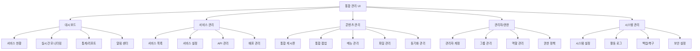

# 통합 CMS 프론트엔드 명세서

## 📋 문서 정보

- **문서명**: 통합 CMS 프론트엔드 명세서
- **버전**: 2.0.0
- **최종 수정일**: 2024-03-25
- **상태**: 최신

---

## 1. 프론트엔드 아키텍처 개요

### 1.1 설계 원칙

#### 🎯 핵심 철학

- **사용자 중심**: 직관적이고 효율적인 관리자 인터페이스
- **성능 우선**: 빠른 로딩과 반응성 있는 UX
- **확장성**: 새로운 서비스와 기능의 쉬운 추가
- **접근성**: 웹 접근성 지침(WCAG 2.1) 준수

#### 🏗️ 아키텍처 패턴

- **Server-Side Rendering (SSR)**: Next.js App Router 활용
- **Component-Driven Development**: 재사용 가능한 컴포넌트 설계
- **Atomic Design**: 체계적인 컴포넌트 계층 구조
- **Progressive Enhancement**: 점진적 기능 향상

### 1.2 기술 스택

#### 🛠️ 핵심 기술

**Frontend Framework**

- **Next.js 14** (App Router) - 서버 컴포넌트와 스트리밍 지원
- **React 18** - Concurrent Features 활용
- **TypeScript 5** - 타입 안전성과 개발 생산성

**UI/UX Library**

- **Chakra UI** - 접근성과 테마 지원이 우수한 컴포넌트 라이브러리
- **Framer Motion** - 부드러운 애니메이션과 트랜지션
- **React Icons** - 일관된 아이콘 시스템

**State Management**

- **TanStack Query (React Query)** - 서버 상태 관리
- **Zustand** - 클라이언트 전역 상태 관리
- **React Hook Form** - 폼 상태 및 검증

**Data Visualization**

- **Chart.js** - 차트와 그래프
- **AG Grid Enterprise** - 고성능 데이터 테이블
- **React Flow** - 다이어그램과 플로우차트

---

## 2. 애플리케이션 구조

### 2.1 전체 UI 구조



### 2.2 폴더 구조

```typescript
/src/
├── app/                          // Next.js App Router
│   ├── (auth)/                   // 인증 관련 페이지 그룹
│   │   ├── login/
│   │   │   ├── page.tsx
│   │   │   └── components/
│   │   │       ├── LoginForm.tsx
│   │   │       └── LoginLayout.tsx
│   │   └── layout.tsx
│   │
│   ├── dashboard/                // 대시보드
│   │   ├── page.tsx
│   │   ├── overview/
│   │   ├── monitoring/
│   │   ├── reports/
│   │   └── components/
│   │       ├── UnifiedDashboard.tsx
│   │       ├── ServiceSummaryCard.tsx
│   │       ├── UnifiedMetrics.tsx
│   │       ├── ServiceHealthPanel.tsx
│   │       ├── ContentSyncChart.tsx
│   │       ├── RecentActivityFeed.tsx
│   │       └── AlertCenter.tsx
│   │
│   ├── services/                 // 서비스 관리
│   │   ├── page.tsx
│   │   ├── [serviceId]/
│   │   │   ├── page.tsx
│   │   │   ├── settings/
│   │   │   └── components/
│   │   ├── new/
│   │   └── components/
│   │       ├── ServiceList.tsx
│   │       ├── ServiceRegistration.tsx
│   │       ├── DatabaseConnectionTest.tsx
│   │       └── ServiceHealthCheck.tsx
│   │
│   ├── content/                  // 콘텐츠 관리
│   │   ├── page.tsx
│   │   ├── board/
│   │   │   ├── page.tsx
│   │   │   └── components/
│   │   │       ├── ContentUnifiedTable.tsx
│   │   │       ├── BulkActionPanel.tsx
│   │   │       ├── ServiceFilter.tsx
│   │   │       └── ContentSyncStatus.tsx
│   │   ├── popup/
│   │   ├── menu/
│   │   ├── files/
│   │   └── sync/
│   │
│   ├── admin/                    // 관리자/권한
│   │   ├── page.tsx
│   │   ├── users/
│   │   │   ├── page.tsx
│   │   │   ├── [userId]/
│   │   │   └── components/
│   │   │       ├── AdminList.tsx
│   │   │       ├── AdminForm.tsx
│   │   │       ├── PermissionMatrix.tsx
│   │   │       └── ServiceAccessControl.tsx
│   │   ├── groups/
│   │   ├── roles/
│   │   └── permissions/
│   │
│   ├── system/                   // 시스템 관리
│   │   ├── settings/
│   │   ├── logs/
│   │   ├── backup/
│   │   └── security/
│   │
│   ├── layout.tsx               // 루트 레이아웃
│   ├── loading.tsx              // 글로벌 로딩
│   ├── error.tsx                // 글로벌 에러
│   └── not-found.tsx            // 404 페이지
│
├── components/                   // 공통 컴포넌트
│   ├── ui/                      // 기본 UI 컴포넌트
│   │   ├── Button/
│   │   ├── Input/
│   │   ├── Modal/
│   │   ├── Table/
│   │   ├── Chart/
│   │   └── index.ts
│   │
│   ├── layout/                  // 레이아웃 컴포넌트
│   │   ├── Sidebar/
│   │   ├── Header/
│   │   ├── Breadcrumb/
│   │   └── Navigation/
│   │
│   ├── forms/                   // 폼 컴포넌트
│   │   ├── ServiceForm/
│   │   ├── AdminForm/
│   │   ├── PermissionForm/
│   │   └── validators/
│   │
│   └── charts/                  // 차트 컴포넌트
│       ├── ServiceChart/
│       ├── ContentChart/
│       ├── PerformanceChart/
│       └── index.ts
│
├── hooks/                       // 커스텀 훅
│   ├── api/                     // API 관련 훅
│   │   ├── useServices.ts
│   │   ├── useContent.ts
│   │   ├── useAdmin.ts
│   │   └── useAuth.ts
│   │
│   ├── ui/                      // UI 관련 훅
│   │   ├── useDisclosure.ts
│   │   ├── useDebounce.ts
│   │   └── useLocalStorage.ts
│   │
│   └── business/                // 비즈니스 로직 훅
│       ├── usePermissionCheck.ts
│       ├── useServiceHealth.ts
│       └── useContentSync.ts
│
├── lib/                         // 유틸리티 라이브러리
│   ├── api/                     // API 클라이언트
│   │   ├── client.ts
│   │   ├── types.ts
│   │   └── endpoints/
│   │
│   ├── utils/                   // 유틸리티 함수
│   │   ├── format.ts
│   │   ├── validation.ts
│   │   └── permissions.ts
│   │
│   ├── stores/                  // 전역 상태
│   │   ├── auth.ts
│   │   ├── ui.ts
│   │   └── service.ts
│   │
│   └── constants/               // 상수 정의
│       ├── routes.ts
│       ├── permissions.ts
│       └── colors.ts
│
├── styles/                      // 스타일 관련
│   ├── globals.css
│   ├── components.css
│   └── theme.ts                 // Chakra UI 테마
│
└── types/                       // TypeScript 타입 정의
    ├── api.ts
    ├── ui.ts
    ├── auth.ts
    └── global.d.ts
```

---

## 3. 핵심 컴포넌트 설계

### 3.1 통합 대시보드 컴포넌트

#### 📊 UnifiedDashboard

```typescript
// components/dashboard/UnifiedDashboard.tsx
interface UnifiedMetrics {
  totalServices: number;
  totalContents: number;
  activePopups: number;
  todayActiveUsers: number;
  systemHealth: "HEALTHY" | "WARNING" | "ERROR";
  serviceStatuses: ServiceStatus[];
  contentSyncStatus: {
    pending: number;
    syncing: number;
    error: number;
    completed: number;
  };
  recentActivities: Activity[];
}

interface ServiceStatus {
  id: number;
  name: string;
  status: "ACTIVE" | "INACTIVE" | "MAINTENANCE";
  health: "HEALTHY" | "WARNING" | "ERROR";
  lastChecked: string;
  metrics: {
    cpu: number;
    memory: number;
    disk: number;
    activeUsers: number;
  };
}

export function UnifiedDashboard() {
  const { data: metrics, isLoading, error } = useUnifiedMetrics();
  const { data: services } = useServices();
  const { data: activities } = useRecentActivities(10);

  if (isLoading) {
    return <DashboardSkeleton />;
  }

  if (error) {
    return (
      <Alert status="error">
        <AlertIcon />
        <AlertTitle>대시보드 로딩 실패</AlertTitle>
        <AlertDescription>
          {error.message || "알 수 없는 오류가 발생했습니다."}
        </AlertDescription>
      </Alert>
    );
  }

  return (
    <Container maxW="full" p={6}>
      <VStack spacing={8} align="stretch">
        {/* 페이지 헤더 */}
        <PageHeader
          title="통합 대시보드"
          subtitle="모든 서비스의 현황을 한눈에 확인하세요"
          rightElement={
            <HStack spacing={3}>
              <Button
                leftIcon={<RefreshIcon />}
                variant="outline"
                onClick={() => refetch()}
                isLoading={isRefetching}
              >
                새로고침
              </Button>
              <Button
                leftIcon={<DownloadIcon />}
                colorScheme="blue"
                onClick={handleExportReport}
              >
                리포트 다운로드
              </Button>
            </HStack>
          }
        />

        {/* 상단 메트릭 카드 */}
        <Grid templateColumns="repeat(auto-fit, minmax(250px, 1fr))" gap={6}>
          <MetricCard
            title="총 서비스"
            value={metrics.totalServices}
            icon={<ServerIcon />}
            trend={{
              value: 5,
              direction: "up",
              label: "전월 대비",
              color: "green.500",
            }}
            onClick={() => router.push("/services")}
          />
          <MetricCard
            title="총 콘텐츠"
            value={metrics.totalContents.toLocaleString()}
            icon={<ContentIcon />}
            trend={{
              value: 12.5,
              direction: "up",
              label: "전월 대비",
              color: "green.500",
            }}
            onClick={() => router.push("/content")}
          />
          <MetricCard
            title="활성 팝업"
            value={metrics.activePopups}
            icon={<PopupIcon />}
            status={metrics.activePopups > 10 ? "warning" : "normal"}
            onClick={() => router.push("/content/popup")}
          />
          <MetricCard
            title="오늘 사용자"
            value={metrics.todayActiveUsers.toLocaleString()}
            icon={<UserIcon />}
            trend={{
              value: 8.3,
              direction: "up",
              label: "어제 대비",
              color: "green.500",
            }}
          />
        </Grid>

        {/* 서비스 상태 패널 */}
        <Card>
          <CardHeader>
            <HStack justify="space-between">
              <Heading size="md">서비스 상태</Heading>
              <Badge
                colorScheme={getHealthBadgeColor(metrics.systemHealth)}
                fontSize="sm"
              >
                시스템 {getHealthText(metrics.systemHealth)}
              </Badge>
            </HStack>
          </CardHeader>
          <CardBody>
            <ServiceHealthPanel services={services} />
          </CardBody>
        </Card>

        {/* 차트 및 활동 로그 */}
        <Grid templateColumns="repeat(auto-fit, minmax(400px, 1fr))" gap={6}>
          <Card>
            <CardHeader>
              <Heading size="md">콘텐츠 동기화 현황</Heading>
            </CardHeader>
            <CardBody>
              <ContentSyncChart data={metrics.contentSyncStatus} />
            </CardBody>
          </Card>

          <Card>
            <CardHeader>
              <Heading size="md">최근 활동</Heading>
            </CardHeader>
            <CardBody>
              <RecentActivityFeed activities={activities} />
            </CardBody>
          </Card>
        </Grid>

        {/* 알림 센터 */}
        <Card>
          <CardHeader>
            <HStack justify="space-between">
              <Heading size="md">시스템 알림</Heading>
              <Button
                size="sm"
                variant="ghost"
                onClick={() => router.push("/system/alerts")}
              >
                전체 보기
              </Button>
            </HStack>
          </CardHeader>
          <CardBody>
            <AlertCenter />
          </CardBody>
        </Card>
      </VStack>
    </Container>
  );
}
```

#### 📈 MetricCard 컴포넌트

```typescript
// components/ui/MetricCard.tsx
interface MetricCardProps {
  title: string;
  value: string | number;
  icon: React.ReactElement;
  trend?: {
    value: number;
    direction: "up" | "down";
    label: string;
    color?: string;
  };
  status?: "normal" | "warning" | "error";
  onClick?: () => void;
}

export const MetricCard = memo(function MetricCard({
  title,
  value,
  icon,
  trend,
  status = "normal",
  onClick,
}: MetricCardProps) {
  const statusColors = {
    normal: "white",
    warning: "orange.50",
    error: "red.50",
  };

  const statusBorderColors = {
    normal: "gray.200",
    warning: "orange.200",
    error: "red.200",
  };

  return (
    <Card
      bg={statusColors[status]}
      borderColor={statusBorderColors[status]}
      borderWidth={2}
      cursor={onClick ? "pointer" : "default"}
      onClick={onClick}
      _hover={onClick ? { shadow: "md", transform: "translateY(-2px)" } : {}}
      transition="all 0.2s"
    >
      <CardBody>
        <HStack spacing={4} align="flex-start">
          <Box p={3} bg="blue.50" rounded="lg" color="blue.600" fontSize="xl">
            {icon}
          </Box>
          <VStack align="flex-start" spacing={1} flex={1}>
            <Text fontSize="sm" color="gray.600" fontWeight="medium">
              {title}
            </Text>
            <Text fontSize="2xl" fontWeight="bold" lineHeight="shorter">
              {typeof value === "number" ? value.toLocaleString() : value}
            </Text>
            {trend && (
              <HStack spacing={1}>
                <Icon
                  as={
                    trend.direction === "up" ? TrendingUpIcon : TrendingDownIcon
                  }
                  color={
                    trend.color ||
                    (trend.direction === "up" ? "green.500" : "red.500")
                  }
                  fontSize="sm"
                />
                <Text
                  fontSize="xs"
                  color={
                    trend.color ||
                    (trend.direction === "up" ? "green.500" : "red.500")
                  }
                  fontWeight="medium"
                >
                  {trend.value}%
                </Text>
                <Text fontSize="xs" color="gray.500">
                  {trend.label}
                </Text>
              </HStack>
            )}
          </VStack>
        </HStack>
      </CardBody>
    </Card>
  );
});
```

### 3.2 권한 관리 컴포넌트

#### 🔐 PermissionMatrix

```typescript
// components/admin/PermissionMatrix.tsx
interface PermissionMatrixProps {
  adminId: number;
  services: Service[];
  roles: Role[];
  permissions: Permission[];
  currentPermissions: AdminPermission[];
  onPermissionChange: (changes: PermissionChange) => Promise<void>;
}

interface Permission {
  module: string;
  moduleName: string;
  actions: string[];
  description: string;
}

interface PermissionChange {
  adminId: number;
  serviceId: number;
  roleId: number;
  permissions: {
    module: string;
    actions: string[];
  }[];
}

export function PermissionMatrix({
  adminId,
  services,
  roles,
  permissions,
  currentPermissions,
  onPermissionChange,
}: PermissionMatrixProps) {
  const [selectedService, setSelectedService] = useState<number | null>(null);
  const [selectedRole, setSelectedRole] = useState<number | null>(null);
  const [changes, setChanges] = useState<PermissionChange[]>([]);
  const [isSaving, setIsSaving] = useState(false);
  const toast = useToast();

  const hasPermission = useCallback(
    (permissions: AdminPermission[], module: string, action: string) => {
      return permissions.some(
        (p) =>
          p.serviceId === selectedService &&
          p.roleId === selectedRole &&
          p.modules[module]?.includes(action)
      );
    },
    [selectedService, selectedRole]
  );

  const handlePermissionToggle = useCallback(
    (module: string, action: string, checked: boolean) => {
      const newChanges = [...changes];
      const changeIndex = newChanges.findIndex(
        (c) => c.serviceId === selectedService && c.roleId === selectedRole
      );

      if (changeIndex === -1) {
        newChanges.push({
          adminId,
          serviceId: selectedService!,
          roleId: selectedRole!,
          permissions: [
            {
              module,
              actions: [action],
            },
          ],
        });
      } else {
        const moduleIndex = newChanges[changeIndex].permissions.findIndex(
          (p) => p.module === module
        );

        if (moduleIndex === -1) {
          newChanges[changeIndex].permissions.push({
            module,
            actions: [action],
          });
        } else {
          const actions =
            newChanges[changeIndex].permissions[moduleIndex].actions;
          if (checked) {
            if (!actions.includes(action)) {
              actions.push(action);
            }
          } else {
            const actionIndex = actions.indexOf(action);
            if (actionIndex !== -1) {
              actions.splice(actionIndex, 1);
            }
          }
        }
      }

      setChanges(newChanges);
    },
    [adminId, selectedService, selectedRole, changes]
  );

  const handleSave = async () => {
    if (changes.length === 0) return;

    setIsSaving(true);
    try {
      await onPermissionChange(changes[0]);
      toast({
        title: "권한이 업데이트되었습니다.",
        status: "success",
        duration: 3000,
      });
      setChanges([]);
    } catch (error) {
      toast({
        title: "권한 업데이트 실패",
        description: error.message || "알 수 없는 오류가 발생했습니다.",
        status: "error",
        duration: 5000,
      });
    } finally {
      setIsSaving(false);
    }
  };

  return (
    <VStack spacing={6} align="stretch">
      {/* 서비스 및 역할 선택 */}
      <Card>
        <CardBody>
          <SimpleGrid columns={{ base: 1, md: 2 }} spacing={4}>
            <FormControl isRequired>
              <FormLabel>서비스</FormLabel>
              <Select
                placeholder="서비스를 선택하세요"
                value={selectedService || ""}
                onChange={(e) => {
                  setSelectedService(Number(e.target.value) || null);
                  setSelectedRole(null);
                  setChanges([]);
                }}
              >
                {services.map((service) => (
                  <option key={service.id} value={service.id}>
                    {service.name}
                  </option>
                ))}
              </Select>
            </FormControl>

            <FormControl isRequired>
              <FormLabel>역할</FormLabel>
              <Select
                placeholder="역할을 선택하세요"
                value={selectedRole || ""}
                onChange={(e) => {
                  setSelectedRole(Number(e.target.value) || null);
                  setChanges([]);
                }}
                isDisabled={!selectedService}
              >
                {roles.map((role) => (
                  <option key={role.id} value={role.id}>
                    {role.name} ({role.description})
                  </option>
                ))}
              </Select>
            </FormControl>
          </SimpleGrid>
        </CardBody>
      </Card>

      {/* 권한 매트릭스 */}
      {selectedService && selectedRole && (
        <Card>
          <CardHeader>
            <Heading size="md">권한 설정 매트릭스</Heading>
          </CardHeader>
          <CardBody>
            <Box overflowX="auto">
              <Table variant="simple" size="md">
                <Thead>
                  <Tr>
                    <Th minW="150px">모듈</Th>
                    <Th textAlign="center">조회</Th>
                    <Th textAlign="center">생성</Th>
                    <Th textAlign="center">수정</Th>
                    <Th textAlign="center">삭제</Th>
                    <Th textAlign="center">승인</Th>
                    <Th textAlign="center">관리</Th>
                  </Tr>
                </Thead>
                <Tbody>
                  {permissions.map((permission) => (
                    <Tr key={permission.module}>
                      <Td>
                        <VStack align="start" spacing={1}>
                          <Text fontWeight="medium">
                            {permission.moduleName}
                          </Text>
                          <Text fontSize="xs" color="gray.500">
                            {permission.description}
                          </Text>
                        </VStack>
                      </Td>
                      {[
                        "read",
                        "create",
                        "update",
                        "delete",
                        "approve",
                        "manage",
                      ].map((action) => (
                        <Td key={action} textAlign="center">
                          <Checkbox
                            isChecked={hasPermission(
                              currentPermissions,
                              permission.module,
                              action
                            )}
                            onChange={(e) =>
                              handlePermissionToggle(
                                permission.module,
                                action,
                                e.target.checked
                              )
                            }
                            isDisabled={!permission.actions.includes(action)}
                            colorScheme="blue"
                          />
                        </Td>
                      ))}
                    </Tr>
                  ))}
                </Tbody>
              </Table>
            </Box>
          </CardBody>
        </Card>
      )}

      {/* 저장 버튼 */}
      {changes.length > 0 && (
        <Card bg="blue.50" borderColor="blue.200">
          <CardBody>
            <HStack justify="space-between">
              <VStack align="start" spacing={1}>
                <Text fontWeight="medium" color="blue.700">
                  {changes.length}개의 권한 변경사항이 있습니다.
                </Text>
                <Text fontSize="sm" color="blue.600">
                  변경사항을 저장하려면 저장 버튼을 클릭하세요.
                </Text>
              </VStack>
              <HStack spacing={3}>
                <Button
                  variant="outline"
                  onClick={() => setChanges([])}
                  isDisabled={isSaving}
                >
                  취소
                </Button>
                <Button
                  colorScheme="blue"
                  onClick={handleSave}
                  isLoading={isSaving}
                  loadingText="저장 중..."
                >
                  변경사항 저장
                </Button>
              </HStack>
            </HStack>
          </CardBody>
        </Card>
      )}
    </VStack>
  );
}
```

### 3.3 서비스 관리 컴포넌트

#### 🏢 ServiceRegistration

```typescript
// components/services/ServiceRegistration.tsx
interface ServiceFormData {
  code: string;
  name: string;
  domain: string;
  apiBaseUrl: string;
  dbConnection: {
    host: string;
    port: number;
    database: string;
    username: string;
    password: string;
  };
  settings: {
    timezone: string;
    language: string;
    features: string[];
  };
}

const serviceSchema = z.object({
  code: z
    .string()
    .min(2)
    .max(20)
    .regex(/^[a-z0-9_]+$/, "영문 소문자, 숫자, 언더스코어만 사용 가능"),
  name: z.string().min(2).max(50),
  domain: z.string().url("올바른 URL 형식이 아닙니다"),
  apiBaseUrl: z.string().url("올바른 API URL 형식이 아닙니다"),
  dbConnection: z.object({
    host: z.string().min(1, "호스트는 필수입니다"),
    port: z.number().min(1).max(65535),
    database: z.string().min(1, "데이터베이스 이름은 필수입니다"),
    username: z.string().min(1, "사용자명은 필수입니다"),
    password: z.string().min(1, "비밀번호는 필수입니다"),
  }),
  settings: z.object({
    timezone: z.string(),
    language: z.string(),
    features: z.array(z.string()),
  }),
});

export function ServiceRegistration({ onSuccess }: { onSuccess?: () => void }) {
  const {
    register,
    handleSubmit,
    control,
    formState: { errors, isSubmitting },
    watch,
    setValue,
  } = useForm<ServiceFormData>({
    resolver: zodResolver(serviceSchema),
    defaultValues: {
      settings: {
        timezone: "Asia/Seoul",
        language: "ko",
        features: [],
      },
      dbConnection: {
        port: 3306,
      },
    },
  });

  const [isTestingConnection, setIsTestingConnection] = useState(false);
  const [connectionTestResult, setConnectionTestResult] = useState<{
    success: boolean;
    message: string;
  } | null>(null);

  const toast = useToast();
  const createServiceMutation = useCreateService();

  const testConnection = async () => {
    const dbConnection = watch("dbConnection");

    if (
      !dbConnection.host ||
      !dbConnection.database ||
      !dbConnection.username
    ) {
      toast({
        title: "연결 정보 부족",
        description: "호스트, 데이터베이스, 사용자명을 모두 입력해주세요.",
        status: "warning",
      });
      return;
    }

    setIsTestingConnection(true);
    try {
      const result = await testDatabaseConnection(dbConnection);
      setConnectionTestResult({
        success: result.success,
        message: result.message,
      });

      if (result.success) {
        toast({
          title: "연결 성공",
          description: "데이터베이스 연결이 정상적으로 확인되었습니다.",
          status: "success",
        });
      } else {
        toast({
          title: "연결 실패",
          description: result.message,
          status: "error",
        });
      }
    } catch (error) {
      setConnectionTestResult({
        success: false,
        message: error.message || "연결 테스트 중 오류가 발생했습니다.",
      });
    } finally {
      setIsTestingConnection(false);
    }
  };

  const onSubmit = async (data: ServiceFormData) => {
    try {
      await createServiceMutation.mutateAsync(data);
      toast({
        title: "서비스가 등록되었습니다",
        description: "새로운 서비스가 성공적으로 등록되었습니다.",
        status: "success",
      });
      onSuccess?.();
    } catch (error) {
      toast({
        title: "서비스 등록 실패",
        description: error.message || "서비스 등록 중 오류가 발생했습니다.",
        status: "error",
      });
    }
  };

  return (
    <Container maxW="2xl">
      <VStack spacing={8} align="stretch">
        <Box>
          <Heading size="lg" mb={2}>
            새 서비스 등록
          </Heading>
          <Text color="gray.600">통합 관리할 새로운 서비스를 등록합니다.</Text>
        </Box>

        <form onSubmit={handleSubmit(onSubmit)}>
          <VStack spacing={6}>
            {/* 기본 정보 */}
            <Card>
              <CardHeader>
                <Heading size="md">기본 정보</Heading>
              </CardHeader>
              <CardBody>
                <SimpleGrid columns={{ base: 1, md: 2 }} spacing={4}>
                  <FormControl isInvalid={!!errors.code}>
                    <FormLabel>서비스 코드 *</FormLabel>
                    <Input {...register("code")} placeholder="service_code" />
                    <FormErrorMessage>{errors.code?.message}</FormErrorMessage>
                    <FormHelperText>
                      영문 소문자, 숫자, 언더스코어만 사용 가능합니다.
                    </FormHelperText>
                  </FormControl>

                  <FormControl isInvalid={!!errors.name}>
                    <FormLabel>서비스 이름 *</FormLabel>
                    <Input {...register("name")} placeholder="서비스 이름" />
                    <FormErrorMessage>{errors.name?.message}</FormErrorMessage>
                  </FormControl>

                  <FormControl isInvalid={!!errors.domain}>
                    <FormLabel>도메인 *</FormLabel>
                    <Input
                      {...register("domain")}
                      placeholder="https://example.com"
                    />
                    <FormErrorMessage>
                      {errors.domain?.message}
                    </FormErrorMessage>
                  </FormControl>

                  <FormControl isInvalid={!!errors.apiBaseUrl}>
                    <FormLabel>API 기본 URL *</FormLabel>
                    <Input
                      {...register("apiBaseUrl")}
                      placeholder="https://api.example.com"
                    />
                    <FormErrorMessage>
                      {errors.apiBaseUrl?.message}
                    </FormErrorMessage>
                  </FormControl>
                </SimpleGrid>
              </CardBody>
            </Card>

            {/* 데이터베이스 연결 정보 */}
            <Card>
              <CardHeader>
                <HStack justify="space-between">
                  <Heading size="md">데이터베이스 연결 정보</Heading>
                  <Button
                    size="sm"
                    leftIcon={<TestTubeIcon />}
                    onClick={testConnection}
                    isLoading={isTestingConnection}
                    loadingText="테스트 중..."
                  >
                    연결 테스트
                  </Button>
                </HStack>
              </CardHeader>
              <CardBody>
                <VStack spacing={4}>
                  {connectionTestResult && (
                    <Alert
                      status={
                        connectionTestResult.success ? "success" : "error"
                      }
                    >
                      <AlertIcon />
                      <AlertDescription>
                        {connectionTestResult.message}
                      </AlertDescription>
                    </Alert>
                  )}

                  <SimpleGrid columns={{ base: 1, md: 2 }} spacing={4} w="full">
                    <FormControl isInvalid={!!errors.dbConnection?.host}>
                      <FormLabel>호스트 *</FormLabel>
                      <Input
                        {...register("dbConnection.host")}
                        placeholder="localhost"
                      />
                      <FormErrorMessage>
                        {errors.dbConnection?.host?.message}
                      </FormErrorMessage>
                    </FormControl>

                    <FormControl isInvalid={!!errors.dbConnection?.port}>
                      <FormLabel>포트 *</FormLabel>
                      <Input
                        type="number"
                        {...register("dbConnection.port", {
                          valueAsNumber: true,
                        })}
                        placeholder="3306"
                      />
                      <FormErrorMessage>
                        {errors.dbConnection?.port?.message}
                      </FormErrorMessage>
                    </FormControl>

                    <FormControl isInvalid={!!errors.dbConnection?.database}>
                      <FormLabel>데이터베이스 이름 *</FormLabel>
                      <Input
                        {...register("dbConnection.database")}
                        placeholder="service_db"
                      />
                      <FormErrorMessage>
                        {errors.dbConnection?.database?.message}
                      </FormErrorMessage>
                    </FormControl>

                    <FormControl isInvalid={!!errors.dbConnection?.username}>
                      <FormLabel>사용자명 *</FormLabel>
                      <Input
                        {...register("dbConnection.username")}
                        placeholder="db_user"
                      />
                      <FormErrorMessage>
                        {errors.dbConnection?.username?.message}
                      </FormErrorMessage>
                    </FormControl>

                    <FormControl isInvalid={!!errors.dbConnection?.password}>
                      <FormLabel>비밀번호 *</FormLabel>
                      <Input
                        type="password"
                        {...register("dbConnection.password")}
                        placeholder="••••••••"
                      />
                      <FormErrorMessage>
                        {errors.dbConnection?.password?.message}
                      </FormErrorMessage>
                    </FormControl>
                  </SimpleGrid>
                </VStack>
              </CardBody>
            </Card>

            {/* 서비스 설정 */}
            <Card>
              <CardHeader>
                <Heading size="md">서비스 설정</Heading>
              </CardHeader>
              <CardBody>
                <SimpleGrid columns={{ base: 1, md: 2 }} spacing={4}>
                  <FormControl>
                    <FormLabel>시간대</FormLabel>
                    <Controller
                      name="settings.timezone"
                      control={control}
                      render={({ field }) => (
                        <Select {...field}>
                          <option value="Asia/Seoul">Asia/Seoul (KST)</option>
                          <option value="UTC">UTC</option>
                          <option value="America/New_York">
                            America/New_York (EST)
                          </option>
                        </Select>
                      )}
                    />
                  </FormControl>

                  <FormControl>
                    <FormLabel>언어</FormLabel>
                    <Controller
                      name="settings.language"
                      control={control}
                      render={({ field }) => (
                        <Select {...field}>
                          <option value="ko">한국어</option>
                          <option value="en">English</option>
                          <option value="ja">日本語</option>
                        </Select>
                      )}
                    />
                  </FormControl>
                </SimpleGrid>

                <FormControl mt={4}>
                  <FormLabel>지원 기능</FormLabel>
                  <Controller
                    name="settings.features"
                    control={control}
                    render={({ field }) => (
                      <CheckboxGroup
                        value={field.value}
                        onChange={field.onChange}
                      >
                        <SimpleGrid columns={{ base: 2, md: 3 }} spacing={3}>
                          <Checkbox value="board">게시판</Checkbox>
                          <Checkbox value="content">콘텐츠</Checkbox>
                          <Checkbox value="popup">팝업</Checkbox>
                          <Checkbox value="menu">메뉴</Checkbox>
                          <Checkbox value="user">사용자 관리</Checkbox>
                          <Checkbox value="file">파일 관리</Checkbox>
                        </SimpleGrid>
                      </CheckboxGroup>
                    )}
                  />
                </FormControl>
              </CardBody>
            </Card>

            {/* 제출 버튼 */}
            <HStack justify="flex-end" spacing={4} w="full">
              <Button variant="outline" onClick={() => window.history.back()}>
                취소
              </Button>
              <Button
                type="submit"
                colorScheme="blue"
                isLoading={isSubmitting}
                loadingText="등록 중..."
                leftIcon={<PlusIcon />}
              >
                서비스 등록
              </Button>
            </HStack>
          </VStack>
        </form>
      </VStack>
    </Container>
  );
}
```

---

## 4. 상태 관리 전략

### 4.1 전역 상태 (Zustand)

#### 🔐 Authentication Store

```typescript
// lib/stores/auth.ts
interface AuthState {
  user: User | null;
  permissions: Permission[];
  isAuthenticated: boolean;
  isLoading: boolean;
  login: (credentials: LoginCredentials) => Promise<void>;
  logout: () => Promise<void>;
  refreshToken: () => Promise<void>;
  checkPermission: (permission: string, serviceId?: number) => boolean;
}

export const useAuthStore = create<AuthState>((set, get) => ({
  user: null,
  permissions: [],
  isAuthenticated: false,
  isLoading: false,

  login: async (credentials) => {
    set({ isLoading: true });
    try {
      const response = await authApi.login(credentials);
      const { user, permissions, tokens } = response.data;

      // 토큰 저장
      tokenStorage.setTokens(tokens);

      set({
        user,
        permissions,
        isAuthenticated: true,
        isLoading: false,
      });

      // 권한 정보 캐싱
      permissionCache.set(user.id, permissions);
    } catch (error) {
      set({ isLoading: false });
      throw error;
    }
  },

  logout: async () => {
    try {
      await authApi.logout();
    } finally {
      tokenStorage.clearTokens();
      permissionCache.clear();
      set({
        user: null,
        permissions: [],
        isAuthenticated: false,
        isLoading: false,
      });
    }
  },

  refreshToken: async () => {
    try {
      const response = await authApi.refresh();
      const { tokens } = response.data;
      tokenStorage.setTokens(tokens);
    } catch (error) {
      // 리프레시 실패 시 로그아웃 처리
      get().logout();
      throw error;
    }
  },

  checkPermission: (permission, serviceId) => {
    const { permissions } = get();
    return permissions.some(
      (p) => p.code === permission && (!serviceId || p.serviceId === serviceId)
    );
  },
}));
```

#### 🏢 Service Store

```typescript
// lib/stores/service.ts
interface ServiceState {
  currentService: Service | null;
  services: Service[];
  isLoading: boolean;
  setCurrentService: (service: Service) => void;
  loadServices: () => Promise<void>;
  updateService: (serviceId: number, data: Partial<Service>) => Promise<void>;
  deleteService: (serviceId: number) => Promise<void>;
  syncService: (serviceId: number) => Promise<void>;
}

export const useServiceStore = create<ServiceState>((set, get) => ({
  currentService: null,
  services: [],
  isLoading: false,

  setCurrentService: (service) => {
    set({ currentService: service });
    // 현재 서비스 정보를 로컬 스토리지에 저장
    localStorage.setItem("currentService", JSON.stringify(service));
  },

  loadServices: async () => {
    set({ isLoading: true });
    try {
      const response = await serviceApi.getServices();
      set({
        services: response.data,
        isLoading: false,
      });
    } catch (error) {
      set({ isLoading: false });
      throw error;
    }
  },

  updateService: async (serviceId, data) => {
    try {
      const response = await serviceApi.updateService(serviceId, data);
      const updatedService = response.data;

      set((state) => ({
        services: state.services.map((s) =>
          s.id === serviceId ? updatedService : s
        ),
        currentService:
          state.currentService?.id === serviceId
            ? updatedService
            : state.currentService,
      }));
    } catch (error) {
      throw error;
    }
  },

  deleteService: async (serviceId) => {
    try {
      await serviceApi.deleteService(serviceId);

      set((state) => ({
        services: state.services.filter((s) => s.id !== serviceId),
        currentService:
          state.currentService?.id === serviceId ? null : state.currentService,
      }));
    } catch (error) {
      throw error;
    }
  },

  syncService: async (serviceId) => {
    try {
      await serviceApi.syncService(serviceId);

      // 동기화 상태 업데이트
      set((state) => ({
        services: state.services.map((s) =>
          s.id === serviceId
            ? { ...s, lastSyncAt: new Date().toISOString() }
            : s
        ),
      }));
    } catch (error) {
      throw error;
    }
  },
}));
```

### 4.2 API 상태 (TanStack Query)

#### 📡 Query Configuration

```typescript
// lib/query/config.ts
import { QueryClient } from "@tanstack/react-query";

export const queryClient = new QueryClient({
  defaultOptions: {
    queries: {
      staleTime: 5 * 60 * 1000, // 5분
      cacheTime: 30 * 60 * 1000, // 30분
      retry: (failureCount, error) => {
        // 401, 403 에러는 재시도하지 않음
        if (error.status === 401 || error.status === 403) {
          return false;
        }
        return failureCount < 3;
      },
      refetchOnWindowFocus: false,
      refetchOnReconnect: true,
    },
    mutations: {
      retry: 2,
      onError: (error) => {
        // 전역 에러 처리
        if (error.status === 401) {
          useAuthStore.getState().logout();
        }
      },
    },
  },
});

// React Query DevTools 설정
export const queryDevtools = process.env.NODE_ENV === "development";
```

#### 🔍 Custom Hooks

```typescript
// hooks/api/useServices.ts
export const useServices = (filters?: ServiceFilters) => {
  return useQuery({
    queryKey: ["services", filters],
    queryFn: () => serviceApi.getServices(filters),
    select: (data) => data.data,
  });
};

export const useService = (serviceId: number) => {
  return useQuery({
    queryKey: ["service", serviceId],
    queryFn: () => serviceApi.getService(serviceId),
    select: (data) => data.data,
    enabled: !!serviceId,
  });
};

export const useCreateService = () => {
  const queryClient = useQueryClient();

  return useMutation({
    mutationFn: serviceApi.createService,
    onSuccess: () => {
      queryClient.invalidateQueries({ queryKey: ["services"] });
    },
  });
};

export const useUpdateService = () => {
  const queryClient = useQueryClient();

  return useMutation({
    mutationFn: ({ id, data }: { id: number; data: Partial<Service> }) =>
      serviceApi.updateService(id, data),
    onSuccess: (data, variables) => {
      queryClient.invalidateQueries({ queryKey: ["services"] });
      queryClient.invalidateQueries({ queryKey: ["service", variables.id] });
    },
  });
};

export const useDeleteService = () => {
  const queryClient = useQueryClient();

  return useMutation({
    mutationFn: serviceApi.deleteService,
    onSuccess: () => {
      queryClient.invalidateQueries({ queryKey: ["services"] });
    },
  });
};

// 실시간 서비스 상태 조회
export const useServiceHealth = (serviceId: number, interval = 30000) => {
  return useQuery({
    queryKey: ["service-health", serviceId],
    queryFn: () => serviceApi.getServiceHealth(serviceId),
    select: (data) => data.data,
    enabled: !!serviceId,
    refetchInterval: interval,
    refetchIntervalInBackground: true,
  });
};
```

---

## 5. 성능 최적화

### 5.1 코드 분할 및 지연 로딩

#### 📦 Dynamic Imports

```typescript
// 라우트 레벨 코드 분할
const DashboardPage = dynamic(() => import("@/app/dashboard/page"), {
  loading: () => <PageSkeleton />,
  ssr: true,
});

const ServicesPage = dynamic(() => import("@/app/services/page"), {
  loading: () => <PageSkeleton />,
  ssr: true,
});

// 컴포넌트 레벨 코드 분할
const PermissionMatrix = dynamic(
  () => import("@/components/admin/PermissionMatrix"),
  {
    loading: () => <TableSkeleton rows={10} />,
    ssr: false,
  }
);

const ServiceChart = dynamic(() => import("@/components/charts/ServiceChart"), {
  loading: () => <ChartSkeleton />,
  ssr: false,
});
```

#### ⚡ Suspense 활용

```typescript
// app/dashboard/page.tsx
export default function DashboardPage() {
  return (
    <Container maxW="full">
      <VStack spacing={8}>
        <PageHeader title="대시보드" />

        {/* 메트릭 카드는 빠르게 렌더링 */}
        <Suspense fallback={<MetricsSkeleton />}>
          <MetricsGrid />
        </Suspense>

        {/* 차트는 별도로 로딩 */}
        <Grid templateColumns="repeat(2, 1fr)" gap={6}>
          <Suspense fallback={<ChartSkeleton />}>
            <ServiceHealthChart />
          </Suspense>
          <Suspense fallback={<ChartSkeleton />}>
            <ContentSyncChart />
          </Suspense>
        </Grid>

        {/* 활동 로그는 가장 마지막에 로딩 */}
        <Suspense fallback={<TableSkeleton />}>
          <RecentActivityTable />
        </Suspense>
      </VStack>
    </Container>
  );
}
```

### 5.2 가상화 및 무한 스크롤

#### 📋 Virtualized Table

```typescript
// components/ui/VirtualizedTable.tsx
import { FixedSizeList as List } from "react-window";

interface VirtualizedTableProps<T> {
  data: T[];
  columns: Column<T>[];
  height: number;
  itemSize: number;
  onRowClick?: (item: T) => void;
}

export function VirtualizedTable<T>({
  data,
  columns,
  height,
  itemSize,
  onRowClick,
}: VirtualizedTableProps<T>) {
  const Row = useCallback(
    ({ index, style }: { index: number; style: React.CSSProperties }) => {
      const item = data[index];

      return (
        <div
          style={style}
          onClick={() => onRowClick?.(item)}
          className="table-row"
        >
          {columns.map((column, columnIndex) => (
            <div key={columnIndex} className="table-cell">
              {column.render ? column.render(item) : item[column.key]}
            </div>
          ))}
        </div>
      );
    },
    [data, columns, onRowClick]
  );

  return (
    <Box>
      {/* 테이블 헤더 */}
      <div className="table-header">
        {columns.map((column, index) => (
          <div key={index} className="table-header-cell">
            {column.title}
          </div>
        ))}
      </div>

      {/* 가상화된 테이블 바디 */}
      <List
        height={height}
        itemCount={data.length}
        itemSize={itemSize}
        overscanCount={5}
      >
        {Row}
      </List>
    </Box>
  );
}
```

#### ♾️ Infinite Query

```typescript
// hooks/api/useInfiniteContent.ts
export const useInfiniteContent = (filters: ContentFilters) => {
  return useInfiniteQuery({
    queryKey: ["content", "infinite", filters],
    queryFn: ({ pageParam = 1 }) =>
      contentApi.getContent({ ...filters, page: pageParam }),
    getNextPageParam: (lastPage) => {
      const { pagination } = lastPage.data;
      return pagination.hasNext ? pagination.page + 1 : undefined;
    },
    select: (data) => ({
      pages: data.pages,
      pageParams: data.pageParams,
      items: data.pages.flatMap((page) => page.data.items),
    }),
  });
};

// components/content/InfiniteContentList.tsx
export function InfiniteContentList({ filters }: { filters: ContentFilters }) {
  const { data, fetchNextPage, hasNextPage, isFetchingNextPage, isLoading } =
    useInfiniteContent(filters);

  const { ref: loadMoreRef, inView } = useInView({
    threshold: 0,
    rootMargin: "100px",
  });

  useEffect(() => {
    if (inView && hasNextPage && !isFetchingNextPage) {
      fetchNextPage();
    }
  }, [inView, hasNextPage, isFetchingNextPage, fetchNextPage]);

  if (isLoading) {
    return <ContentListSkeleton />;
  }

  return (
    <VStack spacing={4}>
      {data?.items.map((item) => (
        <ContentCard key={item.id} content={item} />
      ))}

      {/* 무한 스크롤 트리거 */}
      <div ref={loadMoreRef}>{isFetchingNextPage && <Spinner />}</div>
    </VStack>
  );
}
```

### 5.3 메모이제이션 및 최적화

#### 🧠 Smart Memoization

```typescript
// hooks/useMemoizedData.ts
export const useMemoizedPermissions = (
  user: User | null,
  services: Service[]
) => {
  return useMemo(() => {
    if (!user || !services.length) return {};

    return services.reduce((acc, service) => {
      acc[service.id] = user.permissions
        .filter((p) => p.serviceId === service.id)
        .reduce((permMap, perm) => {
          permMap[perm.code] = true;
          return permMap;
        }, {} as Record<string, boolean>);
      return acc;
    }, {} as Record<number, Record<string, boolean>>);
  }, [user?.id, user?.permissions, services]);
};

// components/optimized/OptimizedServiceCard.tsx
export const ServiceCard = memo(function ServiceCard({
  service,
  permissions,
  onEdit,
  onDelete,
}: ServiceCardProps) {
  const canEdit = permissions?.["SERVICE_EDIT"] || false;
  const canDelete = permissions?.["SERVICE_DELETE"] || false;

  return (
    <Card>
      <CardBody>
        <VStack align="start" spacing={3}>
          <HStack justify="space-between" w="full">
            <Heading size="md">{service.name}</Heading>
            <ServiceStatusBadge status={service.status} />
          </HStack>

          <Text color="gray.600">{service.domain}</Text>

          <HStack spacing={2}>
            {canEdit && (
              <Button
                size="sm"
                leftIcon={<EditIcon />}
                onClick={() => onEdit(service)}
              >
                편집
              </Button>
            )}
            {canDelete && (
              <Button
                size="sm"
                variant="outline"
                colorScheme="red"
                leftIcon={<DeleteIcon />}
                onClick={() => onDelete(service)}
              >
                삭제
              </Button>
            )}
          </HStack>
        </VStack>
      </CardBody>
    </Card>
  );
});
```

---

## 6. 접근성 및 UX

### 6.1 웹 접근성 (WCAG 2.1)

#### ♿ Accessibility Features

```typescript
// components/ui/AccessibleButton.tsx
interface AccessibleButtonProps extends ButtonProps {
  ariaLabel?: string;
  description?: string;
}

export const AccessibleButton = forwardRef<
  HTMLButtonElement,
  AccessibleButtonProps
>(({ ariaLabel, description, children, ...props }, ref) => {
  const buttonId = useId();
  const descriptionId = description ? `${buttonId}-desc` : undefined;

  return (
    <>
      <Button
        ref={ref}
        aria-label={ariaLabel}
        aria-describedby={descriptionId}
        {...props}
      >
        {children}
      </Button>
      {description && (
        <VisuallyHidden id={descriptionId}>{description}</VisuallyHidden>
      )}
    </>
  );
});
```

#### 🎯 Focus Management

```typescript
// hooks/useFocusManagement.ts
export const useFocusManagement = () => {
  const focusableElementsSelector = [
    "a[href]",
    "button:not([disabled])",
    "input:not([disabled])",
    "textarea:not([disabled])",
    "select:not([disabled])",
    '[tabindex]:not([tabindex="-1"])',
  ].join(", ");

  const trapFocus = useCallback((container: HTMLElement) => {
    const focusableElements = container.querySelectorAll(
      focusableElementsSelector
    );
    const firstElement = focusableElements[0] as HTMLElement;
    const lastElement = focusableElements[
      focusableElements.length - 1
    ] as HTMLElement;

    const handleKeyDown = (e: KeyboardEvent) => {
      if (e.key === "Tab") {
        if (e.shiftKey) {
          if (document.activeElement === firstElement) {
            e.preventDefault();
            lastElement.focus();
          }
        } else {
          if (document.activeElement === lastElement) {
            e.preventDefault();
            firstElement.focus();
          }
        }
      }
    };

    container.addEventListener("keydown", handleKeyDown);

    // 첫 번째 요소에 포커스
    firstElement?.focus();

    return () => {
      container.removeEventListener("keydown", handleKeyDown);
    };
  }, []);

  return { trapFocus };
};
```

### 6.2 반응형 디자인

#### 📱 Responsive Layout

```typescript
// components/layout/ResponsiveGrid.tsx
export function ResponsiveGrid({ children }: { children: React.ReactNode }) {
  return (
    <Grid
      templateColumns={{
        base: "1fr",
        md: "repeat(2, 1fr)",
        lg: "repeat(3, 1fr)",
        xl: "repeat(4, 1fr)",
      }}
      gap={{
        base: 4,
        md: 6,
        lg: 8,
      }}
    >
      {children}
    </Grid>
  );
}

// components/layout/ResponsiveSidebar.tsx
export function ResponsiveSidebar() {
  const { isOpen, onOpen, onClose } = useDisclosure();
  const isMobile = useBreakpointValue({ base: true, lg: false });

  return (
    <>
      {/* 모바일에서는 드로어로 표시 */}
      {isMobile ? (
        <Drawer isOpen={isOpen} placement="left" onClose={onClose}>
          <DrawerOverlay />
          <DrawerContent>
            <DrawerCloseButton />
            <DrawerBody p={0}>
              <SidebarContent onItemClick={onClose} />
            </DrawerBody>
          </DrawerContent>
        </Drawer>
      ) : (
        /* 데스크톱에서는 고정 사이드바 */
        <Box
          w="250px"
          h="100vh"
          position="fixed"
          left={0}
          top={0}
          bg="white"
          borderRight="1px"
          borderColor="gray.200"
          overflowY="auto"
        >
          <SidebarContent />
        </Box>
      )}

      {/* 모바일 메뉴 버튼 */}
      {isMobile && (
        <IconButton
          icon={<MenuIcon />}
          aria-label="메뉴 열기"
          onClick={onOpen}
          position="fixed"
          top={4}
          left={4}
          zIndex={10}
        />
      )}
    </>
  );
}
```

---

## 7. 테스팅 전략

### 7.1 컴포넌트 테스트

#### 🧪 Testing Setup

```typescript
// test/test-utils.tsx
import { QueryClient, QueryClientProvider } from "@tanstack/react-query";
import { ChakraProvider } from "@chakra-ui/react";
import { render } from "@testing-library/react";
import { theme } from "@/styles/theme";

const createTestQueryClient = () =>
  new QueryClient({
    defaultOptions: {
      queries: { retry: false },
      mutations: { retry: false },
    },
  });

export const renderWithProviders = (ui: React.ReactElement) => {
  const queryClient = createTestQueryClient();

  return render(
    <QueryClientProvider client={queryClient}>
      <ChakraProvider theme={theme}>{ui}</ChakraProvider>
    </QueryClientProvider>
  );
};
```

#### 🔬 Component Tests

```typescript
// components/ui/MetricCard.test.tsx
describe("MetricCard", () => {
  it("기본 정보를 올바르게 렌더링한다", () => {
    renderWithProviders(
      <MetricCard
        title="테스트 메트릭"
        value={1234}
        icon={<span data-testid="test-icon" />}
      />
    );

    expect(screen.getByText("테스트 메트릭")).toBeInTheDocument();
    expect(screen.getByText("1,234")).toBeInTheDocument();
    expect(screen.getByTestId("test-icon")).toBeInTheDocument();
  });

  it("트렌드 정보가 있을 때 올바르게 표시한다", () => {
    renderWithProviders(
      <MetricCard
        title="테스트 메트릭"
        value={1234}
        icon={<span />}
        trend={{
          value: 15.5,
          direction: "up",
          label: "전월 대비",
          color: "green.500",
        }}
      />
    );

    expect(screen.getByText("15.5%")).toBeInTheDocument();
    expect(screen.getByText("전월 대비")).toBeInTheDocument();
  });

  it("클릭 핸들러가 올바르게 동작한다", async () => {
    const handleClick = jest.fn();

    renderWithProviders(
      <MetricCard
        title="테스트 메트릭"
        value={1234}
        icon={<span />}
        onClick={handleClick}
      />
    );

    await user.click(screen.getByRole("button"));
    expect(handleClick).toHaveBeenCalledTimes(1);
  });
});
```

### 7.2 E2E 테스트

#### 🎭 Playwright Tests

```typescript
// e2e/dashboard.spec.ts
import { test, expect } from "@playwright/test";

test.describe("대시보드", () => {
  test.beforeEach(async ({ page }) => {
    // 로그인
    await page.goto("/login");
    await page.fill('[data-testid="username"]', "admin@example.com");
    await page.fill('[data-testid="password"]', "password123");
    await page.click('[data-testid="login-button"]');
    await page.waitForURL("/dashboard");
  });

  test("대시보드가 올바르게 로드된다", async ({ page }) => {
    await expect(
      page.getByRole("heading", { name: "통합 대시보드" })
    ).toBeVisible();

    // 메트릭 카드들이 표시되는지 확인
    await expect(page.getByText("총 서비스")).toBeVisible();
    await expect(page.getByText("총 콘텐츠")).toBeVisible();
    await expect(page.getByText("활성 팝업")).toBeVisible();
    await expect(page.getByText("오늘 사용자")).toBeVisible();
  });

  test("서비스 상태 패널이 작동한다", async ({ page }) => {
    await expect(page.getByText("서비스 상태")).toBeVisible();

    // 새로고침 버튼 클릭
    await page.click('[data-testid="refresh-services"]');

    // 로딩 상태 확인
    await expect(page.getByTestId("loading-spinner")).toBeVisible();
    await expect(page.getByTestId("loading-spinner")).not.toBeVisible();
  });

  test("차트가 올바르게 렌더링된다", async ({ page }) => {
    // 차트 영역이 로드될 때까지 대기
    await page.waitForSelector('[data-testid="content-sync-chart"]');
    await page.waitForSelector('[data-testid="recent-activity-feed"]');

    await expect(page.getByTestId("content-sync-chart")).toBeVisible();
    await expect(page.getByTestId("recent-activity-feed")).toBeVisible();
  });
});
```

---

## 8. 관련 문서

### 📚 연관 가이드

- **[시스템 개요](./unified-cms-system-overview.md)** - 전체 시스템 아키텍처
- **[API 설계 가이드](./unified-cms-api-guide.md)** - REST API 명세 및 인증
- **[데이터베이스 스키마](./unified-cms-database-schema.md)** - 데이터 구조 설계
- **[배포 운영 가이드](./unified-cms-deployment-guide.md)** - 운영 및 배포
- **[마이그레이션 가이드](./unified-cms-migration-guide.md)** - 기존 코드 전환

### 🔗 외부 참조

- [Next.js 14 Documentation](https://nextjs.org/docs)
- [Chakra UI Components](https://chakra-ui.com/docs/components)
- [TanStack Query Guide](https://tanstack.com/query/latest)
- [Web Content Accessibility Guidelines (WCAG) 2.1](https://www.w3.org/WAI/WCAG21/quickref/)

---

이 프론트엔드 가이드를 통해 사용자 친화적이고 성능이 우수한 통합 CMS 관리 인터페이스를 구축할 수 있습니다. 접근성, 반응형 디자인, 성능 최적화를 모두 고려한 현대적인 웹 애플리케이션을 제공합니다.
