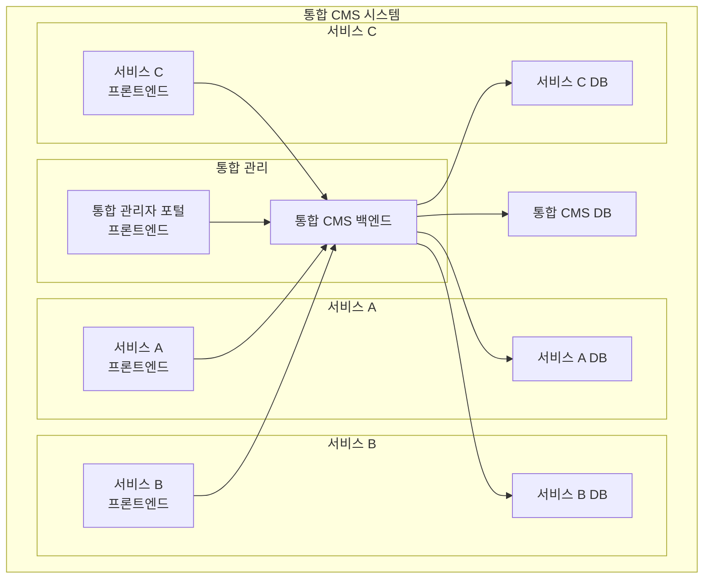

# 통합 CMS v2 아키텍처 설계서

## 1. 시스템 개요

현재 단일 CMS 시스템을 다중 서비스 통합관리가 가능한 플랫폼으로 전환하는 프로젝트입니다.

### 1.1 주요 요구사항
- 하나의 백엔드에서 서비스별 독립된 데이터베이스 관리
- 서비스별 독립된 프론트엔드 운영
- 기존 CMS 구조 및 기능 유지
- 통합 관리를 위한 권한 기능 추가

## 2. 시스템 아키텍처

### 2.1 전체 시스템 구조

### 2.2 데이터베이스 구조
- 통합 CMS DB (integrated_cms): 통합 관리용 메타데이터 저장
  - 통합 관리자(ADMIN_USER) 정보
  - 서비스(SERVICE) 정보
  - 권한 그룹(SERVICE_GROUP) 정보
  - 회원-그룹 매핑(SERVICE_MEMBER_GROUP) 정보
  - 통합 권한(SERVICE_PERMISSION) 정보
  - 권한 변경 이력(SERVICE_PERMISSION_LOG)
- 서비스별 DB: 각 서비스의 독립적인 데이터 저장
  - 기존 CMS 테이블 구조 유지
  - 사이트관리자 및 일반관리자 정보 관리
  - 서비스별 컨텐츠 및 설정 데이터

### 2.2.1 데이터베이스 접근 권한
- integrated.admin 계정:
  - 통합 CMS DB 전체 접근
  - 모든 서비스 DB 접근
  - 슈퍼관리자, 서비스관리자가 사용
- admin 계정:
  - 서비스별 DB만 접근
  - 사이트관리자, 일반관리자가 사용

### 2.3 권한 관리 시스템
1. 계층 구조
   - 슈퍼 관리자: 모든 서비스와 DB에 대한 최고 권한
   - 서비스 관리자: 특정 서비스 전체에 대한 관리 권한
   - 사이트 관리자: 특정 사이트에 대한 관리 권한
   - 일반 관리자: 그룹 기반 제한된 권한

2. 권한 관리 방식
   - 그룹 기반 기본 권한
   - 사용자별 추가 권한 지원
   - 권한 충돌 시 추가 권한 우선
   - 상세 권한 레벨 (READ, WRITE, ADMIN)

3. 권한 범위
   - 전체 사이트 접근 권한
   - 개별 사이트 접근 권한
   - 기능별 권한 (메뉴, 게시판, 컨텐츠)
   - 데이터 접근 권한

## 3. 주요 컴포넌트

### 3.1 통합 관리자 포털
- 전체 사이트 대시보드
- 통합 사용자 관리
- 권한 관리
  - 그룹 권한 관리
  - 사용자 추가 권한 관리
  - 권한 이력 조회
- 사이트별 설정 관리

### 3.2 권한 관리 시스템
- 역할 기반 접근 제어 (RBAC)
- 동적 권한 할당
- 권한 상속 관리
- 권한 감사 로깅
- 실시간 권한 검증

### 3.3 데이터베이스 관리
- 멀티 테넌시 지원
- 서비스별 데이터 격리
- 통합 백업 및 복구
- 데이터 동기화
- 회원 정보 통합 관리

## 4. 보안 설계

### 4.1 인증 시스템
- JWT 기반 통합 인증
- SSO (Single Sign-On) 지원
- 2FA 지원
- 통합 관리자 전용 인증

### 4.2 권한 검증
- API 레벨 권한 검증
- 데이터 레벨 접근 제어
- 권한 변경 감사 로깅
- 실시간 권한 체크

## 5. API 설계

### 5.1 API URL 구조
- `/api/v1/cms/integrated/**` → 통합 CMS DB 직접 접근
- `/api/v1/cms/{serviceId}/**` → 서비스별 DB 동적 접근
  - 예: `/api/v1/cms/service1/board/articles`
  - 예: `/api/v1/cms/douzone/users`

### 5.2 통합 관리 API (`/api/v1/cms/integrated/`)
- 서비스 메타데이터 관리
  - 서비스 등록/수정/삭제
  - DB 연결 정보 관리
- 통합 사용자 관리
  - 슈퍼관리자, 서비스관리자 관리
- 권한 관리 API
  - 그룹 권한 관리
  - 추가 권한 관리
  - 권한 이력 조회
- 전체 시스템 설정 및 모니터링

### 5.3 서비스별 API (`/api/v1/cms/{serviceId}/`)
- 동적 서비스 DB 라우팅
  - 서비스 메타데이터 조회
  - 동적 DB 연결 및 쿼리
- 서비스별 컨텐츠 관리
  - 게시판, 메뉴, 사용자 등
- 기존 CMS 기능 유지
- 서비스별 권한 검증

## 6. 확장성 고려사항

### 6.1 스케일링
- 서비스별 독립 스케일링
- 데이터베이스 샤딩 지원
- 캐시 계층 도입
- 권한 캐싱 전략

### 6.2 모니터링
- 통합 모니터링 시스템
- 성능 메트릭 수집
- 에러 추적 및 알림
- 권한 변경 모니터링

## 7. 마이그레이션 전략

### 7.1 단계별 마이그레이션
1. 통합 관리 시스템 구축
2. 데이터베이스 분리
3. 권한 시스템 통합
4. 서비스별 전환

### 7.2 데이터 마이그레이션
- 데이터 매핑 전략
- 롤백 계획
- 검증 프로세스
- 권한 데이터 이관 계획