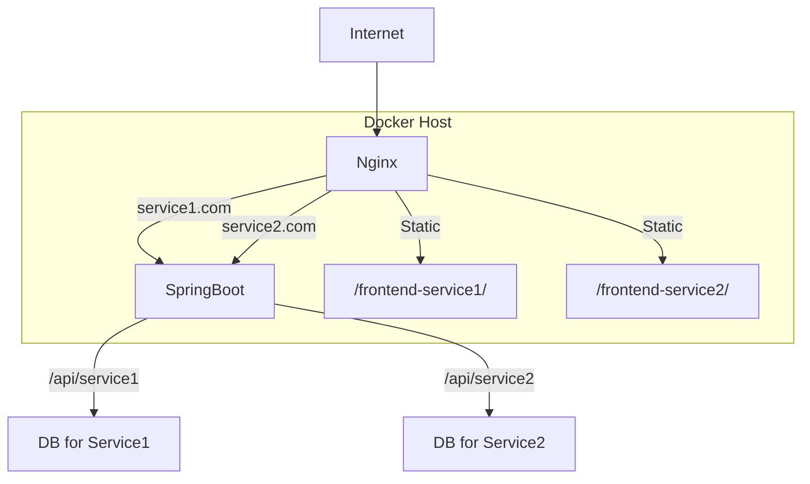

아래는 요청하신 대로 API 엔드포인트를 `/api/service1/`, `/api/service2/` 형식으로 통일하여 반영한 통합 CMS 아키텍처 설계문서입니다.
마크다운 형식으로 제공하니, 필요시 복사하여 `.md` 파일로 저장하시면 됩니다.

---

# 통합 CMS 아키텍처 설계서

## 1. 개요

본 문서는 하나의 서버에서 Nginx, Java Spring Boot, Docker 기반 CI/CD 환경을 활용하여 여러 개의 완전히 분리된 웹 서비스를 통합적으로 운영하는 아키텍처 설계를 다룹니다.
각 서비스는 독립적인 도메인, 프론트엔드, 백엔드 API, 데이터베이스를 갖습니다.

---

## 2. 시스템 구성도



---

## 3. 주요 구성 요소

### 3.1 Nginx (Reverse Proxy & Static Serving)

- 각 도메인(service1.com, service2.com)에 따라 트래픽을 분기
- `/api/`로 시작하는 백엔드 API 요청은 Spring Boot로 프록시
- 정적 파일(프론트엔드 빌드 결과물)은 각 서비스별 디렉토리에서 서빙

### 3.2 Spring Boot (Backend API)

- 단일 인스턴스에서 다중 context path로 각 서비스 API 제공
  - `/api/service1/**` → Service1Controller
  - `/api/service2/**` → Service2Controller
- 각 서비스별로 별도의 데이터베이스 커넥션 사용 (멀티 데이터소스)
- 서비스별 비즈니스 로직, 인증/인가, 데이터 분리

### 3.3 Frontend (React/Vue 등 SPA)

- 서비스별로 완전히 분리된 프론트엔드 프로젝트
  - `/frontend-service1/`
  - `/frontend-service2/`
- 각 서비스별로 별도의 빌드/배포 파이프라인

### 3.4 Database

- 서비스별로 독립된 데이터베이스 인스턴스 또는 스키마 사용
  - DB1: Service1 전용
  - DB2: Service2 전용

### 3.5 Docker & CI/CD

- 모든 구성요소(Nginx, Spring Boot, Frontend, DB)는 Docker 컨테이너로 관리
- 서비스별로 독립적인 CI/CD 파이프라인 구축 (예: GitHub Actions, Jenkins 등)
- 배포 자동화 및 롤백 지원

---

## 4. 도메인 및 URL 구조

| 도메인       | 프론트엔드 경로              | API 엔드포인트     |
| ------------ | ---------------------------- | ------------------ |
| service1.com | / (또는 /frontend-service1/) | /api/service1/\*\* |
| service2.com | / (또는 /frontend-service2/) | /api/service2/\*\* |

- Nginx가 도메인에 따라 프론트엔드/백엔드로 라우팅
- Spring Boot는 `/api/serviceX/`로 API 분기

---

## 5. 보안 및 분리 전략

- 각 서비스는 별도의 DB, 별도의 API, 별도의 프론트엔드로 완전 분리
- 인증/인가 로직도 서비스별로 분리
- Nginx에서 CORS, HTTPS, Rate Limiting 등 적용
- Spring Boot에서 서비스별 SecurityConfig 적용 가능

---

## 6. 예시 Nginx 설정

```nginx
server {
    listen 80;
    server_name service1.com;
    location /api/ {
        proxy_pass http://springboot:8080/api/;
        proxy_set_header Host $host;
        # ... 기타 설정 ...
    }
    location / {
        root /frontend-service1/dist;
        try_files $uri $uri/ /index.html;
    }
}
server {
    listen 80;
    server_name service2.com;
    location /api/ {
        proxy_pass http://springboot:8080/api/;
        proxy_set_header Host $host;
        # ... 기타 설정 ...
    }
    location / {
        root /frontend-service2/dist;
        try_files $uri $uri/ /index.html;
    }
}
```

---

## 7. 예시 Spring Boot Controller

```java
@RestController
@RequestMapping("/api/service1")
public class Service1Controller {
    @GetMapping("/hello")
    public String hello() {
        return "Hello from service1";
    }
}
@RestController
@RequestMapping("/api/service2")
public class Service2Controller {
    @GetMapping("/hello")
    public String hello() {
        return "Hello from service2";
    }
}
```

---

## 8. CI/CD 파이프라인 예시

- 서비스별로 프론트엔드/백엔드 빌드 및 Docker 이미지 생성
- Docker Compose 또는 Kubernetes로 통합 배포
- 서비스별 환경변수, 시크릿 분리 관리

---

## 9. 결론

이 아키텍처는 하나의 서버에서 여러 개의 완전히 분리된 웹서비스를 효율적으로 운영할 수 있도록 설계되었습니다.
각 서비스는 독립적으로 개발, 배포, 운영이 가능하며, 확장성 및 보안성도 확보할 수 있습니다.

---

필요하다면 이 설계서를 기반으로 세부 설계 문서(데이터베이스, CI/CD, 보안 등)를 추가로 작성할 수 있습니다.
추가 요청이나 궁금한 점이 있으면 언제든 말씀해 주세요!
