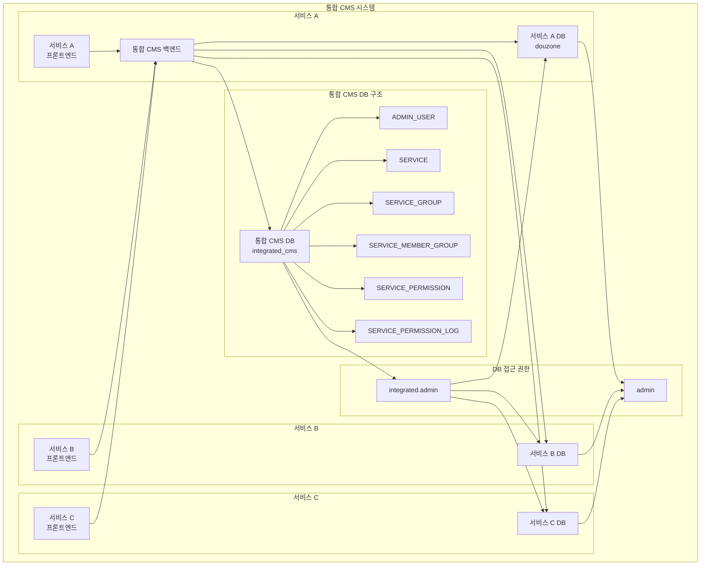
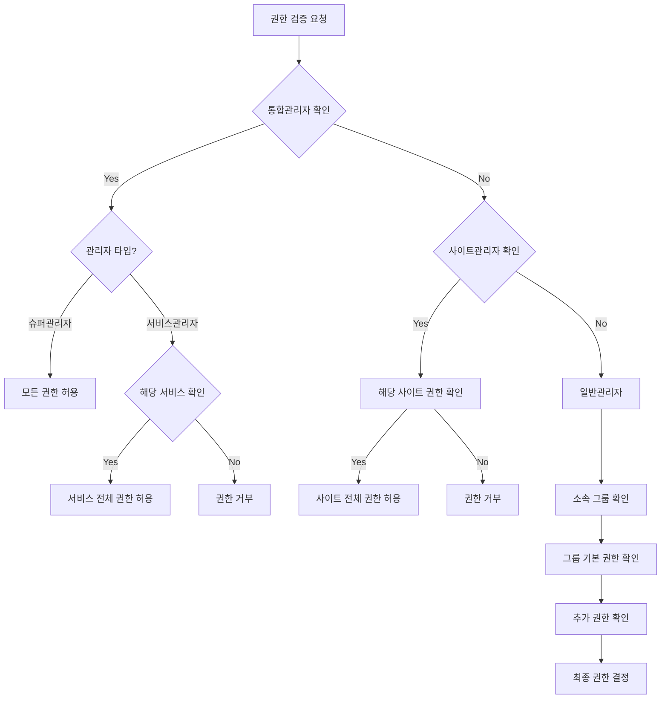

# 통합 CMS v2 데이터베이스 연동 및 권한 검증 구조

## 1. 데이터베이스 연동 구조

### 1.1 전체 구조도

### 1.2 서비스-사이트 관계

1. 슈퍼관리자
   - 모든 서비스와 사이트에 대한 최고 권한
   - 통합 데이터베이스에서 관리
   - 서비스 및 사이트 생성/관리 권한

2. 서비스관리자
   - 특정 서비스 전체에 대한 관리 권한
   - 해당 서비스의 모든 사이트 관리 가능
   - 사이트 관리자 지정 권한

3. 사이트관리자
   - 특정 사이트에 대한 관리 권한
   - 해당 사이트의 그룹 및 일반관리자 관리
   - 사이트 내 컨텐츠 전체 관리 권한

4. 일반관리자
   - 특정 그룹에 소속
   - 그룹의 기본 권한 보유
   - 추가 권한 보유 가능

### 1.3 데이터베이스 구성

#### 1.3.1 데이터베이스 계정
- integrated.admin: 
  - integrated_cms DB 전체 접근 권한
  - 모든 서비스 DB 전체 접근 권한 (douzone 등 추가되는 모든 서비스)
  - 슈퍼관리자, 서비스관리자가 사용
- admin:
  - 각 서비스 DB 전체 접근 권한 (douzone 등 추가되는 모든 서비스)
  - 사이트관리자, 일반관리자가 사용

#### 1.3.2 통합 데이터베이스 (integrated_cms)
- ADMIN_USER: 슈퍼관리자와 서비스관리자 정보
- SERVICE: 서비스 및 사이트 정보
- SERVICE_GROUP: 권한 그룹 정보
- SERVICE_MEMBER_GROUP: 사용자-그룹 매핑
- SERVICE_PERMISSION: 권한 정보
- SERVICE_PERMISSION_LOG: 권한 변경 이력

#### 1.3.3 서비스별 데이터베이스 구조 (예: douzone)
- admin_user: 사이트관리자 및 일반관리자 정보
- admin_group: 그룹 정보
- admin_additional_permission: 추가 권한 정보

※ 각 서비스 데이터베이스는 동일한 구조를 가지며, 서비스가 추가될 때마다 같은 구조로 새로운 데이터베이스가 생성됩니다.

## 2. 권한 검증 프로세스

### 2.1 프로세스 흐름도

### 2.2 시나리오별 권한 검증

1. **납품 시나리오 (예: 대학교)**
   - 슈퍼관리자: 전체 시스템 관리
   - 서비스관리자: 대학 전체 서비스 관리
   - 사이트관리자: 각 학과 사이트 관리
   - 일반관리자: 학과 내 특정 권한 그룹

2. **단일 서비스 다중 사이트 시나리오**
   - 슈퍼관리자: 시스템 총괄
   - 서비스관리자: 서비스 총괄
   - 사이트관리자: 개별 사이트 관리
   - 일반관리자: 사이트 내 그룹별 권한

3. **동적 서비스 라우팅 시나리오**
   - API 요청: `/api/v1/service1/bbs/article`
   - Step 1: ServiceId 'service1' 추출
   - Step 2: integrated_cms.SERVICE 테이블에서 service1 DB 연결 정보 조회
   - Step 3: service1 DB 동적 연결 생성
   - Step 4: service1 데이터베이스에서 실제 데이터 조회 및 응답

## 3. 주요 특징

### 3.1 명확한 권한 계층
- integrated.admin 계정으로 통합 DB와 서비스 DB 모두 관리 가능
- admin 계정으로 서비스 DB만 관리 가능
- 계층적 권한 구조로 명확한 책임 구분
- 동적 서비스 라우팅을 통한 투명한 DB 접근

### 3.2 유연한 권한 관리
- 서비스별 독립적 관리 가능
- 사이트별 독립적 관리 가능
- 그룹 기반 기본 권한
- 관리자별 추가 권한 가능

### 3.3 효율적인 권한 검증
- 계층적 권한 체크
- 캐시 활용 가능
- 상세한 로깅

### 3.4 보안성
- DB 분리로 보안 강화
- 명확한 접근 제어
- 감사 추적 가능

## 4. 운영 고려사항

### 4.1 성능 최적화
- 권한 캐싱 전략 수립
- 인덱스 최적화
- 주기적 성능 모니터링

### 4.2 데이터 정합성
- 트랜잭션 관리
- 권한 변경 시 동기화
- 에러 처리 및 복구

### 4.3 모니터링
- 권한 검증 로그 분석
- 성능 메트릭 수집
- 이상 징후 탐지