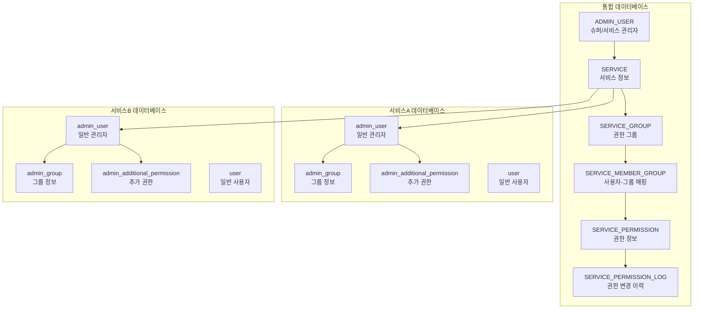
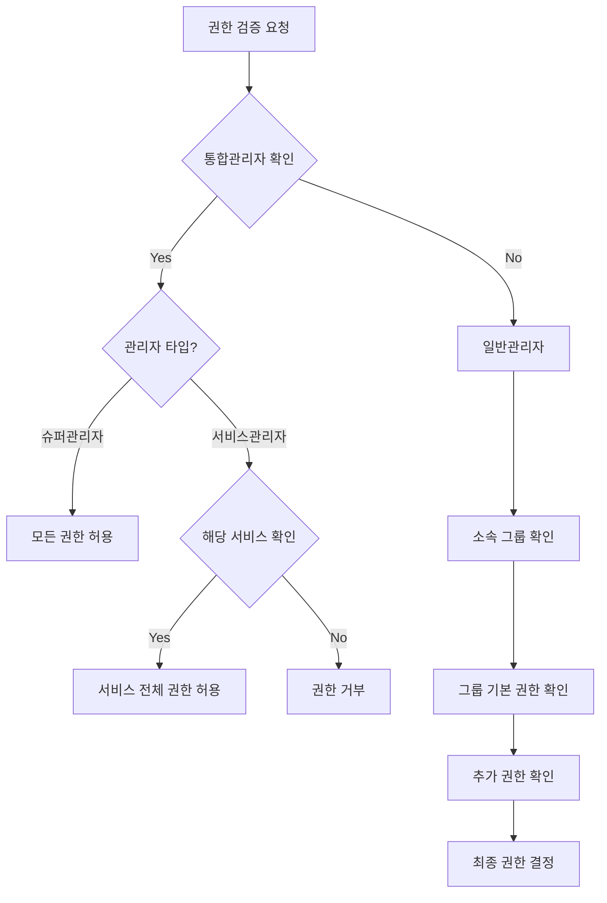

# 통합 CMS v2 데이터베이스 연동 및 권한 검증 구조

## 1. 데이터베이스 연동 구조

### 1.1 전체 구조도

### 1.2 데이터베이스 구성

#### 1.2.1 통합 데이터베이스
- ADMIN_USER: 슈퍼관리자와 서비스관리자 정보 관리
- SERVICE: 서비스 정보 관리
- SERVICE_GROUP: 권한 그룹 정보 관리
- SERVICE_MEMBER_GROUP: 사용자-그룹 매핑 정보
- SERVICE_PERMISSION: 권한 정보 관리
- SERVICE_PERMISSION_LOG: 권한 변경 이력 관리

#### 1.2.2 서비스 데이터베이스
- admin_user: 일반 관리자 정보 관리
- admin_group: 그룹 정보 관리
- admin_additional_permission: 추가 권한 정보 관리
- user: 일반 사용자 정보 관리

## 2. 권한 검증 프로세스

### 2.1 프로세스 흐름도

### 2.2 권한 검증 절차

1. 통합관리자 확인
   - ADMIN_USER 테이블에서 관리자 존재 여부 확인
   - 관리자 타입 확인 (슈퍼관리자/서비스관리자)

2. 슈퍼관리자 권한 검증
   - 모든 서비스에 대한 전체 권한 보유
   - 별도의 추가 검증 없이 권한 허용

3. 서비스관리자 권한 검증
   - SERVICE_ADMIN_MAPPING 테이블에서 서비스 매핑 확인
   - 매핑된 서비스에 대해서만 전체 권한 허용

4. 일반관리자 권한 검증
   - 소속 그룹 확인
   - 그룹의 기본 권한 확인
   - 추가 권한 존재 여부 확인
   - 최종 권한 결정

## 3. 주요 특징

### 3.1 명확한 권한 계층
- 통합관리자(슈퍼/서비스)는 통합 DB에서 관리
- 일반관리자는 각 서비스 DB에서 관리
- 모든 일반관리자는 그룹에 속함

### 3.2 유연한 권한 관리
- 그룹 기반의 기본 권한
- 관리자별 추가 권한 가능
- 권한 변경 이력 추적

### 3.3 효율적인 권한 검증
- 계층적 권한 체크
- 캐시 활용 가능
- 상세한 로깅

### 3.4 보안성
- DB 분리로 보안 강화
- 명확한 접근 제어
- 감사 추적 가능

## 4. 운영 고려사항

### 4.1 성능 최적화
- 권한 캐싱 전략 수립
- 인덱스 최적화
- 주기적 성능 모니터링

### 4.2 데이터 정합성
- 트랜잭션 관리
- 권한 변경 시 동기화
- 에러 처리 및 복구

### 4.3 모니터링
- 권한 검증 로그 분석
- 성능 메트릭 수집
- 이상 징후 탐지