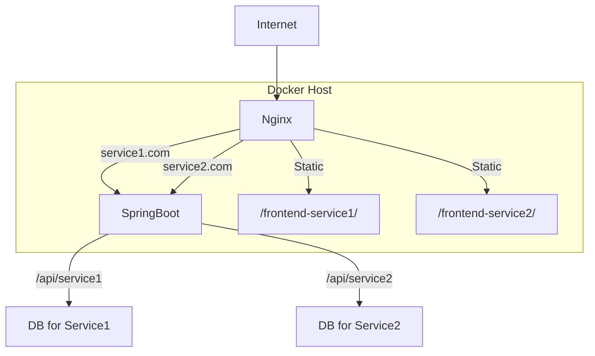

아래는 “통합 CMS 세부 설계문서”와 “실제 예시 포함”을 완전히 통합하여, 실무에서 바로 참고할 수 있도록 항목별로 상세하게 정리한 버전입니다.
아키텍처 개요부터, 네트워크/인프라, Nginx, Spring Boot, 프론트엔드, 데이터베이스, Docker/CI/CD, 보안, 모니터링, 장애 복구까지 실제 코드와 설정 예시를 포함해 한 번에 볼 수 있도록 구성했습니다.

---

# 통합 CMS 세부 설계문서 (실제 예시 완전 통합본)

---

## 1. 아키텍처 개요

- 하나의 서버에서 Nginx, Java Spring Boot, Docker 기반 CI/CD 환경을 활용
- 각 서비스는 독립 도메인, 프론트엔드, 백엔드 API, 데이터베이스를 가짐
- API 엔드포인트는 `/api/service1/`, `/api/service2/` 등으로 통일
- 서비스별 완전 분리(보안, 장애 격리, 확장성)

---

## 2. 시스템 구성도



---

## 3. 네트워크 및 인프라 설계

- **외부 트래픽**: 80/443 포트로 Nginx에 유입
- **내부 통신**: Docker 네트워크로 Nginx :left_right_arrow: Spring Boot :left_right_arrow: DB 컨테이너 간 통신
- **도메인/SSL**: 각 서비스별 독립 도메인(예: service1.com), Let’s Encrypt로 SSL 자동 갱신
- **방화벽**: DB 등 민감 서비스는 외부 접근 차단

---

## 4. Nginx 상세 설정

### 4.1 리버스 프록시 및 정적 파일 서빙

```nginx
server {
    listen 443 ssl;
    server_name service1.com;
    ssl_certificate /etc/letsencrypt/live/service1.com/fullchain.pem;
    ssl_certificate_key /etc/letsencrypt/live/service1.com/privkey.pem;
    location /api/ {
        proxy_pass http://springboot:8080/api/;
        proxy_set_header Host $host;
        proxy_set_header X-Real-IP $remote_addr;
        proxy_set_header X-Forwarded-For $proxy_add_x_forwarded_for;
        proxy_set_header X-Forwarded-Proto $scheme;
    }
    location / {
        root /frontend-service1/dist;
        try_files $uri $uri/ /index.html;
    }
}
```

- service2.com도 동일하게 설정

### 4.2 보안 및 최적화

- HTTP → HTTPS 리다이렉트
- gzip 압축, 캐싱 헤더 적용
- CORS, Rate Limiting, XSS/CSRF 방어 헤더 적용

---

## 5. Spring Boot 백엔드 상세 설계

### 5.1 프로젝트 구조

```
src/
  main/
    java/
      com.example.cms/
        service1/
          controller/
          service/
          repository/
          config/
        service2/
          controller/
          service/
          repository/
          config/
    resources/
      application.yml
      application-service1.yml
      application-service2.yml
```

### 5.2 멀티 데이터소스 설정

#### 5.2.1 의존성 (build.gradle)

```groovy
dependencies {
    implementation 'org.springframework.boot:spring-boot-starter-data-jpa'
    implementation 'mysql:mysql-connector-java'
}
```

#### 5.2.2 application.yml

```yaml
spring:
  datasource:
    service1:
      url: jdbc:mysql://db1:3306/service1
      username: user1
      password: pass1
      driver-class-name: com.mysql.cj.jdbc.Driver
    service2:
      url: jdbc:mysql://db2:3306/service2
      username: user2
      password: pass2
      driver-class-name: com.mysql.cj.jdbc.Driver
  jpa:
    hibernate:
      ddl-auto: update
    show-sql: true
```

#### 5.2.3 데이터소스 설정 클래스

```java
@Configuration
public class DataSourceConfig {
    @Bean(name = "service1DataSource")
    @ConfigurationProperties(prefix = "spring.datasource.service1")
    public DataSource service1DataSource() {
        return DataSourceBuilder.create().build();
    }
    @Bean(name = "service2DataSource")
    @ConfigurationProperties(prefix = "spring.datasource.service2")
    public DataSource service2DataSource() {
        return DataSourceBuilder.create().build();
    }
    // EntityManagerFactory, TransactionManager도 서비스별로 각각 설정
}
```

#### 5.2.4 서비스별 JPA 설정

```java
@Configuration
@EnableJpaRepositories(
    basePackages = "com.example.cms.service1.repository",
    entityManagerFactoryRef = "service1EntityManagerFactory",
    transactionManagerRef = "service1TransactionManager"
)
public class Service1JpaConfig {
    // ... service1DataSource 주입 및 설정 ...
}
```

- service2도 동일하게 별도 설정

### 5.3 API 엔드포인트 설계

```java
@RestController
@RequestMapping("/api/service1")
public class Service1Controller {
    @GetMapping("/hello")
    public String hello() {
        return "Hello from service1";
    }
}
@RestController
@RequestMapping("/api/service2")
public class Service2Controller {
    @GetMapping("/hello")
    public String hello() {
        return "Hello from service2";
    }
}
```

### 5.4 인증/인가 (Spring Security)

```java
@Configuration
@EnableWebSecurity
public class SecurityConfig extends WebSecurityConfigurerAdapter {
    @Override
    protected void configure(HttpSecurity http) throws Exception {
        http
            .antMatcher("/api/service1/**")
                .authorizeRequests()
                .anyRequest().hasRole("SERVICE1_USER")
            .and()
            .antMatcher("/api/service2/**")
                .authorizeRequests()
                .anyRequest().hasRole("SERVICE2_USER")
            .and()
            .csrf().disable();
    }
}
```

- JWT, OAuth2 등 인증 방식은 요구에 따라 추가

### 5.5 예외 및 로깅

- 공통 ExceptionHandler 적용
- 서비스별 로깅 디렉토리/포맷 분리 (logback-spring.xml)

```xml
<configuration>
    <appender name="SERVICE1" class="ch.qos.logback.core.rolling.RollingFileAppender">
        <file>/logs/service1.log</file>
        <!-- ... -->
    </appender>
    <logger name="com.example.cms.service1" level="INFO" additivity="false">
        <appender-ref ref="SERVICE1"/>
    </logger>
    <!-- service2도 동일하게 설정 -->
</configuration>
```

---

## 6. 프론트엔드 상세 설계

### 6.1 프로젝트 구조

```
/frontend-service1/
  src/
    components/
    pages/
    api/
  public/
  dist/
/frontend-service2/
  ...
```

### 6.2 API 연동

- 모든 API 요청은 `/api/service1/`, `/api/service2/`로 분기
- 환경변수로 API base URL 관리 (`.env`)

#### .env 예시

```
VITE_API_BASE_URL=/api/service1
```

#### API 연동 코드 (React + Axios)

```js
import axios from "axios";
const api = axios.create({
  baseURL: import.meta.env.VITE_API_BASE_URL,
  withCredentials: true,
});
export default api;
```

### 6.3 인증/인가

- JWT 등 토큰을 로컬스토리지/쿠키에 저장
- 서비스별 로그인/권한 관리

### 6.4 배포

- 빌드 결과물을 `/frontend-service1/dist`, `/frontend-service2/dist`에 위치
- Nginx에서 정적 파일 서빙

---

## 7. 데이터베이스 상세 설계

### 7.1 분리 전략

- 서비스별로 완전히 분리된 DB 인스턴스 또는 스키마 사용
- DB 계정, 권한도 서비스별로 분리

### 7.2 백업 및 복구

#### 백업 스크립트 (cron + mysqldump)

```bash
# service1 DB 백업
0 3 * * * mysqldump -u user1 -ppass1 -h db1 service1 > /backup/service1_$(date +\%F).sql
# service2 DB 백업
0 3 * * * mysqldump -u user2 -ppass2 -h db2 service2 > /backup/service2_$(date +\%F).sql
```

#### 복구

```bash
mysql -u user1 -ppass1 -h db1 service1 < /backup/service1_2024-06-01.sql
```

### 7.3 마이그레이션

- Flyway, Liquibase 등으로 서비스별 DB 마이그레이션 관리

---

## 8. Docker 및 CI/CD 상세 설계

### 8.1 Docker Compose 예시

```yaml
version: "3"
services:
  nginx:
    image: nginx:latest
    ports:
      - "80:80"
      - "443:443"
    volumes:
      - ./nginx/conf.d:/etc/nginx/conf.d
      - ./frontend-service1/dist:/frontend-service1/dist
      - ./frontend-service2/dist:/frontend-service2/dist
      - ./certs:/etc/letsencrypt
    depends_on:
      - springboot
  springboot:
    image: myorg/cms-backend:latest
    environment:
      - SPRING_PROFILES_ACTIVE=prod
    depends_on:
      - db1
      - db2
  db1:
    image: mysql:8
    environment:
      - MYSQL_DATABASE=service1
      - MYSQL_USER=user1
      - MYSQL_PASSWORD=pass1
      - MYSQL_ROOT_PASSWORD=rootpass
  db2:
    image: mysql:8
    environment:
      - MYSQL_DATABASE=service2
      - MYSQL_USER=user2
      - MYSQL_PASSWORD=pass2
      - MYSQL_ROOT_PASSWORD=rootpass
```

### 8.2 CI/CD 파이프라인 예시 (GitHub Actions)

#### 백엔드 빌드 & Docker 이미지 푸시

```yaml
name: Build and Push Backend
on:
  push:
    paths:
      - "backend/**"
jobs:
  build:
    runs-on: ubuntu-latest
    steps:
      - uses: actions/checkout@v3
      - name: Set up JDK 17
        uses: actions/setup-java@v3
        with:
          java-version: "17"
      - name: Build with Gradle
        run: cd backend && ./gradlew build
      - name: Build Docker image
        run: docker build -t myorg/cms-backend:latest ./backend
      - name: Push Docker image
        run: |
          echo ${{ secrets.DOCKER_PASSWORD }} | docker login -u ${{ secrets.DOCKER_USERNAME }} --password-stdin
          docker push myorg/cms-backend:latest
```

#### 프론트엔드 빌드 & Docker 이미지 푸시

```yaml
name: Build and Push Frontend
on:
  push:
    paths:
      - "frontend-service1/**"
jobs:
  build:
    runs-on: ubuntu-latest
    steps:
      - uses: actions/checkout@v3
      - name: Set up Node.js
        uses: actions/setup-node@v3
        with:
          node-version: "18"
      - name: Install dependencies
        run: cd frontend-service1 && npm ci
      - name: Build
        run: cd frontend-service1 && npm run build
      - name: Build Docker image
        run: docker build -t myorg/frontend-service1:latest ./frontend-service1
      - name: Push Docker image
        run: |
          echo ${{ secrets.DOCKER_PASSWORD }} | docker login -u ${{ secrets.DOCKER_USERNAME }} --password-stdin
          docker push myorg/frontend-service1:latest
```

### 8.3 배포 전략

- Blue/Green, Rolling Update 등 무중단 배포 적용
- 서비스별 환경변수, 시크릿 분리 관리

---

## 9. 보안 설계

- **HTTPS 적용**: Let’s Encrypt 자동 갱신 스크립트(cron + certbot)
- **환경변수/시크릿**: Docker secrets, GitHub Actions secrets 활용
- **DB 방화벽**: 외부 접근 차단, 내부 네트워크만 허용
- **CORS**: Nginx/Spring Boot에서 서비스별로 허용 도메인만 지정
- **XSS/CSRF 방어**: Nginx 및 Spring Security에서 헤더 적용

---

## 10. 모니터링 및 로깅

- **모니터링**: Prometheus, Grafana, ELK Stack 등 도입
- **로깅**: 서비스별 로그 파일 분리, 중앙집중 로그 수집
- **Nginx 로그**:
  ```nginx
  access_log  /var/log/nginx/service1_access.log;
  error_log   /var/log/nginx/service1_error.log;
  ```
- **알림**: 장애 발생 시 Slack, Email 등으로 알림

---

## 11. 백업 및 장애 복구

- 서비스별 DB, 파일 백업 정책 수립
- 정기 복구 테스트
- 장애 발생 시 서비스별 독립 복구 시나리오 문서화
- 롤백 필요 시, 이전 Docker 이미지로 재배포

---

## 12. 확장 및 유지보수

- 신규 서비스 추가 시 동일 패턴으로 확장 가능
- 서비스별로 독립 배포/운영 가능
- 코드/인프라 표준화로 유지보수 용이

---

## 참고

- [Spring Boot 멀티 데이터소스 공식문서](https://docs.spring.io/spring-boot/docs/current/reference/htmlsingle/#howto.data-access.configure-two-datasources)
- [Nginx Reverse Proxy 공식문서](https://nginx.org/en/docs/http/ngx_http_proxy_module.html)

---

이 문서는 통합 CMS 환경에서 실무적으로 바로 적용 가능한 상세 설계와 예시를 모두 포함합니다.
특정 항목에 대해 더 깊은 예시나 설명이 필요하면 언제든 말씀해 주세요!
