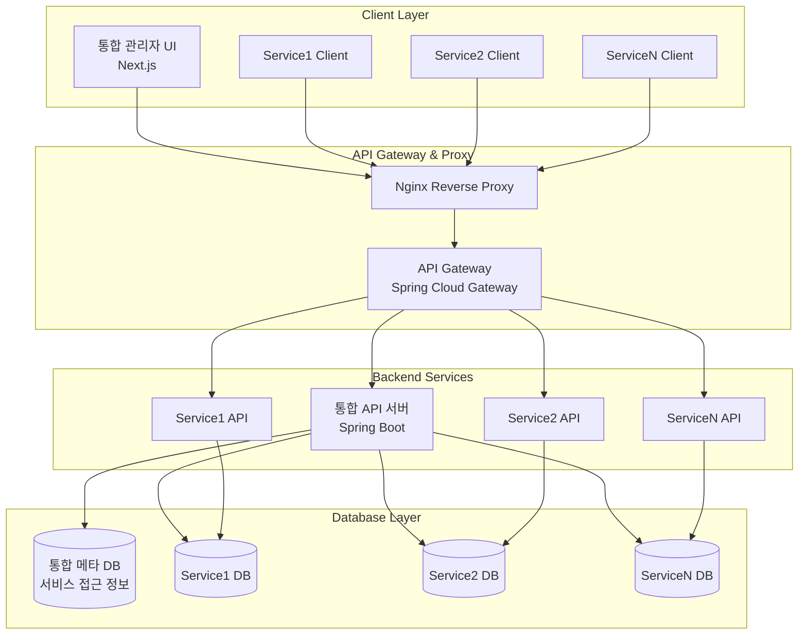
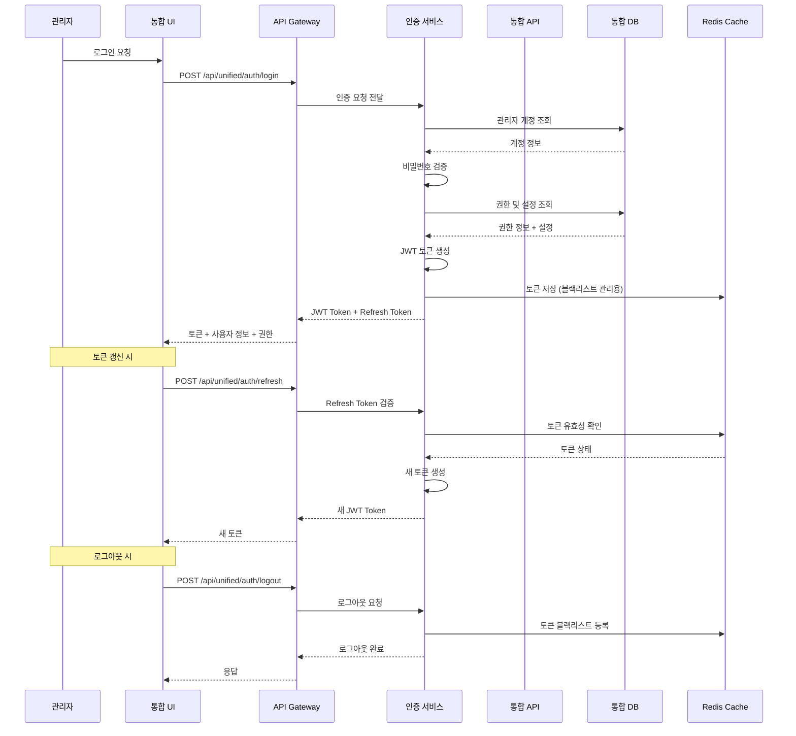
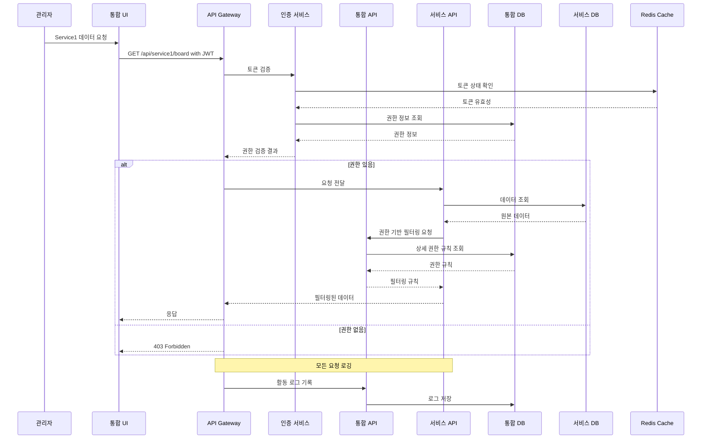
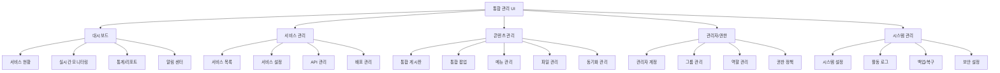
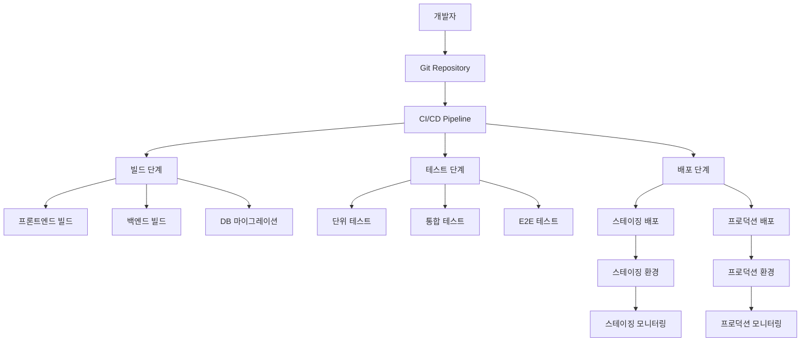

# 통합 CMS 고도화 아키텍처 설계서

## 1. 개요

본 문서는 기존 단일 CMS 시스템을 다중 서비스 통합 관리가 가능한 고도화된 CMS 플랫폼으로 전환하기 위한 아키텍처 설계를 다룹니다.

### 1.1 주요 목표

- **통합 관리**: 여러 CMS 서비스를 하나의 관리자 화면에서 통합 관리
- **서비스 분리**: 각 서비스별 독립적인 데이터베이스와 보안 정책
- **유연한 배포**: 온프레미스 단일 서버 또는 클라우드 다중 서버 지원
- **확장성**: 새로운 서비스 추가 시 최소한의 수정으로 확장 가능

### 1.2 배포 시나리오

- **시나리오 A (온프레미스)**: 단일 서버, 동일 클라이언트 IP
- **시나리오 B (클라우드)**: 다중 서버, 서비스별 독립 IP

---

## 2. 시스템 아키텍처

### 2.1 전체 구성도



### 2.2 핵심 구성 요소

#### 2.2.1 통합 API 서버 (Unified API Server)

- **역할**: 서비스 라우팅, 인증/인가, 통합 관리 기능
- **기술**: Spring Boot + Spring Security + JPA
- **API 패턴**: `/api/unified/` + `/api/service{N}/`

#### 2.2.2 통합 메타 데이터베이스

- **역할**: 서비스 정보, 세분화된 권한 관리, 관리자 계정 및 그룹 정보 저장
- **암호화**: 개별 DB 접근 정보는 AES-256으로 암호화 저장
- **권한 시스템**: RBAC + ABAC 하이브리드 모델로 사용자/그룹/역할/메뉴/기능별 세분화된 권한 관리

#### 2.2.3 서비스별 독립 데이터베이스

- **특징**: 각 서비스만 접근 가능한 독립적인 DB
- **보안**: 서비스별 전용 DB 계정 및 권한

---

## 3. 데이터베이스 설계

### 3.1 통합 메타 데이터베이스 (Master DB)

#### 3.1.1 서비스 관리 테이블

서비스 관리를 위한 테이블들은 다음과 같이 구성됩니다:

##### 3.1.1.1 기본 정보 테이블
- SERVICES: 서비스 기본 정보 관리

##### 3.1.1.2 관리자 계정 관련 테이블
- ADMIN_USERS: 관리자 계정 정보
- ADMIN_GROUPS: 관리자 그룹 정보
- ADMIN_GROUP_MEMBERS: 그룹 멤버십 관리

##### 3.1.1.3 권한 관리 테이블
- ROLES: 역할 정의
- PERMISSIONS: 권한 정의
- MENUS: 메뉴 구조 정의
- ADMIN_SERVICE_ROLES: 사용자/그룹별 서비스 역할 매핑
- ADMIN_MENU_PERMISSIONS: 사용자/그룹별 메뉴 권한 관리

```sql
-- 서비스 정보 테이블
CREATE TABLE SERVICES (
    SERVICE_ID BIGINT PRIMARY KEY AUTO_INCREMENT COMMENT '서비스 고유 ID',
    SERVICE_CODE VARCHAR(50) UNIQUE NOT NULL COMMENT '서비스 코드 (중복 불가)',
    SERVICE_NAME VARCHAR(100) NOT NULL COMMENT '서비스 이름',
    SERVICE_DOMAIN VARCHAR(255) COMMENT '서비스 도메인 (예: https://example.com)',
    API_BASE_URL VARCHAR(255) COMMENT 'API 기본 URL',
    DB_CONNECTION_INFO TEXT COMMENT '암호화된 DB 접속 정보',
    STATUS ENUM('ACTIVE', 'INACTIVE', 'MAINTENANCE') DEFAULT 'ACTIVE' COMMENT '서비스 상태 (활성/비활성/점검)',
    CREATED_BY VARCHAR(36)  NULL COMMENT '생성자 ID',
    CREATED_IP VARCHAR(45)  NULL COMMENT '생성자 IP',
    CREATED_AT TIMESTAMP DEFAULT CURRENT_TIMESTAMP COMMENT '생성 시각',
    UPDATED_BY VARCHAR(36)  NULL COMMENT '수정자 ID',
    UPDATED_IP VARCHAR(45)  NULL COMMENT '수정자 IP',
    UPDATED_AT TIMESTAMP DEFAULT CURRENT_TIMESTAMP ON UPDATE CURRENT_TIMESTAMP COMMENT '수정 시각',
    FOREIGN KEY (CREATED_BY) REFERENCES ADMIN_USERS(ADMIN_ID) ON DELETE SET NULL COMMENT '생성자 참조',
    FOREIGN KEY (UPDATED_BY) REFERENCES ADMIN_USERS(ADMIN_ID) ON DELETE SET NULL COMMENT '수정자 참조',
    INDEX idx_service_code (SERVICE_CODE) COMMENT '서비스 코드 검색용 인덱스',
    INDEX idx_status_created (STATUS, CREATED_AT) COMMENT '상태 및 생성일 기반 필터링용 인덱스',
    INDEX idx_domain (SERVICE_DOMAIN) COMMENT '도메인 기반 검색용 인덱스'
);

-- 고도화된 관리자 권한 시스템 (RBAC + ABAC 하이브리드)
-- 상세 스키마는 implementation-guide.md와 advanced-permission-system.md 참조

-- 관리자 사용자 테이블
CREATE TABLE ADMIN_USERS (
    ADMIN_ID BIGINT PRIMARY KEY AUTO_INCREMENT COMMENT '관리자 고유 ID',
    USERNAME VARCHAR(50) UNIQUE NOT NULL COMMENT '로그인용 사용자 이름',
    PASSWORD VARCHAR(255) NOT NULL COMMENT 'bcrypt로 해시된 비밀번호',
    EMAIL VARCHAR(100) COMMENT '이메일 주소',
    FULL_NAME VARCHAR(100) COMMENT '전체 이름',
    PHONE VARCHAR(20) COMMENT '전화번호',
    DEPARTMENT VARCHAR(100) COMMENT '부서',
    POSITION VARCHAR(100) COMMENT '직책',
    STATUS ENUM('ACTIVE', 'INACTIVE', 'LOCKED', 'PENDING_APPROVAL') DEFAULT 'PENDING_APPROVAL' COMMENT '계정 상태',
    LAST_LOGIN_AT TIMESTAMP NULL COMMENT '마지막 로그인 시간',
    FAILED_LOGIN_ATTEMPTS INT DEFAULT 0 COMMENT '로그인 실패 횟수',
    PASSWORD_CHANGED_AT TIMESTAMP NULL COMMENT '비밀번호 변경 시각',
    TIMEZONE VARCHAR(50) DEFAULT 'Asia/Seoul' COMMENT '시간대',
    LANGUAGE VARCHAR(10) DEFAULT 'ko' COMMENT '언어 설정',
    CREATED_BY VARCHAR(36)  NULL COMMENT '생성자 ID',
    CREATED_IP VARCHAR(45)  NULL COMMENT '생성자 IP',
    CREATED_AT TIMESTAMP DEFAULT CURRENT_TIMESTAMP COMMENT '생성 시각',
    UPDATED_BY VARCHAR(36)  NULL COMMENT '수정자 ID',
    UPDATED_IP VARCHAR(45)  NULL COMMENT '수정자 IP',
    UPDATED_AT TIMESTAMP DEFAULT CURRENT_TIMESTAMP ON UPDATE CURRENT_TIMESTAMP COMMENT '수정 시각',
    FOREIGN KEY (CREATED_BY) REFERENCES ADMIN_USERS(ADMIN_ID) ON DELETE SET NULL COMMENT '생성자 참조',
    FOREIGN KEY (UPDATED_BY) REFERENCES ADMIN_USERS(ADMIN_ID) ON DELETE SET NULL COMMENT '수정자 참조',
    INDEX idx_username_status (USERNAME, STATUS) COMMENT '사용자명/상태 기반 검색용 인덱스',
    INDEX idx_email_status (EMAIL, STATUS) COMMENT '이메일/상태 기반 검색용 인덱스',
    INDEX idx_department (DEPARTMENT) COMMENT '부서 기반 검색용 인덱스',
    INDEX idx_last_login (LAST_LOGIN_AT) COMMENT '최근 로그인 기반 검색용 인덱스'
);

-- 관리자 그룹 테이블 (부서, 프로젝트, 커스텀 그룹)
CREATE TABLE ADMIN_GROUPS (
    GROUP_ID BIGINT PRIMARY KEY AUTO_INCREMENT COMMENT '그룹 고유 ID',
    GROUP_NAME VARCHAR(100) NOT NULL COMMENT '그룹 이름',
    GROUP_CODE VARCHAR(50) UNIQUE NOT NULL COMMENT '그룹 코드',
    DESCRIPTION TEXT COMMENT '그룹 설명',
    GROUP_TYPE ENUM('SYSTEM', 'DEPARTMENT', 'PROJECT', 'CUSTOM') DEFAULT 'CUSTOM' COMMENT '그룹 유형',
    PARENT_GROUP_ID BIGINT NULL COMMENT '상위 그룹 ID (계층 구조)',
    IS_ACTIVE BOOLEAN DEFAULT TRUE COMMENT '활성 여부',
    CREATED_BY VARCHAR(36)  NULL COMMENT '생성자 ID',
    CREATED_IP VARCHAR(45)  NULL COMMENT '생성자 IP',
    CREATED_AT TIMESTAMP DEFAULT CURRENT_TIMESTAMP COMMENT '생성 시각',
    UPDATED_BY VARCHAR(36)  NULL COMMENT '수정자 ID',
    UPDATED_IP VARCHAR(45)  NULL COMMENT '수정자 IP',
    UPDATED_AT TIMESTAMP DEFAULT CURRENT_TIMESTAMP ON UPDATE CURRENT_TIMESTAMP COMMENT '수정 시각',
    FOREIGN KEY (PARENT_GROUP_ID) REFERENCES ADMIN_GROUPS(GROUP_ID) ON DELETE SET NULL COMMENT '상위 그룹 참조',
    FOREIGN KEY (CREATED_BY) REFERENCES ADMIN_USERS(ADMIN_ID) ON DELETE SET NULL COMMENT '생성자 참조',
    FOREIGN KEY (UPDATED_BY) REFERENCES ADMIN_USERS(ADMIN_ID) ON DELETE SET NULL COMMENT '수정자 참조',
    INDEX idx_group_code_type (GROUP_CODE, GROUP_TYPE) COMMENT '그룹 코드/유형 기반 검색용 인덱스',
    INDEX idx_parent_active (PARENT_GROUP_ID, IS_ACTIVE) COMMENT '상위 그룹/활성 상태 기반 검색용 인덱스'
);

-- 관리자 그룹 멤버 테이블
CREATE TABLE ADMIN_GROUP_MEMBERS (
    MEMBER_ID BIGINT PRIMARY KEY AUTO_INCREMENT COMMENT '멤버십 고유 ID',
    GROUP_ID BIGINT NOT NULL COMMENT '그룹 ID',
    ADMIN_ID BIGINT NOT NULL COMMENT '관리자 ID',
    MEMBER_TYPE ENUM('OWNER', 'ADMIN', 'MEMBER') DEFAULT 'MEMBER' COMMENT '멤버 유형',
    JOINED_AT TIMESTAMP DEFAULT CURRENT_TIMESTAMP COMMENT '가입 시각',
    EXPIRES_AT TIMESTAMP NULL COMMENT '만료 시각',
    IS_ACTIVE BOOLEAN DEFAULT TRUE COMMENT '활성 여부',
    CREATED_BY VARCHAR(36)  NULL COMMENT '생성자 ID',
    CREATED_IP VARCHAR(45)  NULL COMMENT '생성자 IP',
    CREATED_AT TIMESTAMP DEFAULT CURRENT_TIMESTAMP COMMENT '생성 시각',
    UPDATED_BY VARCHAR(36)  NULL COMMENT '수정자 ID',
    UPDATED_IP VARCHAR(45)  NULL COMMENT '수정자 IP',
    UPDATED_AT TIMESTAMP DEFAULT CURRENT_TIMESTAMP ON UPDATE CURRENT_TIMESTAMP COMMENT '수정 시각',
    FOREIGN KEY (GROUP_ID) REFERENCES ADMIN_GROUPS(GROUP_ID) ON DELETE CASCADE COMMENT '그룹 참조',
    FOREIGN KEY (ADMIN_ID) REFERENCES ADMIN_USERS(ADMIN_ID) ON DELETE CASCADE COMMENT '관리자 참조',
    FOREIGN KEY (CREATED_BY) REFERENCES ADMIN_USERS(ADMIN_ID) ON DELETE SET NULL COMMENT '생성자 참조',
    FOREIGN KEY (UPDATED_BY) REFERENCES ADMIN_USERS(ADMIN_ID) ON DELETE SET NULL COMMENT '수정자 참조',
    UNIQUE KEY unique_group_admin (GROUP_ID, ADMIN_ID) COMMENT '그룹-관리자 유일성 제약',
    INDEX idx_member_status (MEMBER_TYPE, IS_ACTIVE) COMMENT '멤버 유형/활성 상태 기반 검색용 인덱스',
    INDEX idx_expiration (EXPIRES_AT) COMMENT '만료일 기반 검색용 인덱스',
    CHECK (EXPIRES_AT IS NULL OR EXPIRES_AT > CREATED_AT) COMMENT '만료일은 생성일보다 이후여야 함'
);

-- 역할 정의 테이블
CREATE TABLE ROLES (
    ROLE_ID BIGINT PRIMARY KEY AUTO_INCREMENT COMMENT '역할 고유 ID',
    ROLE_NAME VARCHAR(100) NOT NULL COMMENT '역할 이름',
    ROLE_CODE VARCHAR(50) UNIQUE NOT NULL COMMENT '역할 코드',
    DESCRIPTION TEXT COMMENT '역할 설명',
    ROLE_TYPE ENUM('SYSTEM', 'SERVICE', 'CUSTOM') DEFAULT 'CUSTOM' COMMENT '역할 유형',
    IS_SYSTEM_ROLE BOOLEAN DEFAULT FALSE COMMENT '시스템 역할 여부',
    IS_ACTIVE BOOLEAN DEFAULT TRUE COMMENT '활성 여부',
    CREATED_BY VARCHAR(36)  NULL COMMENT '생성자 ID',
    CREATED_IP VARCHAR(45)  NULL COMMENT '생성자 IP',
    CREATED_AT TIMESTAMP DEFAULT CURRENT_TIMESTAMP COMMENT '생성 시각',
    UPDATED_BY VARCHAR(36)  NULL COMMENT '수정자 ID',
    UPDATED_IP VARCHAR(45)  NULL COMMENT '수정자 IP',
    UPDATED_AT TIMESTAMP DEFAULT CURRENT_TIMESTAMP ON UPDATE CURRENT_TIMESTAMP COMMENT '수정 시각',
    FOREIGN KEY (CREATED_BY) REFERENCES ADMIN_USERS(ADMIN_ID) ON DELETE SET NULL COMMENT '생성자 참조',
    FOREIGN KEY (UPDATED_BY) REFERENCES ADMIN_USERS(ADMIN_ID) ON DELETE SET NULL COMMENT '수정자 참조',
    INDEX idx_role_code_type (ROLE_CODE, ROLE_TYPE) COMMENT '역할 코드/유형 기반 검색용 인덱스',
    INDEX idx_system_active (IS_SYSTEM_ROLE, IS_ACTIVE) COMMENT '시스템 역할/활성 상태 기반 검색용 인덱스'
);

-- 권한 정의 테이블
CREATE TABLE PERMISSIONS (
    PERMISSION_ID BIGINT PRIMARY KEY AUTO_INCREMENT COMMENT '권한 고유 ID',
    PERMISSION_NAME VARCHAR(100) NOT NULL COMMENT '권한 이름',
    PERMISSION_CODE VARCHAR(100) UNIQUE NOT NULL COMMENT '권한 코드',
    DESCRIPTION TEXT COMMENT '권한 설명',
    PERMISSION_CATEGORY VARCHAR(50) NOT NULL COMMENT '권한 카테고리 (MENU, FUNCTION, DATA, SYSTEM)',
    RESOURCE_TYPE VARCHAR(50) NOT NULL COMMENT '리소스 타입 (board, content, menu, user 등)',
    ACTION_TYPE VARCHAR(50) NOT NULL COMMENT '액션 타입 (create, read, update, delete, publish 등)',
    IS_SYSTEM_PERMISSION BOOLEAN DEFAULT FALSE COMMENT '시스템 권한 여부',
    IS_ACTIVE BOOLEAN DEFAULT TRUE COMMENT '활성 여부',
    CREATED_BY VARCHAR(36)  NULL COMMENT '생성자 ID',
    CREATED_IP VARCHAR(45)  NULL COMMENT '생성자 IP',
    CREATED_AT TIMESTAMP DEFAULT CURRENT_TIMESTAMP COMMENT '생성 시각',
    UPDATED_BY VARCHAR(36)  NULL COMMENT '수정자 ID',
    UPDATED_IP VARCHAR(45)  NULL COMMENT '수정자 IP',
    UPDATED_AT TIMESTAMP DEFAULT CURRENT_TIMESTAMP ON UPDATE CURRENT_TIMESTAMP COMMENT '수정 시각',
    FOREIGN KEY (CREATED_BY) REFERENCES ADMIN_USERS(ADMIN_ID) ON DELETE SET NULL COMMENT '생성자 참조',
    FOREIGN KEY (UPDATED_BY) REFERENCES ADMIN_USERS(ADMIN_ID) ON DELETE SET NULL COMMENT '수정자 참조',
    INDEX idx_permission_code (PERMISSION_CODE) COMMENT '권한 코드 검색용 인덱스',
    INDEX idx_category_resource_action (PERMISSION_CATEGORY, RESOURCE_TYPE, ACTION_TYPE) COMMENT '카테고리/리소스/액션 기반 검색용 인덱스',
    INDEX idx_system_active (IS_SYSTEM_PERMISSION, IS_ACTIVE) COMMENT '시스템 권한/활성 상태 기반 검색용 인덱스'
);

-- 메뉴 정의 테이블 (서비스별 메뉴 구조)
CREATE TABLE MENUS (
    MENU_ID BIGINT PRIMARY KEY AUTO_INCREMENT COMMENT '메뉴 고유 ID',
    SERVICE_ID BIGINT NULL COMMENT '서비스 ID (NULL이면 통합 관리용 메뉴)',
    MENU_CODE VARCHAR(50) NOT NULL COMMENT '메뉴 코드',
    MENU_NAME VARCHAR(100) NOT NULL COMMENT '메뉴 이름',
    MENU_PATH VARCHAR(255) NOT NULL COMMENT '메뉴 경로',
    PARENT_MENU_ID BIGINT NULL COMMENT '상위 메뉴 ID',
    MENU_LEVEL INT DEFAULT 1 COMMENT '메뉴 레벨',
    MENU_ORDER INT DEFAULT 0 COMMENT '메뉴 순서',
    MENU_TYPE ENUM('MENU', 'PAGE', 'FUNCTION', 'BUTTON') DEFAULT 'MENU' COMMENT '메뉴 타입',
    MENU_ICON VARCHAR(100) NULL COMMENT '메뉴 아이콘',
    REQUIRED_PERMISSIONS JSON COMMENT '메뉴 접근에 필요한 권한 목록',
    IS_VISIBLE BOOLEAN DEFAULT TRUE COMMENT '메뉴 표시 여부',
    IS_ACTIVE BOOLEAN DEFAULT TRUE COMMENT '활성 여부',
    CREATED_BY VARCHAR(36)  NULL COMMENT '생성자 ID',
    CREATED_IP VARCHAR(45)  NULL COMMENT '생성자 IP',
    CREATED_AT TIMESTAMP DEFAULT CURRENT_TIMESTAMP COMMENT '생성 시각',
    UPDATED_BY VARCHAR(36)  NULL COMMENT '수정자 ID',
    UPDATED_IP VARCHAR(45)  NULL COMMENT '수정자 IP',
    UPDATED_AT TIMESTAMP DEFAULT CURRENT_TIMESTAMP ON UPDATE CURRENT_TIMESTAMP COMMENT '수정 시각',
    FOREIGN KEY (SERVICE_ID) REFERENCES SERVICES(SERVICE_ID) ON DELETE CASCADE COMMENT '서비스 참조',
    FOREIGN KEY (PARENT_MENU_ID) REFERENCES MENUS(MENU_ID) ON DELETE CASCADE COMMENT '상위 메뉴 참조',
    FOREIGN KEY (CREATED_BY) REFERENCES ADMIN_USERS(ADMIN_ID) ON DELETE SET NULL COMMENT '생성자 참조',
    FOREIGN KEY (UPDATED_BY) REFERENCES ADMIN_USERS(ADMIN_ID) ON DELETE SET NULL COMMENT '수정자 참조',
    UNIQUE KEY unique_service_menu_code (SERVICE_ID, MENU_CODE) COMMENT '서비스별 메뉴 코드 유일성 제약',
    INDEX idx_service_active (SERVICE_ID, IS_ACTIVE) COMMENT '서비스/활성 상태 기반 검색용 인덱스',
    INDEX idx_parent_level_order (PARENT_MENU_ID, MENU_LEVEL, MENU_ORDER) COMMENT '메뉴 구조 조회용 인덱스',
    INDEX idx_menu_path (MENU_PATH) COMMENT '메뉴 경로 검색용 인덱스'
);

-- 사용자-서비스-역할 매핑 테이블
CREATE TABLE ADMIN_SERVICE_ROLES (
    ASSIGNMENT_ID BIGINT PRIMARY KEY AUTO_INCREMENT COMMENT '할당 고유 ID',
    ADMIN_ID BIGINT NULL COMMENT '관리자 ID',
    GROUP_ID BIGINT NULL COMMENT '그룹 ID',
    SERVICE_ID BIGINT NULL COMMENT '서비스 ID (NULL이면 통합 시스템)',
    ROLE_ID BIGINT NOT NULL COMMENT '역할 ID',
    ASSIGNMENT_TYPE ENUM('USER', 'GROUP') NOT NULL COMMENT '할당 타입',
    IS_ACTIVE BOOLEAN DEFAULT TRUE COMMENT '활성 여부',
    GRANTED_AT TIMESTAMP DEFAULT CURRENT_TIMESTAMP COMMENT '권한 부여 시간',
    EXPIRES_AT TIMESTAMP NULL COMMENT '권한 만료 시간',
    GRANTED_BY BIGINT NULL COMMENT '권한 부여자 ID',
    CREATED_BY VARCHAR(36)  NULL COMMENT '생성자 ID',
    CREATED_IP VARCHAR(45)  NULL COMMENT '생성자 IP',
    CREATED_AT TIMESTAMP DEFAULT CURRENT_TIMESTAMP COMMENT '생성 시각',
    UPDATED_BY VARCHAR(36)  NULL COMMENT '수정자 ID',
    UPDATED_IP VARCHAR(45)  NULL COMMENT '수정자 IP',
    UPDATED_AT TIMESTAMP DEFAULT CURRENT_TIMESTAMP ON UPDATE CURRENT_TIMESTAMP COMMENT '수정 시각',
    FOREIGN KEY (ADMIN_ID) REFERENCES ADMIN_USERS(ADMIN_ID) ON DELETE CASCADE COMMENT '관리자 참조',
    FOREIGN KEY (GROUP_ID) REFERENCES ADMIN_GROUPS(GROUP_ID) ON DELETE CASCADE COMMENT '그룹 참조',
    FOREIGN KEY (SERVICE_ID) REFERENCES SERVICES(SERVICE_ID) ON DELETE CASCADE COMMENT '서비스 참조',
    FOREIGN KEY (ROLE_ID) REFERENCES ROLES(ROLE_ID) ON DELETE CASCADE COMMENT '역할 참조',
    FOREIGN KEY (GRANTED_BY) REFERENCES ADMIN_USERS(ADMIN_ID) ON DELETE SET NULL COMMENT '권한 부여자 참조',
    FOREIGN KEY (CREATED_BY) REFERENCES ADMIN_USERS(ADMIN_ID) ON DELETE SET NULL COMMENT '생성자 참조',
    FOREIGN KEY (UPDATED_BY) REFERENCES ADMIN_USERS(ADMIN_ID) ON DELETE SET NULL COMMENT '수정자 참조',
    UNIQUE KEY unique_user_service_role (ADMIN_ID, SERVICE_ID, ROLE_ID) COMMENT '사용자별 서비스 역할 유일성 제약',
    UNIQUE KEY unique_group_service_role (GROUP_ID, SERVICE_ID, ROLE_ID) COMMENT '그룹별 서비스 역할 유일성 제약',
    INDEX idx_admin_service_active (ADMIN_ID, SERVICE_ID, IS_ACTIVE) COMMENT '관리자별 서비스 권한 조회용 인덱스',
    INDEX idx_group_service_active (GROUP_ID, SERVICE_ID, IS_ACTIVE) COMMENT '그룹별 서비스 권한 조회용 인덱스',
    INDEX idx_service_role (SERVICE_ID, ROLE_ID) COMMENT '서비스별 역할 조회용 인덱스',
    INDEX idx_expiration (EXPIRES_AT) COMMENT '만료일 기반 검색용 인덱스',
    CHECK (
        (ASSIGNMENT_TYPE = 'USER' AND ADMIN_ID IS NOT NULL AND GROUP_ID IS NULL) OR
        (ASSIGNMENT_TYPE = 'GROUP' AND ADMIN_ID IS NULL AND GROUP_ID IS NOT NULL)
    ) COMMENT '할당 타입에 따른 ID 검증',
    CHECK (EXPIRES_AT IS NULL OR EXPIRES_AT > GRANTED_AT) COMMENT '만료일은 부여일보다 이후여야 함'
);

-- 사용자별 메뉴 권한 오버라이드 테이블
CREATE TABLE ADMIN_MENU_PERMISSIONS (
    MENU_PERMISSION_ID BIGINT PRIMARY KEY AUTO_INCREMENT COMMENT '메뉴 권한 고유 ID',
    ADMIN_ID BIGINT NULL COMMENT '관리자 ID',
    GROUP_ID BIGINT NULL COMMENT '그룹 ID',
    MENU_ID BIGINT NOT NULL COMMENT '메뉴 ID',
    PERMISSION_TYPE ENUM('ALLOW', 'DENY') NOT NULL COMMENT '권한 타입 (허용/거부)',
    ASSIGNMENT_TYPE ENUM('USER', 'GROUP') NOT NULL COMMENT '할당 타입',
    SPECIFIC_PERMISSIONS JSON COMMENT '메뉴 내 세부 기능별 권한',
    IS_ACTIVE BOOLEAN DEFAULT TRUE COMMENT '활성 여부',
    GRANTED_AT TIMESTAMP DEFAULT CURRENT_TIMESTAMP COMMENT '권한 부여 시간',
    EXPIRES_AT TIMESTAMP NULL COMMENT '권한 만료 시간',
    GRANTED_BY BIGINT NULL COMMENT '권한 부여자 ID',
    CREATED_BY VARCHAR(36)  NULL COMMENT '생성자 ID',
    CREATED_IP VARCHAR(45)  NULL COMMENT '생성자 IP',
    CREATED_AT TIMESTAMP DEFAULT CURRENT_TIMESTAMP COMMENT '생성 시각',
    UPDATED_BY VARCHAR(36)  NULL COMMENT '수정자 ID',
    UPDATED_IP VARCHAR(45)  NULL COMMENT '수정자 IP',
    UPDATED_AT TIMESTAMP DEFAULT CURRENT_TIMESTAMP ON UPDATE CURRENT_TIMESTAMP COMMENT '수정 시각',
    UPDATED_AT TIMESTAMP DEFAULT CURRENT_TIMESTAMP ON UPDATE CURRENT_TIMESTAMP COMMENT '수정 시각',
    FOREIGN KEY (ADMIN_ID) REFERENCES ADMIN_USERS(ADMIN_ID) ON DELETE CASCADE COMMENT '관리자 참조',
    FOREIGN KEY (GROUP_ID) REFERENCES ADMIN_GROUPS(GROUP_ID) ON DELETE CASCADE COMMENT '그룹 참조',
    FOREIGN KEY (MENU_ID) REFERENCES MENUS(MENU_ID) ON DELETE CASCADE COMMENT '메뉴 참조',
    FOREIGN KEY (GRANTED_BY) REFERENCES ADMIN_USERS(ADMIN_ID) ON DELETE SET NULL COMMENT '권한 부여자 참조',
    FOREIGN KEY (CREATED_BY) REFERENCES ADMIN_USERS(ADMIN_ID) ON DELETE SET NULL COMMENT '생성자 참조',
    FOREIGN KEY (UPDATED_BY) REFERENCES ADMIN_USERS(ADMIN_ID) ON DELETE SET NULL COMMENT '수정자 참조',
    UNIQUE KEY unique_user_menu_permission (ADMIN_ID, MENU_ID) COMMENT '사용자별 메뉴 권한 유일성 제약',
    UNIQUE KEY unique_group_menu_permission (GROUP_ID, MENU_ID) COMMENT '그룹별 메뉴 권한 유일성 제약',
    INDEX idx_admin_menu_active (ADMIN_ID, MENU_ID, IS_ACTIVE) COMMENT '관리자별 메뉴 권한 조회용 인덱스',
    INDEX idx_group_menu_active (GROUP_ID, MENU_ID, IS_ACTIVE) COMMENT '그룹별 메뉴 권한 조회용 인덱스',
    INDEX idx_menu_permission (MENU_ID, PERMISSION_TYPE) COMMENT '메뉴별 권한 타입 조회용 인덱스',
    INDEX idx_expiration (EXPIRES_AT) COMMENT '만료일 기반 검색용 인덱스',
    CHECK (
        (ASSIGNMENT_TYPE = 'USER' AND ADMIN_ID IS NOT NULL AND GROUP_ID IS NULL) OR
        (ASSIGNMENT_TYPE = 'GROUP' AND ADMIN_ID IS NULL AND GROUP_ID IS NOT NULL)
    ) COMMENT '할당 타입에 따른 ID 검증',
    CHECK (EXPIRES_AT IS NULL OR EXPIRES_AT > GRANTED_AT) COMMENT '만료일은 부여일보다 이후여야 함'
);
```

#### 3.1.2 통합 관리 테이블

통합 관리를 위한 테이블들은 다음과 같이 구성됩니다:

##### 3.1.2.1 통합 콘텐츠 관리 테이블
- UNIFIED_CONTENT_MANAGEMENT: 서비스별 콘텐츠 통합 관리
- UNIFIED_ACTIVITY_LOGS: 통합 시스템 활동 로그

```sql
-- 통합 게시글 관리 뷰
CREATE TABLE UNIFIED_CONTENT_MANAGEMENT (
    CONTENT_ID BIGINT PRIMARY KEY AUTO_INCREMENT COMMENT '통합 콘텐츠 ID',
    SERVICE_ID BIGINT NOT NULL COMMENT '원본 서비스 ID',
    ORIGINAL_CONTENT_ID BIGINT NOT NULL COMMENT '원본 콘텐츠 ID (서비스 내 콘텐츠)',
    CONTENT_TYPE ENUM('BOARD', 'POPUP', 'CONTENT', 'MENU') NOT NULL COMMENT '콘텐츠 유형',
    TITLE VARCHAR(255) NOT NULL COMMENT '콘텐츠 제목',
    STATUS VARCHAR(50) NOT NULL DEFAULT 'DRAFT' COMMENT '콘텐츠 상태 (DRAFT, PUBLISHED, DELETED)',
    AUTHOR VARCHAR(100) NOT NULL COMMENT '작성자',
    CONTENT_DATA JSON COMMENT '콘텐츠 메타데이터 (검색용)',
    SYNC_STATUS ENUM('PENDING', 'SUCCESS', 'ERROR') DEFAULT 'PENDING' COMMENT '동기화 상태',
    SYNC_MESSAGE TEXT COMMENT '동기화 실패 시 에러 메시지',
    LAST_SYNCED_AT TIMESTAMP DEFAULT CURRENT_TIMESTAMP ON UPDATE CURRENT_TIMESTAMP COMMENT '최종 동기화 시각',
    CREATED_BY VARCHAR(36)  NULL COMMENT '생성자 ID',
    CREATED_IP VARCHAR(45)  NULL COMMENT '생성자 IP',
    CREATED_AT TIMESTAMP DEFAULT CURRENT_TIMESTAMP COMMENT '생성 시각',
    UPDATED_BY VARCHAR(36)  NULL COMMENT '수정자 ID',
    UPDATED_IP VARCHAR(45)  NULL COMMENT '수정자 IP',
    UPDATED_AT TIMESTAMP DEFAULT CURRENT_TIMESTAMP ON UPDATE CURRENT_TIMESTAMP COMMENT '수정 시각',
    FOREIGN KEY (SERVICE_ID) REFERENCES SERVICES(SERVICE_ID) ON DELETE CASCADE COMMENT '서비스 참조',
    FOREIGN KEY (CREATED_BY) REFERENCES ADMIN_USERS(ADMIN_ID) ON DELETE SET NULL COMMENT '생성자 참조',
    FOREIGN KEY (UPDATED_BY) REFERENCES ADMIN_USERS(ADMIN_ID) ON DELETE SET NULL COMMENT '수정자 참조',
    UNIQUE KEY unique_service_content (SERVICE_ID, CONTENT_TYPE, ORIGINAL_CONTENT_ID) COMMENT '서비스별 콘텐츠 유일성 제약',
    INDEX idx_service_type_status (SERVICE_ID, CONTENT_TYPE, STATUS) COMMENT '서비스/유형/상태별 조회용 인덱스',
    INDEX idx_sync_status (SYNC_STATUS, LAST_SYNCED_AT) COMMENT '동기화 상태 모니터링용 인덱스',
    INDEX idx_title (TITLE) COMMENT '제목 검색용 인덱스',
    INDEX idx_author (AUTHOR) COMMENT '작성자 검색용 인덱스',
    CHECK (SYNC_STATUS != 'ERROR' OR SYNC_MESSAGE IS NOT NULL) COMMENT '동기화 실패 시 에러 메시지 필수'
);

-- 통합 활동 로그
CREATE TABLE UNIFIED_ACTIVITY_LOGS (
    LOG_ID BIGINT PRIMARY KEY AUTO_INCREMENT COMMENT '로그 고유 ID',
    ADMIN_ID BIGINT NOT NULL COMMENT '작업한 관리자 ID',
    SERVICE_ID BIGINT NOT NULL COMMENT '대상 서비스 ID',
    ACTION VARCHAR(100) NOT NULL COMMENT '실행된 작업명 (예: update, delete)',
    TARGET_TYPE VARCHAR(50) NOT NULL COMMENT '대상 객체 유형 (예: BOARD, MENU)',
    TARGET_ID BIGINT NOT NULL COMMENT '대상 객체 ID',
    DETAILS JSON NOT NULL COMMENT '작업 상세 내역(JSON)',
    REQUEST_METHOD VARCHAR(10) NOT NULL COMMENT 'HTTP 메소드',
    REQUEST_PATH VARCHAR(255) NOT NULL COMMENT '요청 경로',
    REQUEST_PARAMS JSON COMMENT '요청 파라미터',
    RESPONSE_STATUS INT NOT NULL COMMENT 'HTTP 응답 상태 코드',
    RESPONSE_MESSAGE VARCHAR(255) COMMENT '응답 메시지',
    EXECUTION_TIME INT NOT NULL COMMENT '실행 시간 (ms)',
    USER_AGENT VARCHAR(255) COMMENT '사용자 에이전트',
    IP_ADDRESS VARCHAR(45) NOT NULL COMMENT '요청자 IP 주소',
    CREATED_BY VARCHAR(36)  NULL COMMENT '생성자 ID',
    CREATED_IP VARCHAR(45)  NULL COMMENT '생성자 IP',
    CREATED_AT TIMESTAMP DEFAULT CURRENT_TIMESTAMP COMMENT '생성 시각',
    UPDATED_BY VARCHAR(36)  NULL COMMENT '수정자 ID',
    UPDATED_IP VARCHAR(45)  NULL COMMENT '수정자 IP',
    UPDATED_AT TIMESTAMP DEFAULT CURRENT_TIMESTAMP ON UPDATE CURRENT_TIMESTAMP COMMENT '수정 시각',
    FOREIGN KEY (ADMIN_ID) REFERENCES ADMIN_USERS(ADMIN_ID) ON DELETE CASCADE COMMENT '관리자 참조',
    FOREIGN KEY (SERVICE_ID) REFERENCES SERVICES(SERVICE_ID) ON DELETE CASCADE COMMENT '서비스 참조',
    FOREIGN KEY (CREATED_BY) REFERENCES ADMIN_USERS(ADMIN_ID) ON DELETE SET NULL COMMENT '생성자 참조',
    FOREIGN KEY (UPDATED_BY) REFERENCES ADMIN_USERS(ADMIN_ID) ON DELETE SET NULL COMMENT '수정자 참조',
    INDEX idx_admin_action_time (ADMIN_ID, ACTION, CREATED_AT) COMMENT '관리자별 작업 이력 조회용 인덱스',
    INDEX idx_service_type_time (SERVICE_ID, TARGET_TYPE, CREATED_AT) COMMENT '서비스별 객체 타입 이력 조회용 인덱스',
    INDEX idx_status_time (RESPONSE_STATUS, CREATED_AT) COMMENT '응답 상태별 이력 조회용 인덱스',
    INDEX idx_ip_time (IP_ADDRESS, CREATED_AT) COMMENT 'IP별 접근 이력 조회용 인덱스'
);
```

### 3.2 개별 서비스 데이터베이스

각 서비스는 기존 CMS 구조를 유지하되, 통합 관리를 위한 메타데이터를 추가합니다.

#### 3.2.1 기존 테이블 확장
- 콘텐츠 동기화 상태 추적
- 통합 시스템과의 연동 정보 관리

```sql
-- 기존 테이블에 통합 관리용 컬럼 추가
ALTER TABLE BBS_ARTICLES 
    ADD COLUMN UNIFIED_SYNC_FLAG BOOLEAN DEFAULT FALSE COMMENT '통합 콘텐츠 동기화 여부',
    ADD COLUMN UNIFIED_SYNC_STATUS ENUM('PENDING', 'SUCCESS', 'ERROR') DEFAULT 'PENDING' COMMENT '동기화 상태',
    ADD COLUMN UNIFIED_SYNC_MESSAGE TEXT NULL COMMENT '동기화 실패 시 에러 메시지',
    ADD COLUMN UNIFIED_CONTENT_ID BIGINT NULL COMMENT '통합 시스템의 콘텐츠 ID',
    ADD COLUMN UNIFIED_LAST_SYNC TIMESTAMP NULL COMMENT '통합 콘텐츠 최종 동기화 시각',
    ADD INDEX idx_unified_sync (UNIFIED_SYNC_FLAG, UNIFIED_SYNC_STATUS) COMMENT '동기화 상태 조회용 인덱스',
    ADD INDEX idx_unified_content (UNIFIED_CONTENT_ID) COMMENT '통합 콘텐츠 ID 조회용 인덱스',
    ADD CHECK (UNIFIED_SYNC_STATUS != 'ERROR' OR UNIFIED_SYNC_MESSAGE IS NOT NULL) COMMENT '동기화 실패 시 에러 메시지 필수';

-- 서비스별 관리자 매핑 테이블
CREATE TABLE SERVICE_ADMIN_MAPPING (
    MAPPING_ID BIGINT PRIMARY KEY AUTO_INCREMENT COMMENT '매핑 고유 ID',
    UNIFIED_ADMIN_ID BIGINT NOT NULL COMMENT '통합 DB 기준 ADMIN_USERS의 ADMIN_ID',
    LOCAL_ADMIN_ID BIGINT NOT NULL COMMENT '서비스 DB 기준 관리자 ID',
    MAPPING_STATUS ENUM('ACTIVE', 'INACTIVE', 'PENDING') DEFAULT 'PENDING' COMMENT '매핑 상태',
    PERMISSIONS JSON NOT NULL COMMENT '해당 관리자에 대한 권한 정보(JSON)',
    SYNC_STATUS ENUM('PENDING', 'SUCCESS', 'ERROR') DEFAULT 'PENDING' COMMENT '동기화 상태',
    SYNC_MESSAGE TEXT NULL COMMENT '동기화 실패 시 에러 메시지',
    LAST_SYNCED_AT TIMESTAMP NULL COMMENT '최종 동기화 시각',
    CREATED_BY VARCHAR(36)  NULL COMMENT '생성자 ID',
    CREATED_IP VARCHAR(45)  NULL COMMENT '생성자 IP',
    CREATED_AT TIMESTAMP DEFAULT CURRENT_TIMESTAMP COMMENT '생성 시각',
    UPDATED_BY VARCHAR(36)  NULL COMMENT '수정자 ID',
    UPDATED_IP VARCHAR(45)  NULL COMMENT '수정자 IP',
    UPDATED_AT TIMESTAMP DEFAULT CURRENT_TIMESTAMP ON UPDATE CURRENT_TIMESTAMP COMMENT '수정 시각',
    UNIQUE KEY unique_admin_mapping (UNIFIED_ADMIN_ID, LOCAL_ADMIN_ID) COMMENT '관리자 매핑 유일성 제약',
    INDEX idx_unified_admin (UNIFIED_ADMIN_ID, MAPPING_STATUS) COMMENT '통합 관리자별 매핑 조회용 인덱스',
    INDEX idx_local_admin (LOCAL_ADMIN_ID, MAPPING_STATUS) COMMENT '로컬 관리자별 매핑 조회용 인덱스',
    INDEX idx_sync_status (SYNC_STATUS, LAST_SYNCED_AT) COMMENT '동기화 상태 모니터링용 인덱스',
    CHECK (SYNC_STATUS != 'ERROR' OR SYNC_MESSAGE IS NOT NULL) COMMENT '동기화 실패 시 에러 메시지 필수'
);
```

---

## 4. API 설계

### 4.1 API 구조

#### 4.1.1 통합 관리 API (`/api/unified/`)

```yaml
# 인증 및 권한
POST   /api/unified/auth/login                  # 통합 관리자 로그인
POST   /api/unified/auth/logout                 # 로그아웃
POST   /api/unified/auth/refresh                # 토큰 갱신
GET    /api/unified/auth/me                     # 현재 사용자 정보 조회

# 서비스 관리
GET    /api/unified/services                    # 서비스 목록 조회
POST   /api/unified/services                    # 새 서비스 등록
GET    /api/unified/services/{serviceId}        # 서비스 상세 정보 조회
PUT    /api/unified/services/{serviceId}        # 서비스 정보 수정
DELETE /api/unified/services/{serviceId}        # 서비스 삭제
POST   /api/unified/services/{serviceId}/test   # 서비스 연결 테스트
GET    /api/unified/services/{serviceId}/health # 서비스 상태 확인
GET    /api/unified/services/{serviceId}/stats  # 서비스 통계 조회

# 통합 콘텐츠 관리
GET    /api/unified/content                     # 모든 서비스 콘텐츠 통합 조회
GET    /api/unified/content/{contentId}         # 콘텐츠 상세 조회
POST   /api/unified/content/sync                # 서비스별 콘텐츠 동기화
POST   /api/unified/content/bulk-action         # 일괄 작업 (삭제, 상태 변경 등)
GET    /api/unified/content/sync/status         # 동기화 상태 조회
GET    /api/unified/content/sync/history        # 동기화 이력 조회

# 통합 팝업 관리
GET    /api/unified/popups                      # 모든 서비스 팝업 통합 조회
GET    /api/unified/popups/{popupId}           # 팝업 상세 조회
POST   /api/unified/popups/bulk-action          # 팝업 일괄 관리
GET    /api/unified/popups/stats                # 팝업 통계 조회

# 관리자 계정 관리
GET    /api/unified/admins                      # 관리자 목록 조회
POST   /api/unified/admins                      # 관리자 생성
GET    /api/unified/admins/{adminId}           # 관리자 상세 정보 조회
PUT    /api/unified/admins/{adminId}           # 관리자 정보 수정
DELETE /api/unified/admins/{adminId}           # 관리자 삭제
PUT    /api/unified/admins/{adminId}/status    # 관리자 상태 변경
POST   /api/unified/admins/{adminId}/reset-password # 비밀번호 초기화

# 권한 관리
GET    /api/unified/permissions                 # 권한 목록 조회
POST   /api/unified/permissions                 # 권한 생성
PUT    /api/unified/permissions/{permissionId}  # 권한 수정
DELETE /api/unified/permissions/{permissionId}  # 권한 삭제
GET    /api/unified/roles                       # 역할 목록 조회
POST   /api/unified/roles                       # 역할 생성
PUT    /api/unified/roles/{roleId}             # 역할 수정
DELETE /api/unified/roles/{roleId}             # 역할 삭제

# 그룹 관리
GET    /api/unified/groups                      # 그룹 목록 조회
POST   /api/unified/groups                      # 그룹 생성
GET    /api/unified/groups/{groupId}           # 그룹 상세 정보 조회
PUT    /api/unified/groups/{groupId}           # 그룹 정보 수정
DELETE /api/unified/groups/{groupId}           # 그룹 삭제
POST   /api/unified/groups/{groupId}/members   # 그룹 멤버 추가
DELETE /api/unified/groups/{groupId}/members/{memberId} # 그룹 멤버 제거

# 활동 로그
GET    /api/unified/logs                        # 활동 로그 조회
GET    /api/unified/logs/export                 # 활동 로그 내보내기
GET    /api/unified/logs/stats                  # 활동 통계 조회

# 시스템 관리
GET    /api/unified/system/health               # 시스템 상태 확인
GET    /api/unified/system/stats                # 시스템 통계 조회
GET    /api/unified/system/settings             # 시스템 설정 조회
PUT    /api/unified/system/settings             # 시스템 설정 수정
```

#### 4.1.2 서비스별 API (`/api/service{N}/`)

각 서비스는 독립적인 인증/인가를 유지하되, 통합 관리를 위한 추가 기능을 제공합니다.

```yaml
# 서비스 인증
POST   /api/service{N}/auth/login               # 서비스별 로그인
POST   /api/service{N}/auth/logout              # 로그아웃
POST   /api/service{N}/auth/refresh             # 토큰 갱신
GET    /api/service{N}/auth/me                  # 현재 사용자 정보

# 게시판 관리
GET    /api/service{N}/board/articles           # 게시글 목록 조회
POST   /api/service{N}/board/articles           # 게시글 작성
GET    /api/service{N}/board/articles/{id}      # 게시글 상세 조회
PUT    /api/service{N}/board/articles/{id}      # 게시글 수정
DELETE /api/service{N}/board/articles/{id}      # 게시글 삭제
POST   /api/service{N}/board/articles/bulk      # 게시글 일괄 작업
GET    /api/service{N}/board/categories         # 게시판 카테고리 조회
GET    /api/service{N}/board/stats              # 게시판 통계 조회

# 콘텐츠 관리
GET    /api/service{N}/content                  # 콘텐츠 목록 조회
POST   /api/service{N}/content                  # 콘텐츠 생성
GET    /api/service{N}/content/{id}             # 콘텐츠 상세 조회
PUT    /api/service{N}/content/{id}             # 콘텐츠 수정
DELETE /api/service{N}/content/{id}             # 콘텐츠 삭제
POST   /api/service{N}/content/bulk             # 콘텐츠 일괄 작업
GET    /api/service{N}/content/templates        # 콘텐츠 템플릿 조회

# 팝업 관리
GET    /api/service{N}/popups                   # 팝업 목록 조회
POST   /api/service{N}/popups                   # 팝업 생성
GET    /api/service{N}/popups/{id}              # 팝업 상세 조회
PUT    /api/service{N}/popups/{id}              # 팝업 수정
DELETE /api/service{N}/popups/{id}              # 팝업 삭제
PUT    /api/service{N}/popups/{id}/status       # 팝업 상태 변경

# 메뉴 관리
GET    /api/service{N}/menus                    # 메뉴 목록 조회
POST   /api/service{N}/menus                    # 메뉴 생성
GET    /api/service{N}/menus/{id}               # 메뉴 상세 조회
PUT    /api/service{N}/menus/{id}               # 메뉴 수정
DELETE /api/service{N}/menus/{id}               # 메뉴 삭제
PUT    /api/service{N}/menus/order              # 메뉴 순서 변경

# 파일 관리
POST   /api/service{N}/files/upload             # 파일 업로드
GET    /api/service{N}/files/{id}               # 파일 조회
DELETE /api/service{N}/files/{id}               # 파일 삭제
GET    /api/service{N}/files/stats              # 파일 사용량 통계

# 통합 관리 연동
GET    /api/service{N}/sync/status              # 동기화 상태 조회
POST   /api/service{N}/sync/request             # 동기화 요청
GET    /api/service{N}/sync/history             # 동기화 이력 조회

# 서비스 관리
GET    /api/service{N}/settings                 # 서비스 설정 조회
PUT    /api/service{N}/settings                 # 서비스 설정 수정
GET    /api/service{N}/stats                    # 서비스 통계 조회
GET    /api/service{N}/health                   # 서비스 상태 확인
```

### 4.2 인증/인가 플로우

#### 4.2.1 통합 관리자 인증 플로우



#### 4.2.2 서비스 접근 인가 플로우



#### 4.2.3 권한 상속 및 우선순위

1. **권한 상속 구조**
   - 시스템 권한 > 서비스 권한 > 그룹 권한 > 사용자 권한
   - 상위 그룹의 권한은 하위 그룹에 상속
   - 명시적 거부(DENY)는 허용(ALLOW)보다 우선

2. **권한 평가 순서**
   - 사용자 직접 권한 확인
   - 사용자 소속 그룹 권한 확인
   - 상위 그룹 권한 상속 확인
   - 서비스 기본 권한 확인
   - 시스템 기본 권한 확인

3. **캐시 전략**
   - 사용자별 권한 캐시 (5분)
   - 그룹 권한 캐시 (10분)
   - 시스템 권한 캐시 (1시간)
   - 권한 변경 시 관련 캐시 즉시 무효화
```

---

## 5. 통합 프론트엔드 설계

### 5.1 기본 구조



### 5.2 컴포넌트 구조

```typescript
// 통합 관리 페이지 구조
/src/app/
├── (auth)/                      // 인증 관련 페이지
│   ├── login/                   // 로그인
│   └── logout/                  // 로그아웃
│
├── dashboard/                   // 대시보드
│   ├── overview/               // 전체 현황
│   │   ├── page.tsx
│   │   └── components/
│   │       ├── ServiceSummaryCard.tsx
│   │       ├── UnifiedMetrics.tsx
│   │       └── AlertPanel.tsx
│   ├── monitoring/             // 실시간 모니터링
│   └── reports/                // 통계/리포트
│
├── services/                    // 서비스 관리
│   ├── [serviceId]/            // 서비스 상세
│   ├── settings/               // 서비스 설정
│   │   ├── page.tsx
│   │   └── components/
│   │       ├── ServiceRegistration.tsx
│   │       ├── DatabaseConnectionTest.tsx
│   │       └── ServiceHealthCheck.tsx
│   └── deployment/             // 배포 관리
│
├── content/                     // 콘텐츠 관리
│   ├── board/                  // 통합 게시판
│   │   ├── page.tsx
│   │   └── components/
│   │       ├── ContentUnifiedTable.tsx
│   │       ├── BulkActionPanel.tsx
│   │       └── ServiceFilter.tsx
│   ├── popup/                  // 통합 팝업
│   ├── menu/                   // 메뉴 관리
│   └── sync/                   // 동기화 관리
│
├── admin/                       // 관리자/권한
│   ├── users/                  // 관리자 계정
│   │   ├── page.tsx
│   │   └── components/
│   │       ├── AdminList.tsx
│   │       ├── PermissionMatrix.tsx
│   │       └── ServiceAccessControl.tsx
│   ├── groups/                 // 그룹 관리
│   ├── roles/                  // 역할 관리
│   └── permissions/            // 권한 정책
│
└── system/                      // 시스템 관리
    ├── settings/               // 시스템 설정
    ├── logs/                   // 활동 로그
    ├── backup/                 // 백업/복구
    └── security/               // 보안 설정
```

### 5.3 핵심 기능 컴포넌트

#### 5.3.1 통합 대시보드

```typescript
// components/dashboard/UnifiedDashboard.tsx
interface UnifiedMetrics {
  totalServices: number;
  totalContents: number;
  activePopups: number;
  todayActiveUsers: number;
  systemHealth: "HEALTHY" | "WARNING" | "ERROR";
  serviceStatuses: ServiceStatus[];
  contentSyncStatus: {
    pending: number;
    syncing: number;
    error: number;
    completed: number;
  };
  recentActivities: Activity[];
}

interface ServiceStatus {
  id: number;
  name: string;
  status: "ACTIVE" | "INACTIVE" | "MAINTENANCE";
  health: "HEALTHY" | "WARNING" | "ERROR";
  lastChecked: string;
  metrics: {
    cpu: number;
    memory: number;
    disk: number;
    activeUsers: number;
  };
}

export function UnifiedDashboard() {
  const { data: metrics, isLoading } = useUnifiedMetrics();
  const { data: services } = useServices();
  const { data: activities } = useRecentActivities();

  if (isLoading) {
    return <DashboardSkeleton />;
  }

  return (
    <VStack spacing={6} align="stretch">
      {/* 상단 메트릭 카드 */}
      <Grid templateColumns="repeat(4, 1fr)" gap={6}>
        <MetricCard
          title="총 서비스"
          value={metrics.totalServices}
          icon={<ServerIcon />}
          trend={{
            value: 5,
            direction: "up",
            label: "전월 대비",
          }}
        />
        <MetricCard
          title="총 콘텐츠"
          value={metrics.totalContents}
          icon={<ContentIcon />}
          trend={{
            value: 12.5,
            direction: "up",
            label: "전월 대비",
          }}
        />
        <MetricCard
          title="활성 팝업"
          value={metrics.activePopups}
          icon={<PopupIcon />}
        />
        <MetricCard
          title="오늘 사용자"
          value={metrics.todayActiveUsers}
          icon={<UserIcon />}
          trend={{
            value: 8.3,
            direction: "up",
            label: "어제 대비",
          }}
        />
      </Grid>

      {/* 서비스 상태 패널 */}
      <Box p={6} bg="white" rounded="lg" shadow="sm">
        <HStack justify="space-between" mb={4}>
          <Heading size="md">서비스 상태</Heading>
          <Button
            size="sm"
            leftIcon={<RefreshIcon />}
            onClick={() => refetch()}
          >
            새로고침
          </Button>
        </HStack>
        <ServiceHealthPanel services={services} />
      </Box>

      {/* 차트 및 활동 로그 */}
      <Grid templateColumns="repeat(2, 1fr)" gap={6}>
        <GridItem>
          <Box p={6} bg="white" rounded="lg" shadow="sm">
            <Heading size="md" mb={4}>콘텐츠 동기화 현황</Heading>
            <ContentSyncChart data={metrics.contentSyncStatus} />
          </Box>
        </GridItem>

        <GridItem>
          <Box p={6} bg="white" rounded="lg" shadow="sm">
            <Heading size="md" mb={4}>최근 활동</Heading>
            <RecentActivityFeed activities={activities} />
          </Box>
        </GridItem>
      </Grid>

      {/* 알림 센터 */}
      <Box p={6} bg="white" rounded="lg" shadow="sm">
        <Heading size="md" mb={4}>시스템 알림</Heading>
        <AlertCenter />
      </Box>
    </VStack>
  );
}
```

#### 5.3.2 권한 관리 매트릭스

```typescript
// components/admin/PermissionMatrix.tsx
interface PermissionMatrixProps {
  adminId: number;
  services: Service[];
  roles: Role[];
  permissions: Permission[];
  currentPermissions: AdminPermission[];
  onPermissionChange: (changes: PermissionChange) => Promise<void>;
}

interface PermissionChange {
  adminId: number;
  serviceId: number;
  roleId: number;
  permissions: {
    module: string;
    actions: string[];
  }[];
}

export function PermissionMatrix({
  adminId,
  services,
  roles,
  permissions,
  currentPermissions,
  onPermissionChange,
}: PermissionMatrixProps) {
  const [selectedService, setSelectedService] = useState<number | null>(null);
  const [selectedRole, setSelectedRole] = useState<number | null>(null);
  const [changes, setChanges] = useState<PermissionChange[]>([]);
  const toast = useToast();

  // 권한 변경 처리
  const handlePermissionToggle = async (
    module: string,
    action: string,
    checked: boolean
  ) => {
    const newChanges = [...changes];
    const changeIndex = newChanges.findIndex(
      (c) => c.serviceId === selectedService && c.roleId === selectedRole
    );

    if (changeIndex === -1) {
      newChanges.push({
        adminId,
        serviceId: selectedService!,
        roleId: selectedRole!,
        permissions: [{
          module,
          actions: [action]
        }]
      });
    } else {
      const moduleIndex = newChanges[changeIndex].permissions.findIndex(
        (p) => p.module === module
      );
      if (moduleIndex === -1) {
        newChanges[changeIndex].permissions.push({
          module,
          actions: [action]
        });
      } else {
        const actions = newChanges[changeIndex].permissions[moduleIndex].actions;
        if (checked) {
          actions.push(action);
        } else {
          const actionIndex = actions.indexOf(action);
          if (actionIndex !== -1) {
            actions.splice(actionIndex, 1);
          }
        }
      }
    }

    setChanges(newChanges);
  };

  // 권한 변경 저장
  const handleSave = async () => {
    try {
      await onPermissionChange(changes[0]);
      toast({
        title: "권한이 업데이트되었습니다.",
        status: "success"
      });
      setChanges([]);
    } catch (error) {
      toast({
        title: "권한 업데이트 실패",
        description: error.message,
        status: "error"
      });
    }
  };

  return (
    <VStack spacing={6} align="stretch">
      {/* 서비스 및 역할 선택 */}
      <HStack spacing={4}>
        <FormControl>
          <FormLabel>서비스</FormLabel>
          <Select
            value={selectedService || ""}
            onChange={(e) => setSelectedService(Number(e.target.value))}
          >
            <option value="">서비스 선택</option>
            {services.map((service) => (
              <option key={service.id} value={service.id}>
                {service.name}
              </option>
            ))}
          </Select>
        </FormControl>

        <FormControl>
          <FormLabel>역할</FormLabel>
          <Select
            value={selectedRole || ""}
            onChange={(e) => setSelectedRole(Number(e.target.value))}
            isDisabled={!selectedService}
          >
            <option value="">역할 선택</option>
            {roles.map((role) => (
              <option key={role.id} value={role.id}>
                {role.name}
              </option>
            ))}
          </Select>
        </FormControl>
      </HStack>

      {/* 권한 매트릭스 */}
      {selectedService && selectedRole && (
        <Box overflowX="auto">
          <Table>
            <Thead>
              <Tr>
                <Th>모듈</Th>
                <Th>조회</Th>
                <Th>생성</Th>
                <Th>수정</Th>
                <Th>삭제</Th>
                <Th>승인</Th>
              </Tr>
            </Thead>
            <Tbody>
              {permissions.map((permission) => (
                <Tr key={permission.module}>
                  <Td>{permission.moduleName}</Td>
                  {["read", "create", "update", "delete", "approve"].map((action) => (
                    <Td key={action}>
                      <Checkbox
                        isChecked={hasPermission(currentPermissions, permission.module, action)}
                        onChange={(e) => handlePermissionToggle(
                          permission.module,
                          action,
                          e.target.checked
                        )}
                      />
                    </Td>
                  ))}
                </Tr>
              ))}
            </Tbody>
          </Table>
        </Box>
      )}

      {/* 저장 버튼 */}
      {changes.length > 0 && (
        <Button
          colorScheme="blue"
          onClick={handleSave}
          isLoading={isSaving}
        >
          권한 변경 저장
        </Button>
      )}
    </VStack>
  );
}
```

### 5.4 기술 스택

1. **프레임워크 및 라이브러리**
   - Next.js 14 (App Router)
   - React 18 (Server Components)
   - TypeScript 5
   - Chakra UI (디자인 시스템)
   - TanStack Query (API 상태 관리)
   - Zustand (전역 상태 관리)
   - React Hook Form (폼 관리)
   - Zod (데이터 검증)

2. **데이터 시각화**
   - AG Grid Enterprise (데이터 그리드)
   - Chart.js (차트/그래프)
   - React Flow (다이어그램)
   - React Calendar (일정 관리)

3. **유틸리티**
   - date-fns (날짜 처리)
   - axios (HTTP 클라이언트)
   - lodash-es (유틸리티 함수)
   - i18next (다국어 지원)

4. **개발 도구**
   - ESLint (코드 품질)
   - Prettier (코드 포맷팅)
   - Jest (단위 테스트)
   - Cypress (E2E 테스트)
   - Storybook (컴포넌트 문서화)

### 5.5 상태 관리 전략

1. **전역 상태 (Zustand)**
   ```typescript
   // stores/auth.ts
   interface AuthState {
     user: User | null;
     permissions: Permission[];
     isAuthenticated: boolean;
     login: (credentials: Credentials) => Promise<void>;
     logout: () => Promise<void>;
     refreshToken: () => Promise<void>;
   }

   // stores/service.ts
   interface ServiceState {
     currentService: Service | null;
     services: Service[];
     setCurrentService: (service: Service) => void;
     updateService: (service: Service) => Promise<void>;
     syncService: (serviceId: number) => Promise<void>;
   }

   // stores/ui.ts
   interface UIState {
     sidebarOpen: boolean;
     theme: 'light' | 'dark';
     language: string;
     notifications: Notification[];
     toggleSidebar: () => void;
     setTheme: (theme: 'light' | 'dark') => void;
     addNotification: (notification: Notification) => void;
   }
   ```

2. **API 상태 (TanStack Query)**
   ```typescript
   // lib/query/config.ts
   const queryClient = new QueryClient({
     defaultOptions: {
       queries: {
         staleTime: 5 * 60 * 1000,    // 5분
         cacheTime: 30 * 60 * 1000,   // 30분
         retry: 3,
         refetchOnWindowFocus: false,
       },
       mutations: {
         retry: 2,
       },
     },
   });

   // hooks/queries/useServiceData.ts
   export const useServiceData = (serviceId: number) => {
     return useQuery({
       queryKey: ['service', serviceId],
       queryFn: () => fetchServiceDetails(serviceId),
       enabled: !!serviceId,
     });
   };

   // hooks/queries/useContentSync.ts
   export const useContentSync = (serviceId: number) => {
     const queryClient = useQueryClient();
     
     return useMutation({
       mutationFn: syncServiceContent,
       onSuccess: () => {
         queryClient.invalidateQueries({
           queryKey: ['content', serviceId]
         });
       },
     });
   };
   ```

3. **로컬 상태 (React Hook Form)**
   ```typescript
   // components/forms/ServiceForm.tsx
   const { register, handleSubmit, control, formState } = useForm<ServiceForm>({
     resolver: zodResolver(serviceSchema),
     defaultValues: {
       name: '',
       domain: '',
       status: 'ACTIVE',
       settings: defaultSettings,
     },
   });

   // components/forms/AdminForm.tsx
   const methods = useFormContext<AdminFormData>();
   const { fields, append, remove } = useFieldArray({
     control: methods.control,
     name: "permissions",
   });
   ```

### 5.6 성능 최적화

1. **코드 분할**
   - 동적 임포트를 통한 지연 로딩
   ```typescript
   const DynamicChart = dynamic(() => import('@/components/charts/ServiceChart'), {
     loading: () => <ChartSkeleton />,
     ssr: false,
   });
   ```
   - 라우트 기반 코드 분할
   ```typescript
   // app/services/[serviceId]/page.tsx
   import { Suspense } from 'react';
   import { ServiceDetails } from '@/components/services/ServiceDetails';
   import { ServiceDetailsSkeleton } from '@/components/skeletons';

   export default function ServicePage({ params }) {
     return (
       <Suspense fallback={<ServiceDetailsSkeleton />}>
         <ServiceDetails serviceId={params.serviceId} />
       </Suspense>
     );
   }
   ```
   - 대형 컴포넌트의 모듈화
   ```typescript
   // components/dashboard/index.ts
   export * from './MetricCard';
   export * from './ServiceHealthPanel';
   export * from './ContentSyncChart';
   export * from './RecentActivityFeed';
   export * from './AlertCenter';
   ```

2. **데이터 최적화**
   - 서버 컴포넌트를 통한 데이터 프리페칭
   ```typescript
   // app/services/page.tsx
   import { Suspense } from 'react';
   import { ServiceList } from '@/components/services/ServiceList';
   import { getServices } from '@/lib/api/services';

   export default async function ServicesPage() {
     const services = await getServices();
     return (
       <Suspense>
         <ServiceList initialData={services} />
       </Suspense>
     );
   }
   ```
   - 스트리밍 및 Suspense 활용
   ```typescript
   // components/dashboard/DashboardContent.tsx
   export function DashboardContent() {
     return (
       <Grid templateColumns="repeat(4, 1fr)" gap={6}>
         <Suspense fallback={<MetricsSkeleton />}>
           <UnifiedMetrics />
         </Suspense>
         <Suspense fallback={<ServicesSkeleton />}>
           <ServiceHealthPanel />
         </Suspense>
         <Suspense fallback={<ChartSkeleton />}>
           <ContentSyncChart />
         </Suspense>
       </Grid>
     );
   }
   ```
   - 무한 스크롤 및 가상화 적용
   ```typescript
   // components/content/ContentList.tsx
   export function ContentList() {
     const { data, fetchNextPage, hasNextPage } = useInfiniteQuery({
       queryKey: ['contents'],
       queryFn: fetchContents,
       getNextPageParam: (lastPage) => lastPage.nextCursor,
     });

     return (
       <VirtualizedList
         height={800}
         itemCount={data?.pages.length * 20}
         itemSize={50}
         onItemsRendered={({ visibleStopIndex }) => {
           if (visibleStopIndex > data?.pages.length * 20 - 10) {
             fetchNextPage();
           }
         }}
       >
         {({ index, style }) => (
           <ContentListItem
             content={data?.pages[Math.floor(index / 20)].items[index % 20]}
             style={style}
           />
         )}
       </VirtualizedList>
     );
   }
   ```

3. **캐시 전략**
   - 브라우저 캐시 활용
   ```typescript
   // next.config.js
   module.exports = {
     async headers() {
       return [
         {
           source: '/api/services/:serviceId/stats',
           headers: [
             {
               key: 'Cache-Control',
               value: 'public, max-age=300, stale-while-revalidate=60',
             },
           ],
         },
       ];
     },
   };
   ```
   - API 응답 캐싱
   ```typescript
   // lib/api/cache.ts
   export const getServiceStats = async (serviceId: number) => {
     const cacheKey = `service-stats-${serviceId}`;
     const cachedData = await redis.get(cacheKey);
     
     if (cachedData) {
       return JSON.parse(cachedData);
     }

     const stats = await fetchServiceStats(serviceId);
     await redis.setex(cacheKey, 300, JSON.stringify(stats));
     
     return stats;
   };
   ```
   - 정적 자산 캐싱
   ```typescript
   // next.config.js
   module.exports = {
     images: {
       domains: ['assets.example.com'],
       minimumCacheTTL: 60,
     },
     staticPageGenerationTimeout: 120,
   };
   ```

4. **렌더링 최적화**
   - 메모이제이션 활용
   ```typescript
   // hooks/useFilteredContent.ts
   export function useFilteredContent(contents: Content[], filters: Filters) {
     return useMemo(() => {
       return contents.filter((content) => {
         return (
           (!filters.status || content.status === filters.status) &&
           (!filters.type || content.type === filters.type) &&
           (!filters.service || content.serviceId === filters.service)
         );
       });
     }, [contents, filters]);
   }
   ```
   - 컴포넌트 지연 로딩
   ```typescript
   // components/charts/index.ts
   export const ServiceChart = dynamic(() => import('./ServiceChart'), {
     loading: () => <ChartSkeleton />,
     ssr: false,
   });

   export const ContentChart = dynamic(() => import('./ContentChart'), {
     loading: () => <ChartSkeleton />,
     ssr: false,
   });
   ```
   - 불필요한 리렌더링 방지
   ```typescript
   // components/common/MetricCard.tsx
   export const MetricCard = memo(function MetricCard({
     title,
     value,
     trend,
     icon,
   }: MetricCardProps) {
     return (
       <Box p={4} bg="white" rounded="lg" shadow="sm">
         <HStack spacing={4}>
           {icon}
           <VStack align="start" spacing={1}>
             <Text fontSize="sm" color="gray.500">{title}</Text>
             <Text fontSize="2xl" fontWeight="bold">{value}</Text>
             {trend && (
               <TrendIndicator
                 value={trend.value}
                 direction={trend.direction}
                 label={trend.label}
               />
             )}
           </VStack>
         </HStack>
       </Box>
     );
   });
```

## 6. 배포 및 운영

### 6.1 배포 아키텍처



### 6.2 배포 프로세스

1. **CI/CD 파이프라인**
   ```yaml
   # .github/workflows/deploy.yml
   name: Deploy Pipeline
   
   on:
     push:
       branches: [main, develop]
     pull_request:
       branches: [main, develop]
   
   jobs:
     build:
       runs-on: ubuntu-latest
       steps:
         - uses: actions/checkout@v3
         
         # 프론트엔드 빌드
         - name: Setup Node.js
           uses: actions/setup-node@v3
           with:
             node-version: '18'
             cache: 'npm'
             cache-dependency-path: client/package-lock.json
         
         - name: Install Frontend Dependencies
           run: cd client && npm ci
         
         - name: Build Frontend
           run: cd client && npm run build
         
         # 백엔드 빌드
         - name: Setup Java
           uses: actions/setup-java@v3
           with:
             java-version: '17'
             distribution: 'temurin'
             cache: 'maven'
         
         - name: Build Backend
           run: cd server && mvn clean package
         
         # 테스트 실행
         - name: Run Tests
           run: |
             cd client && npm test
             cd ../server && mvn test
         
         # 도커 이미지 빌드
         - name: Build Docker Images
           run: |
             docker build -t unified-cms-frontend ./client
             docker build -t unified-cms-backend ./server
         
         # 이미지 푸시
         - name: Push Docker Images
           run: |
             docker push unified-cms-frontend
             docker push unified-cms-backend
   
     deploy-staging:
       needs: build
       if: github.ref == 'refs/heads/develop'
       runs-on: ubuntu-latest
       steps:
         - name: Deploy to Staging
           uses: some-deploy-action@v1
           with:
             environment: staging
             
     deploy-production:
       needs: [build, deploy-staging]
       if: github.ref == 'refs/heads/main'
       runs-on: ubuntu-latest
       steps:
         - name: Deploy to Production
           uses: some-deploy-action@v1
           with:
             environment: production
   ```

2. **환경별 설정 관리**
   ```yaml
   # config/staging.yml
   environment: staging
   domain: staging.unified-cms.com
   
   database:
     master:
       host: staging-db.unified-cms.com
       port: 3306
       name: unified_cms
       
   redis:
     host: staging-redis.unified-cms.com
     port: 6379
     
   logging:
     level: DEBUG
     path: /var/log/unified-cms
     
   monitoring:
     enabled: true
     endpoint: https://monitoring.unified-cms.com
   
   # config/production.yml
   environment: production
   domain: unified-cms.com
   
   database:
     master:
       host: prod-db.unified-cms.com
       port: 3306
       name: unified_cms
       
   redis:
     host: prod-redis.unified-cms.com
     port: 6379
     
   logging:
     level: INFO
     path: /var/log/unified-cms
     
   monitoring:
     enabled: true
     endpoint: https://monitoring.unified-cms.com
     ```

### 6.3 운영 모니터링

1. **시스템 모니터링**
   ```typescript
   // lib/monitoring/system.ts
   interface SystemMetrics {
     cpu: {
       usage: number;
       load: number[];
     };
     memory: {
       total: number;
       used: number;
       free: number;
     };
     disk: {
       total: number;
       used: number;
       free: number;
     };
     network: {
       incoming: number;
       outgoing: number;
     };
   }
   
   // 시스템 메트릭 수집
   export async function collectSystemMetrics(): Promise<SystemMetrics> {
     const metrics = await Promise.all([
       getCPUMetrics(),
       getMemoryMetrics(),
       getDiskMetrics(),
       getNetworkMetrics(),
     ]);
     
     return {
       cpu: metrics[0],
       memory: metrics[1],
       disk: metrics[2],
       network: metrics[3],
     };
   }
   ```

2. **애플리케이션 모니터링**
   ```typescript
   // lib/monitoring/application.ts
   interface AppMetrics {
     activeUsers: number;
     requestCount: number;
     errorCount: number;
     responseTime: number;
     activeServices: number;
     syncStatus: {
       pending: number;
       processing: number;
       completed: number;
       failed: number;
     };
   }
   
   // 애플리케이션 메트릭 수집
   export async function collectAppMetrics(): Promise<AppMetrics> {
     const metrics = await Promise.all([
       getUserMetrics(),
       getRequestMetrics(),
       getErrorMetrics(),
       getPerformanceMetrics(),
       getServiceMetrics(),
       getSyncMetrics(),
     ]);
     
     return {
       activeUsers: metrics[0],
       requestCount: metrics[1],
       errorCount: metrics[2],
       responseTime: metrics[3],
       activeServices: metrics[4],
       syncStatus: metrics[5],
     };
   }
   ```

3. **알림 설정**
   ```typescript
   // lib/monitoring/alerts.ts
   interface AlertRule {
     metric: string;
     condition: 'gt' | 'lt' | 'eq';
     threshold: number;
     duration: number;
     severity: 'info' | 'warning' | 'critical';
     channels: string[];
   }
   
   const alertRules: AlertRule[] = [
     {
       metric: 'cpu.usage',
       condition: 'gt',
       threshold: 80,
       duration: 300,
       severity: 'warning',
       channels: ['slack', 'email'],
     },
     {
       metric: 'memory.used',
       condition: 'gt',
       threshold: 90,
       duration: 300,
       severity: 'critical',
       channels: ['slack', 'email', 'sms'],
     },
     {
       metric: 'error.rate',
       condition: 'gt',
       threshold: 5,
       duration: 60,
       severity: 'critical',
       channels: ['slack', 'email'],
     },
     {
       metric: 'sync.failed',
       condition: 'gt',
       threshold: 10,
       duration: 900,
       severity: 'warning',
       channels: ['slack'],
     },
   ];
   ```
### 6.4 장애 대응

1. **장애 감지 및 복구**
   ```typescript
   // lib/monitoring/recovery.ts
   interface FailoverConfig {
     service: string;
     healthCheck: {
       endpoint: string;
       interval: number;
       timeout: number;
       failureThreshold: number;
     };
     recovery: {
       strategy: 'restart' | 'failover' | 'manual';
       timeout: number;
       maxAttempts: number;
     };
   }
   
   // 서비스 장애 감지 및 복구
   export class ServiceFailoverManager {
     private configs: Map<string, FailoverConfig> = new Map();
     
     async monitorService(config: FailoverConfig) {
       let failures = 0;
       
       while (true) {
         try {
           const health = await this.checkServiceHealth(config);
           
           if (!health.isHealthy) {
             failures++;
             
             if (failures >= config.healthCheck.failureThreshold) {
               await this.handleServiceFailure(config);
               failures = 0;
             }
           } else {
             failures = 0;
           }
         } catch (error) {
           console.error(`Error monitoring service ${config.service}:`, error);
         }
         
         await sleep(config.healthCheck.interval);
       }
     }
     
     private async handleServiceFailure(config: FailoverConfig) {
       const { recovery } = config;
       
       switch (recovery.strategy) {
         case 'restart':
           await this.restartService(config.service);
           break;
           
         case 'failover':
           await this.failoverToStandby(config.service);
           break;
           
         case 'manual':
           await this.notifyOperators(config.service);
           break;
       }
     }
   }
   ```

2. **백업 및 복구**
   ```typescript
   // lib/backup/manager.ts
   interface BackupConfig {
     type: 'full' | 'incremental';
     target: 'database' | 'files' | 'all';
     schedule: string;
     retention: {
       count: number;
       days: number;
     };
     storage: {
       type: 's3' | 'gcs' | 'local';
       path: string;
     };
   }
   
   // 백업 관리자
   export class BackupManager {
     async createBackup(config: BackupConfig) {
       const backupId = generateBackupId();
       
       try {
         // 백업 시작 로깅
         await this.logBackupStart(backupId, config);
         
         // 백업 수행
         if (config.target === 'database' || config.target === 'all') {
           await this.backupDatabase(backupId, config);
         }
         
         if (config.target === 'files' || config.target === 'all') {
           await this.backupFiles(backupId, config);
         }
         
         // 백업 메타데이터 저장
         await this.saveBackupMetadata(backupId, config);
         
         // 오래된 백업 정리
         await this.cleanupOldBackups(config);
         
         return {
           backupId,
           status: 'success',
           timestamp: new Date(),
         };
       } catch (error) {
         // 실패 처리
         await this.handleBackupFailure(backupId, error);
         throw error;
       }
     }
     
     async restoreBackup(backupId: string) {
       const metadata = await this.getBackupMetadata(backupId);
       
       try {
         // 복구 시작 로깅
         await this.logRestoreStart(backupId);
         
         // 데이터베이스 복구
         if (metadata.target === 'database' || metadata.target === 'all') {
           await this.restoreDatabase(backupId);
         }
         
         // 파일 복구
         if (metadata.target === 'files' || metadata.target === 'all') {
           await this.restoreFiles(backupId);
         }
         
         return {
           status: 'success',
           timestamp: new Date(),
         };
       } catch (error) {
         // 실패 처리
         await this.handleRestoreFailure(backupId, error);
         throw error;
       }
     }
   }
   ```
### 6.5 보안 설정

1. **네트워크 보안**
   ```typescript
   // config/security/network.ts
   export const networkSecurityConfig = {
     // CORS 설정
     cors: {
       origin: ['https://unified-cms.com'],
       methods: ['GET', 'POST', 'PUT', 'DELETE'],
       allowedHeaders: ['Content-Type', 'Authorization'],
       credentials: true,
     },
     
     // 레이트 리미팅
     rateLimit: {
       windowMs: 15 * 60 * 1000,  // 15분
       max: 100,  // IP당 최대 요청 수
       message: '너무 많은 요청이 발생했습니다. 잠시 후 다시 시도해주세요.',
     },
     
     // HTTPS 설정
     https: {
       enabled: true,
       hsts: {
         maxAge: 31536000,
         includeSubDomains: true,
         preload: true,
       },
     },
     
     // 프록시 설정
     proxy: {
       trusted: ['127.0.0.1', '10.0.0.0/8'],
     },
   };
   ```

2. **보안 헤더**
   ```typescript
   // middleware/security.ts
   export const securityHeaders = {
     'Content-Security-Policy': `
       default-src 'self';
       script-src 'self' 'unsafe-inline' 'unsafe-eval';
       style-src 'self' 'unsafe-inline';
       img-src 'self' data: https:;
       font-src 'self' data:;
       connect-src 'self' https://api.unified-cms.com;
     `,
     'X-Content-Type-Options': 'nosniff',
     'X-Frame-Options': 'DENY',
     'X-XSS-Protection': '1; mode=block',
     'Referrer-Policy': 'strict-origin-when-cross-origin',
     'Permissions-Policy': 'camera=(), microphone=(), geolocation=()',
   };
   ```

3. **데이터 암호화**
   ```typescript
   // lib/security/encryption.ts
   interface EncryptionConfig {
     algorithm: 'aes-256-gcm';
     keySize: 32;
     ivSize: 12;
     tagSize: 16;
   }
   
   export class DataEncryption {
     private readonly config: EncryptionConfig = {
       algorithm: 'aes-256-gcm',
       keySize: 32,
       ivSize: 12,
       tagSize: 16,
     };
     
     // 데이터 암호화
     async encrypt(data: string, key: Buffer): Promise<string> {
       const iv = crypto.randomBytes(this.config.ivSize);
       const cipher = crypto.createCipheriv(
         this.config.algorithm,
         key,
         iv,
         { authTagLength: this.config.tagSize }
       );
       
       const encrypted = Buffer.concat([
         cipher.update(data, 'utf8'),
         cipher.final(),
       ]);
       
       const tag = cipher.getAuthTag();
       
       return Buffer.concat([iv, tag, encrypted]).toString('base64');
     }
     
     // 데이터 복호화
     async decrypt(encryptedData: string, key: Buffer): Promise<string> {
       const data = Buffer.from(encryptedData, 'base64');
       
       const iv = data.slice(0, this.config.ivSize);
       const tag = data.slice(
         this.config.ivSize,
         this.config.ivSize + this.config.tagSize
       );
       const encrypted = data.slice(this.config.ivSize + this.config.tagSize);
       
       const decipher = crypto.createDecipheriv(
         this.config.algorithm,
         key,
         iv,
         { authTagLength: this.config.tagSize }
       );
       
       decipher.setAuthTag(tag);
       
       return Buffer.concat([
         decipher.update(encrypted),
         decipher.final(),
       ]).toString('utf8');
     }
   }
   ```
## 7. 결론 및 향후 계획

### 7.1 주요 개선사항

1. **통합 관리 기능**
   - 다중 CMS 서비스의 중앙 집중식 관리
   - 통합 대시보드를 통한 실시간 모니터링
   - 서비스 간 콘텐츠 동기화

2. **보안 강화**
   - RBAC + ABAC 하이브리드 권한 모델
   - 데이터 암호화 및 보안 강화
   - 감사 로그 및 활동 추적

3. **운영 효율성**
   - 자동화된 배포 프로세스
   - 장애 감지 및 자동 복구
   - 백업 및 복구 체계

### 7.2 향후 계획

1. **1단계 (3개월)**
   - 기본 통합 관리 기능 구현
   - 핵심 보안 기능 구현
   - 초기 서비스 연동

2. **2단계 (6개월)**
   - 고급 모니터링 기능 추가
   - 자동화된 장애 복구 구현
   - 추가 서비스 연동

3. **3단계 (12개월)**
   - AI 기반 이상 감지
   - 고급 분석 및 리포팅
   - 서비스 확장 및 최적화

### 7.3 기대효과

1. **운영 효율성**
   - 관리 작업 시간 50% 감소
   - 장애 대응 시간 60% 단축
   - 리소스 활용률 30% 개선

2. **보안 강화**
   - 보안 사고 위험 70% 감소
   - 규정 준수율 100% 달성
   - 데이터 유출 위험 최소화

3. **사용자 경험**
   - 서비스 가용성 99.9% 달성
   - 응답 시간 40% 개선
   - 사용자 만족도 향상
---

## 부록

### A. 문서 이력

| 버전 | 날짜 | 작성자 | 변경 내용 |
|------|------|--------|-----------|
| 1.0.0 | 2024-03-01 | 아키텍처팀 | 초기 버전 작성 |
| 1.1.0 | 2024-03-15 | 아키텍처팀 | 데이터베이스 설계 상세화 |
| 1.2.0 | 2024-03-20 | 아키텍처팀 | API 설계 및 보안 정책 추가 |

### B. 용어 정리

| 용어 | 설명 |
|------|------|
| RBAC | Role-Based Access Control, 역할 기반 접근 제어 |
| ABAC | Attribute-Based Access Control, 속성 기반 접근 제어 |
| CMS | Content Management System, 콘텐츠 관리 시스템 |
| API Gateway | 다중 서비스의 API를 통합 관리하는 중앙 게이트웨이 |
| CI/CD | Continuous Integration/Continuous Deployment, 지속적 통합/배포 |

### C. 참고 문서

1. [전자정부 표준프레임워크 가이드](https://www.egovframe.go.kr/guide/guide.jsp)
2. [Spring Cloud Gateway 문서](https://spring.io/projects/spring-cloud-gateway)
3. [Next.js 공식 문서](https://nextjs.org/docs)
4. [OWASP 보안 가이드라인](https://owasp.org/www-project-web-security-testing-guide/)

```

### 6.1 다중 레벨 보안

#### 6.1.1 네트워크 레벨

```nginx
# Nginx 설정 - IP 기반 접근 제어
server {
    listen 443 ssl;
    server_name unified-cms.domain.com;

    # 관리자 IP만 허용
    allow 192.168.1.0/24;
    allow 10.0.0.0/8;
    deny all;

    location /api/unified/ {
        proxy_pass http://unified-api:8080;
        proxy_set_header X-Real-IP $remote_addr;
        proxy_set_header X-Forwarded-For $proxy_add_x_forwarded_for;
    }

    location /api/service1/ {
        auth_request /auth-service1;
        proxy_pass http://service1-api:8081;
    }
}
```

#### 6.1.2 애플리케이션 레벨

```java
// 통합 보안 설정
@Configuration
@EnableWebSecurity
public class UnifiedSecurityConfig {

    @Bean
    public SecurityFilterChain unifiedFilterChain(HttpSecurity http) throws Exception {
        return http
            .securityMatcher("/api/unified/**")
            .authorizeHttpRequests(auth -> auth
                .requestMatchers("/api/unified/auth/**").permitAll()
                .requestMatchers("/api/unified/admin/**").hasRole("SUPER_ADMIN")
                .requestMatchers("/api/unified/**").hasAnyRole("SUPER_ADMIN", "SERVICE_ADMIN")
                .anyRequest().authenticated()
            )
            .oauth2ResourceServer(oauth2 -> oauth2.jwt(withDefaults()))
            .build();
    }
}

// 서비스별 보안 설정
@Component
public class ServiceSecurityManager {

    public boolean hasServicePermission(String adminId, String serviceCode, String module, String action) {
        // 통합 DB에서 권한 조회
        AdminServicePermission permission = permissionRepository
            .findByAdminIdAndServiceCode(adminId, serviceCode);

        if (permission == null) return false;

        Map<String, List<String>> permissions = permission.getPermissions();
        List<String> modulePermissions = permissions.get(module);

        return modulePermissions != null && modulePermissions.contains(action);
    }
}
```

### 6.2 데이터베이스 접근 제어

#### 6.2.1 암호화된 연결 정보 관리

```java
@Service
public class DatabaseConnectionService {

    @Autowired
    private EncryptionService encryptionService;

    public DataSource getServiceDataSource(String serviceCode) {
        Service service = serviceRepository.findByServiceCode(serviceCode);

        // 암호화된 연결 정보 복호화
        String decryptedConnectionInfo = encryptionService.decrypt(service.getDbConnectionInfo());
        DatabaseConnectionInfo dbInfo = JsonUtils.fromJson(decryptedConnectionInfo, DatabaseConnectionInfo.class);

        // 동적 DataSource 생성
        HikariConfig config = new HikariConfig();
        config.setJdbcUrl(dbInfo.getJdbcUrl());
        config.setUsername(dbInfo.getUsername());
        config.setPassword(dbInfo.getPassword());
        config.setMaximumPoolSize(5); // 서비스별 제한

        return new HikariDataSource(config);
    }
}
```

#### 6.2.2 계정별 권한 분리

```sql
-- 서비스별 데이터베이스 계정 생성
CREATE USER 'service1_readonly'@'%' IDENTIFIED BY 'secure_password1';
CREATE USER 'service1_admin'@'%' IDENTIFIED BY 'secure_password2';

-- 읽기 전용 권한
GRANT SELECT ON service1_db.* TO 'service1_readonly'@'%';

-- 관리자 권한 (CRUD)
GRANT SELECT, INSERT, UPDATE, DELETE ON service1_db.* TO 'service1_admin'@'%';

-- 서비스 간 접근 차단
REVOKE ALL ON service2_db.* FROM 'service1_readonly'@'%';
REVOKE ALL ON service2_db.* FROM 'service1_admin'@'%';
```

---

## 7. 구현 로드맵

### 7.1 Phase 1: 기반 구조 구축 (4주)

1. **통합 메타 데이터베이스 설계 및 구축**

   - 서비스 등록 테이블
   - 관리자 권한 관리 테이블
   - 암호화 시스템 구현

2. **API Gateway 구현**

   - Spring Cloud Gateway 설정
   - 라우팅 규칙 정의
   - 인증/인가 필터 구현

3. **기본 통합 API 구현**
   - 서비스 등록/관리 API
   - 관리자 인증/권한 API
   - 헬스체크 API

### 7.2 Phase 2: 통합 관리 기능 구현 (6주)

1. **통합 프론트엔드 구현**

   - 통합 대시보드
   - 서비스 관리 화면
   - 관리자 권한 관리 화면

2. **통합 컨텐츠 관리**

   - 게시글 일괄 관리
   - 팝업 통합 관리
   - 메뉴 통합 관리

3. **권한 관리 시스템**
   - 세분화된 권한 제어
   - 권한 매트릭스 UI
   - 활동 로그 시스템

### 7.3 Phase 3: 고급 기능 및 최적화 (4주)

1. **성능 최적화**

   - 데이터베이스 연결 풀 최적화
   - 캐싱 시스템 도입 (Redis)
   - 비동기 처리 개선

2. **모니터링 및 알림**

   - 서비스 헬스체크 자동화
   - 장애 감지 및 알림
   - 성능 메트릭 수집

3. **보안 강화**
   - 2FA 인증 도입
   - 감사 로그 강화
   - 침입 탐지 시스템

---

## 8. 기존 코드 마이그레이션 가이드

### 8.1 백엔드 마이그레이션

#### 8.1.1 기존 Controller 수정

```java
// 기존 코드
@RestController
@RequestMapping("/cms/content")
public class ContentController {
    // ...
}

// 수정된 코드
@RestController
@RequestMapping("/api/{serviceCode}/content")
public class ServiceContentController {

    @Autowired
    private ServiceSecurityManager securityManager;

    @Autowired
    private DynamicDataSourceService dataSourceService;

    @GetMapping
    public ResponseEntity<Page<ContentDto>> getContents(
            @PathVariable String serviceCode,
            Pageable pageable,
            Authentication auth) {

        // 권한 체크
        if (!securityManager.hasServicePermission(auth.getName(), serviceCode, "content", "read")) {
            throw new AccessDeniedException("No permission for this service");
        }

        // 동적 데이터소스 설정
        try (DataSourceContext context = dataSourceService.setDataSource(serviceCode)) {
            Page<ContentDto> contents = contentService.getContents(pageable);
            return ResponseEntity.ok(contents);
        }
    }
}
```

#### 8.1.2 동적 데이터소스 구현

```java
@Component
public class DynamicDataSourceService {

    private final Map<String, DataSource> dataSourceCache = new ConcurrentHashMap<>();

    public DataSourceContext setDataSource(String serviceCode) {
        DataSource dataSource = getOrCreateDataSource(serviceCode);
        DataSourceContextHolder.setDataSource(dataSource);
        return new DataSourceContext();
    }

    private DataSource getOrCreateDataSource(String serviceCode) {
        return dataSourceCache.computeIfAbsent(serviceCode, this::createDataSource);
    }

    // DataSourceContext - try-with-resources 지원
    public static class DataSourceContext implements AutoCloseable {
        @Override
        public void close() {
            DataSourceContextHolder.clearDataSource();
        }
    }
}
```

### 8.2 프론트엔드 마이그레이션

#### 8.2.1 API 클라이언트 수정

```typescript
// 기존 API 클라이언트
const contentApi = {
  getContents: () => axios.get("/cms/content"),
  createContent: (data) => axios.post("/cms/content", data),
};

// 수정된 API 클라이언트
const createServiceApi = (serviceCode: string) => ({
  content: {
    getContents: () => axios.get(`/api/${serviceCode}/content`),
    createContent: (data) => axios.post(`/api/${serviceCode}/content`, data),
  },
  board: {
    getArticles: () => axios.get(`/api/${serviceCode}/board/articles`),
    createArticle: (data) =>
      axios.post(`/api/${serviceCode}/board/articles`, data),
  },
});

// 서비스별 API 인스턴스 생성
export const service1Api = createServiceApi("service1");
export const service2Api = createServiceApi("service2");

// 통합 API
export const unifiedApi = {
  services: {
    getAll: () => axios.get("/api/unified/services"),
    create: (data) => axios.post("/api/unified/services", data),
  },
  content: {
    getUnified: () => axios.get("/api/unified/content"),
    bulkAction: (action, ids) =>
      axios.post("/api/unified/content/bulk-action", { action, ids }),
  },
};
```

#### 8.2.2 권한 기반 UI 렌더링

```typescript
// 권한 기반 컴포넌트
interface ServicePermissionProps {
  serviceCode: string;
  module: string;
  action: string;
  children: React.ReactNode;
}

export function ServicePermission({
  serviceCode,
  module,
  action,
  children,
}: ServicePermissionProps) {
  const { permissions } = useAuth();

  const hasPermission = permissions
    ?.find((p) => p.serviceCode === serviceCode)
    ?.modules[module]?.includes(action);

  if (!hasPermission) return null;

  return <>{children}</>;
}

// 사용 예시
<ServicePermission serviceCode="service1" module="content" action="write">
  <Button onClick={handleCreateContent}>새 컨텐츠 작성</Button>
</ServicePermission>;
```

---

## 9. 결론

이 통합 CMS 고도화 아키텍처는 다음과 같은 핵심 가치를 제공합니다:

1. **확장성**: 새로운 서비스 추가 시 최소한의 수정
2. **보안성**: 다중 레벨 보안 및 서비스별 격리
3. **유연성**: 온프레미스/클라우드 다양한 배포 환경 지원
4. **관리효율성**: 통합 관리 화면을 통한 운영 효율 극대화
5. **기존 호환성**: 기존 CMS 기능의 점진적 마이그레이션 지원

이 설계를 통해 기존 CMS의 장점을 유지하면서도, 다중 서비스 환경에서의 통합 관리가 가능한 차세대 CMS 플랫폼을 구축할 수 있습니다.
