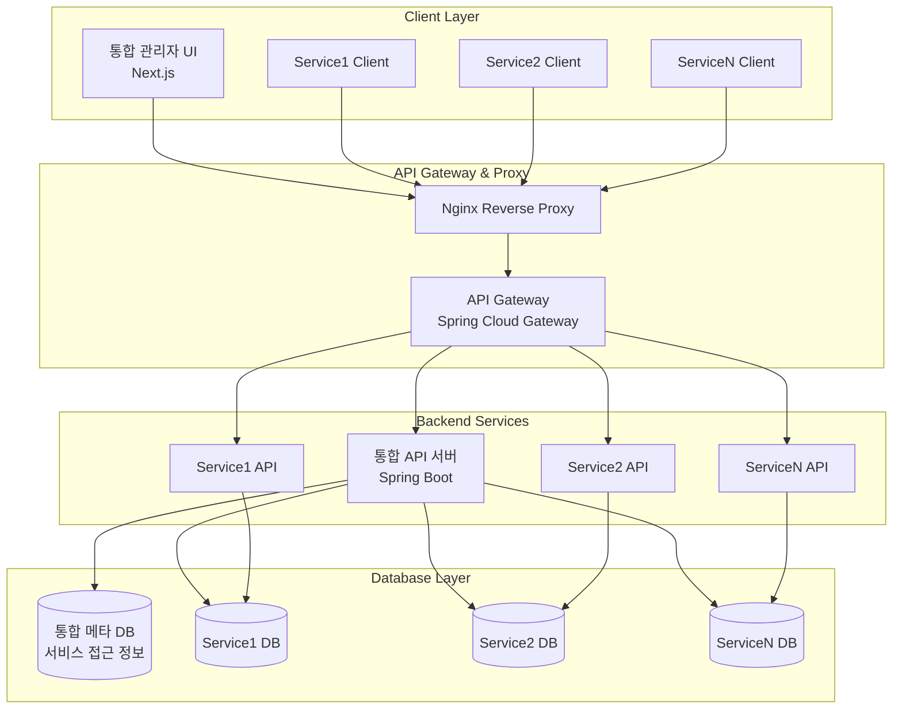
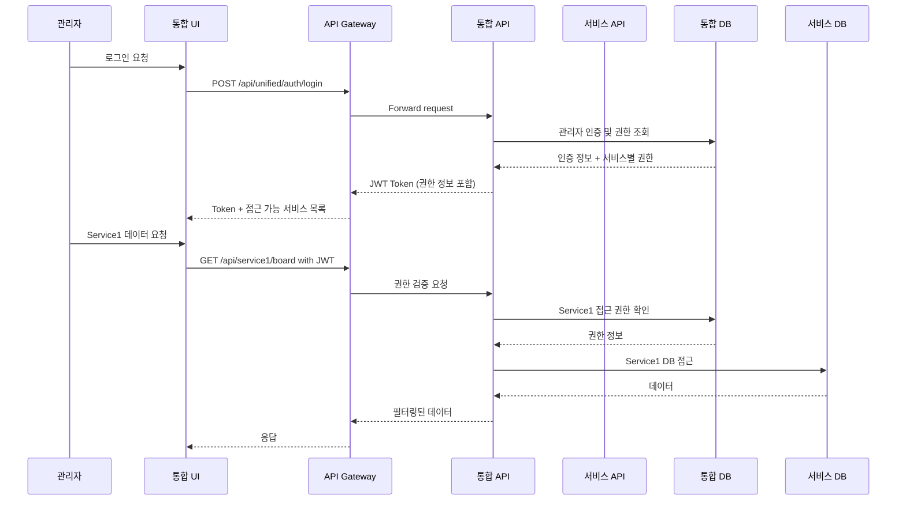

# 통합 CMS 고도화 아키텍처 설계서

## 1. 개요

본 문서는 기존 단일 CMS 시스템을 다중 서비스 통합 관리가 가능한 고도화된 CMS 플랫폼으로 전환하기 위한 아키텍처 설계를 다룹니다.

### 1.1 주요 목표

- **통합 관리**: 여러 CMS 서비스를 하나의 관리자 화면에서 통합 관리
- **서비스 분리**: 각 서비스별 독립적인 데이터베이스와 보안 정책
- **유연한 배포**: 온프레미스 단일 서버 또는 클라우드 다중 서버 지원
- **확장성**: 새로운 서비스 추가 시 최소한의 수정으로 확장 가능

### 1.2 배포 시나리오

- **시나리오 A (온프레미스)**: 단일 서버, 동일 클라이언트 IP
- **시나리오 B (클라우드)**: 다중 서버, 서비스별 독립 IP

---

## 2. 시스템 아키텍처

### 2.1 전체 구성도



### 2.2 핵심 구성 요소

#### 2.2.1 통합 API 서버 (Unified API Server)

- **역할**: 서비스 라우팅, 인증/인가, 통합 관리 기능
- **기술**: Spring Boot + Spring Security + JPA
- **API 패턴**: `/api/unified/` + `/api/service{N}/`

#### 2.2.2 통합 메타 데이터베이스

- **역할**: 서비스 정보, 접근 권한, 관리자 계정 정보 저장
- **암호화**: 개별 DB 접근 정보는 AES-256으로 암호화 저장

#### 2.2.3 서비스별 독립 데이터베이스

- **특징**: 각 서비스만 접근 가능한 독립적인 DB
- **보안**: 서비스별 전용 DB 계정 및 권한

---

## 3. 데이터베이스 설계

### 3.1 통합 메타 데이터베이스 (Master DB)

#### 3.1.1 서비스 관리 테이블

```sql
-- 서비스 정보 테이블
CREATE TABLE SERVICES (
    SERVICE_ID BIGINT PRIMARY KEY AUTO_INCREMENT COMMENT '서비스 고유 ID',
    SERVICE_CODE VARCHAR(50) UNIQUE NOT NULL COMMENT '서비스 코드 (중복 불가)',
    SERVICE_NAME VARCHAR(100) NOT NULL COMMENT '서비스 이름',
    SERVICE_DOMAIN VARCHAR(255) COMMENT '서비스 도메인 (예: https://example.com)',
    API_BASE_URL VARCHAR(255) COMMENT 'API 기본 URL',
    DB_CONNECTION_INFO TEXT COMMENT '암호화된 DB 접속 정보',
    STATUS ENUM('ACTIVE', 'INACTIVE', 'MAINTENANCE') COMMENT '서비스 상태 (활성/비활성/점검)',
    CREATED_BY VARCHAR(36)  NULL COMMENT '생성자 ID',
    CREATED_IP VARCHAR(45)  NULL COMMENT '생성자 IP',
    CREATED_AT TIMESTAMP DEFAULT CURRENT_TIMESTAMP COMMENT '생성 시각',
    UPDATED_BY VARCHAR(36)  NULL COMMENT '수정자 ID',
    UPDATED_IP VARCHAR(45)  NULL COMMENT '수정자 IP',
    UPDATED_AT TIMESTAMP DEFAULT CURRENT_TIMESTAMP ON UPDATE CURRENT_TIMESTAMP COMMENT '수정 시각'
);

-- 관리자 계정 테이블
CREATE TABLE ADMIN_USERS ( 
    ADMIN_ID BIGINT PRIMARY KEY AUTO_INCREMENT COMMENT '관리자 고유 ID',
    USERNAME VARCHAR(50) UNIQUE NOT NULL COMMENT '로그인용 사용자 이름',
    PASSWORD VARCHAR(255) NOT NULL COMMENT 'bcrypt로 해시된 비밀번호',
    EMAIL VARCHAR(100) COMMENT '이메일 주소',
    ROLE ENUM('SUPER_ADMIN', 'SERVICE_ADMIN', 'OPERATOR') COMMENT '관리자 역할',
    STATUS ENUM('ACTIVE', 'INACTIVE') COMMENT '계정 상태 (활성/비활성)',
    CREATED_BY VARCHAR(36)  NULL COMMENT '생성자 ID',
    CREATED_IP VARCHAR(45)  NULL COMMENT '생성자 IP',
    CREATED_AT TIMESTAMP DEFAULT CURRENT_TIMESTAMP COMMENT '생성 시각',
    UPDATED_BY VARCHAR(36)  NULL COMMENT '수정자 ID',
    UPDATED_IP VARCHAR(45)  NULL COMMENT '수정자 IP',
    UPDATED_AT TIMESTAMP DEFAULT CURRENT_TIMESTAMP ON UPDATE CURRENT_TIMESTAMP COMMENT '수정 시각'
);

-- 관리자 서비스 권한 테이블
CREATE TABLE ADMIN_SERVICE_PERMISSIONS (
    PERMISSION_ID BIGINT PRIMARY KEY AUTO_INCREMENT COMMENT '권한 고유 ID',
    ADMIN_ID BIGINT COMMENT '권한을 가진 관리자 ID',
    SERVICE_ID BIGINT COMMENT '대상 서비스 ID',
    PERMISSIONS JSON COMMENT '서비스별 기능 권한 JSON (예: {"board": ["read", "write"]})',
    GRANTED_AT TIMESTAMP DEFAULT CURRENT_TIMESTAMP COMMENT '권한 부여 일시',
    GRANTED_BY BIGINT COMMENT '권한 부여한 관리자 ID',
    CREATED_BY VARCHAR(36)  NULL COMMENT '생성자 ID',
    CREATED_IP VARCHAR(45)  NULL COMMENT '생성자 IP',
    CREATED_AT TIMESTAMP DEFAULT CURRENT_TIMESTAMP COMMENT '생성 시각',
    UPDATED_BY VARCHAR(36)  NULL COMMENT '수정자 ID',
    UPDATED_IP VARCHAR(45)  NULL COMMENT '수정자 IP',
    UPDATED_AT TIMESTAMP DEFAULT CURRENT_TIMESTAMP ON UPDATE CURRENT_TIMESTAMP COMMENT '수정 시각',
    FOREIGN KEY (ADMIN_ID) REFERENCES ADMIN_USERS(ADMIN_ID),
    FOREIGN KEY (SERVICE_ID) REFERENCES SERVICES(SERVICE_ID),
    FOREIGN KEY (GRANTED_BY) REFERENCES ADMIN_USERS(ADMIN_ID)
);
```

#### 3.1.2 통합 관리 테이블

```sql
-- 통합 게시글 관리 뷰
CREATE TABLE UNIFIED_CONTENT_MANAGEMENT (
    CONTENT_ID BIGINT PRIMARY KEY AUTO_INCREMENT COMMENT '통합 콘텐츠 ID',
    SERVICE_ID BIGINT COMMENT '원본 서비스 ID',
    ORIGINAL_CONTENT_ID BIGINT COMMENT '원본 콘텐츠 ID (서비스 내 콘텐츠)',
    CONTENT_TYPE ENUM('BOARD', 'POPUP', 'CONTENT', 'MENU') COMMENT '콘텐츠 유형',
    TITLE VARCHAR(255) COMMENT '콘텐츠 제목',
    STATUS VARCHAR(50) COMMENT '콘텐츠 상태 (예: 게시, 임시저장 등)',
    AUTHOR VARCHAR(100) COMMENT '작성자',
    LAST_SYNCED_AT TIMESTAMP DEFAULT CURRENT_TIMESTAMP ON UPDATE CURRENT_TIMESTAMP COMMENT '최종 동기화 시각',
    CREATED_BY VARCHAR(36)  NULL COMMENT '생성자 ID',
    CREATED_IP VARCHAR(45)  NULL COMMENT '생성자 IP',
    CREATED_AT TIMESTAMP DEFAULT CURRENT_TIMESTAMP COMMENT '생성 시각',
    UPDATED_BY VARCHAR(36)  NULL COMMENT '수정자 ID',
    UPDATED_IP VARCHAR(45)  NULL COMMENT '수정자 IP',
    UPDATED_AT TIMESTAMP DEFAULT CURRENT_TIMESTAMP ON UPDATE CURRENT_TIMESTAMP COMMENT '수정 시각',
    FOREIGN KEY (SERVICE_ID) REFERENCES SERVICES(SERVICE_ID)
);

-- 통합 활동 로그
CREATE TABLE UNIFIED_ACTIVITY_LOGS (
    LOG_ID BIGINT PRIMARY KEY AUTO_INCREMENT COMMENT '로그 고유 ID',
    ADMIN_ID BIGINT COMMENT '작업한 관리자 ID',
    SERVICE_ID BIGINT COMMENT '대상 서비스 ID',
    ACTION VARCHAR(100) COMMENT '실행된 작업명 (예: update, delete)',
    TARGET_TYPE VARCHAR(50) COMMENT '대상 객체 유형 (예: BOARD, MENU)',
    TARGET_ID BIGINT COMMENT '대상 객체 ID',
    DETAILS JSON COMMENT '작업 상세 내역(JSON)',
    IP_ADDRESS VARCHAR(45) COMMENT '요청자 IP 주소',
    CREATED_BY VARCHAR(36)  NULL COMMENT '생성자 ID',
    CREATED_IP VARCHAR(45)  NULL COMMENT '생성자 IP',
    CREATED_AT TIMESTAMP DEFAULT CURRENT_TIMESTAMP COMMENT '생성 시각',
    UPDATED_BY VARCHAR(36)  NULL COMMENT '수정자 ID',
    UPDATED_IP VARCHAR(45)  NULL COMMENT '수정자 IP',
    UPDATED_AT TIMESTAMP DEFAULT CURRENT_TIMESTAMP ON UPDATE CURRENT_TIMESTAMP COMMENT '수정 시각',
    FOREIGN KEY (ADMIN_ID) REFERENCES ADMIN_USERS(ADMIN_ID),
    FOREIGN KEY (SERVICE_ID) REFERENCES SERVICES(SERVICE_ID)
);
```

### 3.2 개별 서비스 데이터베이스

각 서비스는 기존 CMS 구조를 유지하되, 통합 관리를 위한 메타데이터 추가:

```sql
-- 기존 테이블에 통합 관리용 컬럼 추가
ALTER TABLE BOARD_ARTICLES 
    ADD COLUMN UNIFIED_SYNC_FLAG BOOLEAN DEFAULT FALSE COMMENT '통합 콘텐츠 동기화 여부',
    ADD COLUMN UNIFIED_LAST_SYNC TIMESTAMP NULL COMMENT '통합 콘텐츠 최종 동기화 시각';

-- 서비스별 관리자 매핑 테이블
CREATE TABLE SERVICE_ADMIN_MAPPING (
    MAPPING_ID BIGINT PRIMARY KEY AUTO_INCREMENT COMMENT '매핑 고유 ID',
    UNIFIED_ADMIN_ID BIGINT COMMENT '통합 DB 기준 ADMIN_USERS의 ADMIN_ID',
    LOCAL_ADMIN_ID BIGINT COMMENT '서비스 DB 기준 관리자 ID',
    PERMISSIONS JSON COMMENT '해당 관리자에 대한 권한 정보(JSON)',
    CREATED_AT TIMESTAMP DEFAULT CURRENT_TIMESTAMP COMMENT '생성 시각'
);
```

---

## 4. API 설계

### 4.1 API 구조

#### 4.1.1 통합 관리 API (`/api/unified/`)

```yaml
# 서비스 관리
GET    /api/unified/services                    # 서비스 목록 조회
POST   /api/unified/services                    # 새 서비스 등록
PUT    /api/unified/services/{serviceId}        # 서비스 정보 수정
DELETE /api/unified/services/{serviceId}        # 서비스 삭제

# 통합 컨텐츠 관리
GET    /api/unified/content                     # 모든 서비스 컨텐츠 통합 조회
GET    /api/unified/content/sync                # 서비스별 컨텐츠 동기화
POST   /api/unified/content/bulk-action         # 일괄 작업 (삭제, 상태 변경 등)

# 통합 팝업 관리
GET    /api/unified/popups                      # 모든 서비스 팝업 통합 조회
POST   /api/unified/popups/bulk-action          # 팝업 일괄 관리

# 관리자 권한 관리
GET    /api/unified/admins                      # 관리자 목록
POST   /api/unified/admins                      # 관리자 생성
PUT    /api/unified/admins/{adminId}/permissions # 권한 설정
```

#### 4.1.2 서비스별 API (`/api/service{N}/`)

```yaml
# 기존 CMS API를 서비스별로 분리
GET    /api/service1/board/articles             # Service1의 게시글
POST   /api/service1/board/articles             # Service1에 게시글 작성
GET    /api/service2/board/articles             # Service2의 게시글
POST   /api/service2/board/articles             # Service2에 게시글 작성

# 각 서비스는 독립적인 인증/인가
# 통합 API에서 적절한 서비스로 라우팅
```

### 4.2 인증/인가 플로우



---

## 5. 통합 프론트엔드 설계

### 5.1 컴포넌트 구조

```typescript
// 통합 관리 페이지 구조
/src/app/unified/
├── dashboard/                    // 통합 대시보드
│   ├── page.tsx                 // 모든 서비스 종합 현황
│   └── components/
│       ├── ServiceSummaryCard.tsx
│       ├── UnifiedMetrics.tsx
│       └── AlertPanel.tsx
├── content/                     // 통합 컨텐츠 관리
│   ├── page.tsx                // 모든 서비스 컨텐츠 일괄 관리
│   └── components/
│       ├── ContentUnifiedTable.tsx
│       ├── BulkActionPanel.tsx
│       └── ServiceFilter.tsx
├── popup/                      // 통합 팝업 관리
├── admin/                      // 관리자 관리
│   ├── page.tsx               // 관리자 계정 및 권한 관리
│   └── components/
│       ├── AdminList.tsx
│       ├── PermissionMatrix.tsx
│       └── ServiceAccessControl.tsx
└── settings/                   // 서비스 설정
    ├── page.tsx               // 서비스 등록/수정/삭제
    └── components/
        ├── ServiceRegistration.tsx
        ├── DatabaseConnectionTest.tsx
        └── ServiceHealthCheck.tsx
```

### 5.2 핵심 기능 컴포넌트

#### 5.2.1 통합 대시보드

```typescript
// UnifiedDashboard.tsx
interface UnifiedMetrics {
  totalServices: number;
  totalContents: number;
  activePopups: number;
  todayActiveUsers: number;
  systemHealth: "HEALTHY" | "WARNING" | "ERROR";
  serviceStatuses: ServiceStatus[];
}

export function UnifiedDashboard() {
  const { data: metrics } = useUnifiedMetrics();
  const { data: services } = useServices();

  return (
    <Grid templateColumns="repeat(4, 1fr)" gap={6}>
      <MetricCard title="총 서비스" value={metrics.totalServices} />
      <MetricCard title="총 컨텐츠" value={metrics.totalContents} />
      <MetricCard title="활성 팝업" value={metrics.activePopups} />
      <MetricCard title="오늘 사용자" value={metrics.todayActiveUsers} />

      <GridItem colSpan={4}>
        <ServiceHealthPanel services={services} />
      </GridItem>

      <GridItem colSpan={2}>
        <ContentDistributionChart />
      </GridItem>

      <GridItem colSpan={2}>
        <RecentActivityFeed />
      </GridItem>
    </Grid>
  );
}
```

#### 5.2.2 권한 관리 매트릭스

```typescript
// PermissionMatrix.tsx
interface PermissionMatrixProps {
  adminId: number;
  services: Service[];
  permissions: AdminPermission[];
  onPermissionChange: (
    serviceId: number,
    module: string,
    actions: string[]
  ) => void;
}

export function PermissionMatrix({
  adminId,
  services,
  permissions,
  onPermissionChange,
}: PermissionMatrixProps) {
  const modules = ["board", "content", "popup", "menu", "user"];
  const actions = ["read", "write", "delete", "publish"];

  return (
    <Table>
      <Thead>
        <Tr>
          <Th>서비스</Th>
          {modules.map((module) => (
            <Th key={module}>{module}</Th>
          ))}
        </Tr>
      </Thead>
      <Tbody>
        {services.map((service) => (
          <Tr key={service.id}>
            <Td>{service.name}</Td>
            {modules.map((module) => (
              <Td key={module}>
                <PermissionCheckboxGroup
                  serviceId={service.id}
                  module={module}
                  availableActions={actions}
                  currentPermissions={getPermissions(
                    permissions,
                    service.id,
                    module
                  )}
                  onChange={(actions) =>
                    onPermissionChange(service.id, module, actions)
                  }
                />
              </Td>
            ))}
          </Tr>
        ))}
      </Tbody>
    </Table>
  );
}
```

---

## 6. 보안 및 접근 제어

### 6.1 다중 레벨 보안

#### 6.1.1 네트워크 레벨

```nginx
# Nginx 설정 - IP 기반 접근 제어
server {
    listen 443 ssl;
    server_name unified-cms.domain.com;

    # 관리자 IP만 허용
    allow 192.168.1.0/24;
    allow 10.0.0.0/8;
    deny all;

    location /api/unified/ {
        proxy_pass http://unified-api:8080;
        proxy_set_header X-Real-IP $remote_addr;
        proxy_set_header X-Forwarded-For $proxy_add_x_forwarded_for;
    }

    location /api/service1/ {
        auth_request /auth-service1;
        proxy_pass http://service1-api:8081;
    }
}
```

#### 6.1.2 애플리케이션 레벨

```java
// 통합 보안 설정
@Configuration
@EnableWebSecurity
public class UnifiedSecurityConfig {

    @Bean
    public SecurityFilterChain unifiedFilterChain(HttpSecurity http) throws Exception {
        return http
            .securityMatcher("/api/unified/**")
            .authorizeHttpRequests(auth -> auth
                .requestMatchers("/api/unified/auth/**").permitAll()
                .requestMatchers("/api/unified/admin/**").hasRole("SUPER_ADMIN")
                .requestMatchers("/api/unified/**").hasAnyRole("SUPER_ADMIN", "SERVICE_ADMIN")
                .anyRequest().authenticated()
            )
            .oauth2ResourceServer(oauth2 -> oauth2.jwt(withDefaults()))
            .build();
    }
}

// 서비스별 보안 설정
@Component
public class ServiceSecurityManager {

    public boolean hasServicePermission(String adminId, String serviceCode, String module, String action) {
        // 통합 DB에서 권한 조회
        AdminServicePermission permission = permissionRepository
            .findByAdminIdAndServiceCode(adminId, serviceCode);

        if (permission == null) return false;

        Map<String, List<String>> permissions = permission.getPermissions();
        List<String> modulePermissions = permissions.get(module);

        return modulePermissions != null && modulePermissions.contains(action);
    }
}
```

### 6.2 데이터베이스 접근 제어

#### 6.2.1 암호화된 연결 정보 관리

```java
@Service
public class DatabaseConnectionService {

    @Autowired
    private EncryptionService encryptionService;

    public DataSource getServiceDataSource(String serviceCode) {
        Service service = serviceRepository.findByServiceCode(serviceCode);

        // 암호화된 연결 정보 복호화
        String decryptedConnectionInfo = encryptionService.decrypt(service.getDbConnectionInfo());
        DatabaseConnectionInfo dbInfo = JsonUtils.fromJson(decryptedConnectionInfo, DatabaseConnectionInfo.class);

        // 동적 DataSource 생성
        HikariConfig config = new HikariConfig();
        config.setJdbcUrl(dbInfo.getJdbcUrl());
        config.setUsername(dbInfo.getUsername());
        config.setPassword(dbInfo.getPassword());
        config.setMaximumPoolSize(5); // 서비스별 제한

        return new HikariDataSource(config);
    }
}
```

#### 6.2.2 계정별 권한 분리

```sql
-- 서비스별 데이터베이스 계정 생성
CREATE USER 'service1_readonly'@'%' IDENTIFIED BY 'secure_password1';
CREATE USER 'service1_admin'@'%' IDENTIFIED BY 'secure_password2';

-- 읽기 전용 권한
GRANT SELECT ON service1_db.* TO 'service1_readonly'@'%';

-- 관리자 권한 (CRUD)
GRANT SELECT, INSERT, UPDATE, DELETE ON service1_db.* TO 'service1_admin'@'%';

-- 서비스 간 접근 차단
REVOKE ALL ON service2_db.* FROM 'service1_readonly'@'%';
REVOKE ALL ON service2_db.* FROM 'service1_admin'@'%';
```

---

## 7. 구현 로드맵

### 7.1 Phase 1: 기반 구조 구축 (4주)

1. **통합 메타 데이터베이스 설계 및 구축**

   - 서비스 등록 테이블
   - 관리자 권한 관리 테이블
   - 암호화 시스템 구현

2. **API Gateway 구현**

   - Spring Cloud Gateway 설정
   - 라우팅 규칙 정의
   - 인증/인가 필터 구현

3. **기본 통합 API 구현**
   - 서비스 등록/관리 API
   - 관리자 인증/권한 API
   - 헬스체크 API

### 7.2 Phase 2: 통합 관리 기능 구현 (6주)

1. **통합 프론트엔드 구현**

   - 통합 대시보드
   - 서비스 관리 화면
   - 관리자 권한 관리 화면

2. **통합 컨텐츠 관리**

   - 게시글 일괄 관리
   - 팝업 통합 관리
   - 메뉴 통합 관리

3. **권한 관리 시스템**
   - 세분화된 권한 제어
   - 권한 매트릭스 UI
   - 활동 로그 시스템

### 7.3 Phase 3: 고급 기능 및 최적화 (4주)

1. **성능 최적화**

   - 데이터베이스 연결 풀 최적화
   - 캐싱 시스템 도입 (Redis)
   - 비동기 처리 개선

2. **모니터링 및 알림**

   - 서비스 헬스체크 자동화
   - 장애 감지 및 알림
   - 성능 메트릭 수집

3. **보안 강화**
   - 2FA 인증 도입
   - 감사 로그 강화
   - 침입 탐지 시스템

---

## 8. 기존 코드 마이그레이션 가이드

### 8.1 백엔드 마이그레이션

#### 8.1.1 기존 Controller 수정

```java
// 기존 코드
@RestController
@RequestMapping("/cms/content")
public class ContentController {
    // ...
}

// 수정된 코드
@RestController
@RequestMapping("/api/{serviceCode}/content")
public class ServiceContentController {

    @Autowired
    private ServiceSecurityManager securityManager;

    @Autowired
    private DynamicDataSourceService dataSourceService;

    @GetMapping
    public ResponseEntity<Page<ContentDto>> getContents(
            @PathVariable String serviceCode,
            Pageable pageable,
            Authentication auth) {

        // 권한 체크
        if (!securityManager.hasServicePermission(auth.getName(), serviceCode, "content", "read")) {
            throw new AccessDeniedException("No permission for this service");
        }

        // 동적 데이터소스 설정
        try (DataSourceContext context = dataSourceService.setDataSource(serviceCode)) {
            Page<ContentDto> contents = contentService.getContents(pageable);
            return ResponseEntity.ok(contents);
        }
    }
}
```

#### 8.1.2 동적 데이터소스 구현

```java
@Component
public class DynamicDataSourceService {

    private final Map<String, DataSource> dataSourceCache = new ConcurrentHashMap<>();

    public DataSourceContext setDataSource(String serviceCode) {
        DataSource dataSource = getOrCreateDataSource(serviceCode);
        DataSourceContextHolder.setDataSource(dataSource);
        return new DataSourceContext();
    }

    private DataSource getOrCreateDataSource(String serviceCode) {
        return dataSourceCache.computeIfAbsent(serviceCode, this::createDataSource);
    }

    // DataSourceContext - try-with-resources 지원
    public static class DataSourceContext implements AutoCloseable {
        @Override
        public void close() {
            DataSourceContextHolder.clearDataSource();
        }
    }
}
```

### 8.2 프론트엔드 마이그레이션

#### 8.2.1 API 클라이언트 수정

```typescript
// 기존 API 클라이언트
const contentApi = {
  getContents: () => axios.get("/cms/content"),
  createContent: (data) => axios.post("/cms/content", data),
};

// 수정된 API 클라이언트
const createServiceApi = (serviceCode: string) => ({
  content: {
    getContents: () => axios.get(`/api/${serviceCode}/content`),
    createContent: (data) => axios.post(`/api/${serviceCode}/content`, data),
  },
  board: {
    getArticles: () => axios.get(`/api/${serviceCode}/board/articles`),
    createArticle: (data) =>
      axios.post(`/api/${serviceCode}/board/articles`, data),
  },
});

// 서비스별 API 인스턴스 생성
export const service1Api = createServiceApi("service1");
export const service2Api = createServiceApi("service2");

// 통합 API
export const unifiedApi = {
  services: {
    getAll: () => axios.get("/api/unified/services"),
    create: (data) => axios.post("/api/unified/services", data),
  },
  content: {
    getUnified: () => axios.get("/api/unified/content"),
    bulkAction: (action, ids) =>
      axios.post("/api/unified/content/bulk-action", { action, ids }),
  },
};
```

#### 8.2.2 권한 기반 UI 렌더링

```typescript
// 권한 기반 컴포넌트
interface ServicePermissionProps {
  serviceCode: string;
  module: string;
  action: string;
  children: React.ReactNode;
}

export function ServicePermission({
  serviceCode,
  module,
  action,
  children,
}: ServicePermissionProps) {
  const { permissions } = useAuth();

  const hasPermission = permissions
    ?.find((p) => p.serviceCode === serviceCode)
    ?.modules[module]?.includes(action);

  if (!hasPermission) return null;

  return <>{children}</>;
}

// 사용 예시
<ServicePermission serviceCode="service1" module="content" action="write">
  <Button onClick={handleCreateContent}>새 컨텐츠 작성</Button>
</ServicePermission>;
```

---

## 9. 결론

이 통합 CMS 고도화 아키텍처는 다음과 같은 핵심 가치를 제공합니다:

1. **확장성**: 새로운 서비스 추가 시 최소한의 수정
2. **보안성**: 다중 레벨 보안 및 서비스별 격리
3. **유연성**: 온프레미스/클라우드 다양한 배포 환경 지원
4. **관리효율성**: 통합 관리 화면을 통한 운영 효율 극대화
5. **기존 호환성**: 기존 CMS 기능의 점진적 마이그레이션 지원

이 설계를 통해 기존 CMS의 장점을 유지하면서도, 다중 서비스 환경에서의 통합 관리가 가능한 차세대 CMS 플랫폼을 구축할 수 있습니다.
