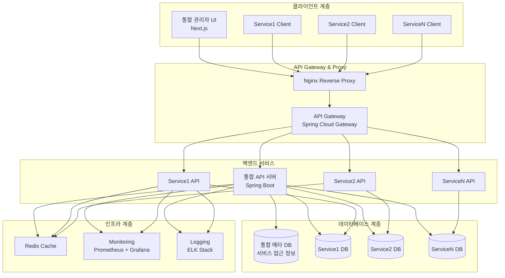
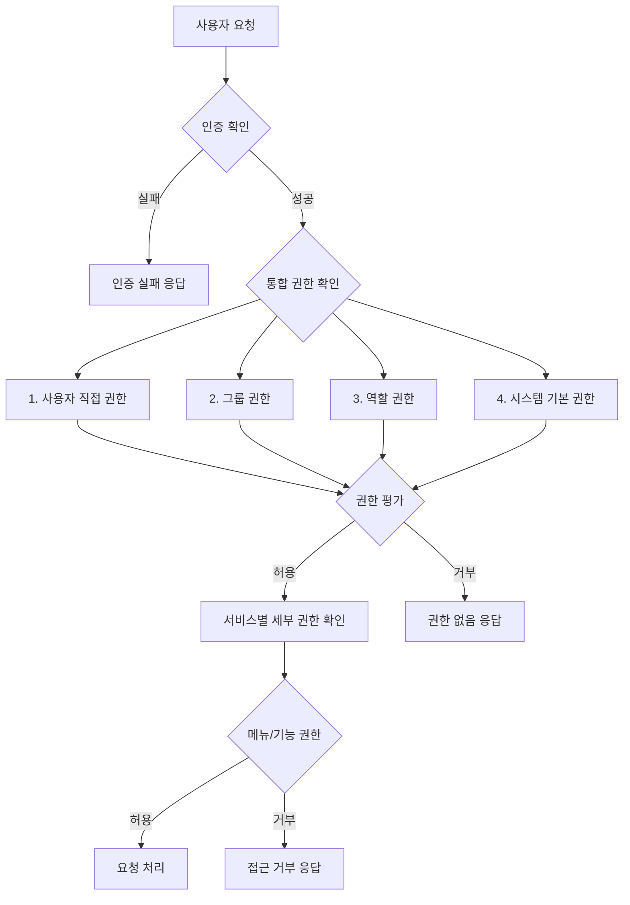

# 통합 CMS 시스템 개요

## 📋 문서 정보

- **문서명**: 통합 CMS 시스템 개요
- **버전**: 2.0.0
- **최종 수정일**: 2024-03-25
- **상태**: 최신

---

## 1. 프로젝트 개요

### 1.1 시스템 목적

본 문서는 기존 단일 CMS 시스템을 **다중 서비스 통합 관리**가 가능한 고도화된 CMS 플랫폼으로 전환하기 위한 전체 시스템 개요를 제공합니다.

#### 🎯 핵심 목표

- **통합 관리**: 여러 CMS 서비스를 하나의 관리자 화면에서 통합 관리
- **서비스 분리**: 각 서비스별 독립적인 데이터베이스와 보안 정책
- **유연한 배포**: 온프레미스 단일 서버 또는 클라우드 다중 서버 지원
- **확장성**: 새로운 서비스 추가 시 최소한의 수정으로 확장 가능

#### 📊 기대 효과

- **운영 효율성**: 관리 작업 시간 50% 감소, 장애 대응 시간 60% 단축
- **보안 강화**: 보안 사고 위험 70% 감소, 규정 준수율 100% 달성
- **사용자 경험**: 서비스 가용성 99.9% 달성, 응답 시간 40% 개선

### 1.2 시스템 특징

#### 🏗️ 아키텍처 특징

- **마이크로서비스 아키텍처**: 서비스별 독립적 운영 및 확장
- **API Gateway 패턴**: 통합된 API 라우팅 및 인증
- **CQRS + Event Sourcing**: 명령/쿼리 분리 및 이벤트 기반 상태 관리
- **Multi-tenancy**: 서비스별 격리된 데이터 및 보안 경계

#### 🔐 보안 특징

- **Zero Trust Architecture**: 모든 접근에 대한 검증 및 최소 권한 원칙
- **RBAC + ABAC 하이브리드**: 역할 기반 + 속성 기반 접근 제어
- **End-to-End Encryption**: 데이터 전송 및 저장 시 암호화
- **Security Audit Trail**: 모든 보안 관련 활동 추적 및 감사

---

## 2. 시스템 아키텍처

### 2.1 전체 구성도



### 2.2 핵심 구성 요소

#### 🛡️ 통합 API 서버 (Unified API Server)

- **역할**: 서비스 라우팅, 인증/인가, 통합 관리 기능
- **기술**: Spring Boot + Spring Security + JPA
- **API 패턴**: `/api/unified/` + `/api/{serviceCode}/`
- **특징**:
  - 동적 데이터소스 관리
  - JWT 기반 인증
  - RBAC + ABAC 하이브리드 권한 시스템

#### 🗄️ 통합 메타 데이터베이스

- **역할**: 서비스 정보, 세분화된 권한 관리, 관리자 계정 및 그룹 정보 저장
- **암호화**: 개별 DB 접근 정보는 AES-256으로 암호화 저장
- **권한 시스템**: RBAC + ABAC 하이브리드 모델로 사용자/그룹/역할/메뉴/기능별 세분화된 권한 관리

#### 🔒 서비스별 독립 데이터베이스

- **특징**: 각 서비스만 접근 가능한 독립적인 DB
- **보안**: 서비스별 전용 DB 계정 및 권한
- **격리**: 서비스 간 데이터 접근 완전 차단

---

## 3. 핵심 기능

### 3.1 통합 관리 기능

#### 📊 통합 대시보드

- **실시간 모니터링**: 서비스별 상태, 사용자 활동, 성능 지표
- **통계 분석**: KPI 대시보드, 트렌드 분석, 이상 탐지
- **알림 센터**: 시스템 이벤트, 장애 알림, 작업 완료 통지

#### 🗂️ 통합 컨텐츠 관리

- **게시글 일괄 관리**: 서비스 전체 게시글 조회/수정/삭제
- **팝업 통합 관리**: 전체 서비스 팝업 스케줄링 및 관리
- **메뉴 통합 관리**: 서비스별 메뉴 구조 통합 관리

#### 👥 고급 관리자 관리

- **세분화된 권한 제어**: 사용자/그룹/역할/메뉴/기능별 권한
- **계층적 권한 구조**: 그룹 기반 권한 상속
- **동적 권한 할당**: 실시간 권한 변경 및 적용

### 3.2 권한 관리 시스템

#### 🔐 RBAC + ABAC 하이브리드 모델



#### 🎭 권한 계층 구조

1. **시스템 권한** > 서비스 권한 > 그룹 권한 > 사용자 권한
2. **상위 그룹**의 권한은 **하위 그룹**에 상속
3. **명시적 거부(DENY)**는 **허용(ALLOW)**보다 우선

---

## 4. 기술 스택

### 4.1 백엔드 기술 스택

```yaml
Framework: Spring Boot 3.x
Security: Spring Security 6.x
Data Access: JPA/Hibernate + HikariCP
API Gateway: Spring Cloud Gateway
Authentication: JWT + OAuth2
Caching: Redis + Caffeine
Database: MariaDB/MySQL 8.x
Message Queue: RabbitMQ (선택)
```

### 4.2 프론트엔드 기술 스택

```yaml
Framework: Next.js 14 (App Router)
UI Library: React 18 + Chakra UI
State Management: TanStack Query + Zustand
Form Management: React Hook Form
Charts: Chart.js + Recharts
Type Safety: TypeScript 5.x
```

### 4.3 인프라 기술 스택

```yaml
Reverse Proxy: Nginx
Containerization: Docker + Docker Compose
Orchestration: Kubernetes (선택)
Monitoring: Prometheus + Grafana
Logging: ELK Stack / Loki
CI/CD: GitHub Actions
```

---

## 5. 배포 시나리오

### 5.1 시나리오 A: 온프레미스 통합 배포

- **환경**: 단일 서버, 동일한 클라이언트 IP
- **용도**: 기업 내부 통합 관리, 소규모 서비스 운영
- **장점**: 관리 단순성, 네트워크 비용 절감

### 5.2 시나리오 B: 클라우드 분산 배포

- **환경**: 다중 서버, 서비스별 독립 IP
- **용도**: 대규모 서비스, 고가용성 요구사항
- **장점**: 확장성, 장애 격리, 성능 최적화

---

## 6. 보안 및 운영

### 6.1 다중 레벨 보안

#### 🛡️ 보안 계층

1. **네트워크 레벨**: IP 기반 접근 제어, HTTPS 강제
2. **애플리케이션 레벨**: JWT 토큰, 권한 기반 접근 제어
3. **데이터베이스 레벨**: 암호화된 연결 정보, 계정별 권한 분리

#### 🔐 데이터 암호화

- **DB 연결 정보**: AES-256-GCM 암호화
- **민감 정보**: 애플리케이션 레벨 암호화
- **통신**: TLS 1.3 적용

### 6.2 운영 및 모니터링

#### 📊 모니터링 전략

- **애플리케이션 모니터링**: 성능, 에러율, 응답시간
- **인프라 모니터링**: CPU, 메모리, 디스크, 네트워크
- **비즈니스 모니터링**: 사용자 활동, 콘텐츠 동기화 상태

#### 🚨 알림 시스템

- **즉시 알림**: 시스템 장애, 보안 위협
- **일일 리포트**: 성능 통계, 사용량 분석
- **주간 리포트**: 트렌드 분석, 용량 계획

---

## 7. 구현 로드맵

### 7.1 Phase 1: 기반 구조 (4주)

- ✅ 통합 메타 데이터베이스 설계 및 구축
- ✅ API Gateway 구현
- ✅ 기본 통합 API 구현

### 7.2 Phase 2: 통합 관리 기능 (6주)

- 🔄 통합 프론트엔드 구현
- 🔄 통합 컨텐츠 관리
- 🔄 권한 관리 시스템

### 7.3 Phase 3: 고급 기능 및 최적화 (4주)

- ⏳ 성능 최적화
- ⏳ 모니터링 및 알림
- ⏳ 보안 강화

---

## 8. 관련 문서

### 📚 상세 설계 문서

- **[02-unified-cms-architecture.md](./02-unified-cms-architecture.md)** - 상세한 시스템 아키텍처
- **[03-unified-cms-database-design.md](./03-unified-cms-database-design.md)** - 전체 테이블 DDL 및 설계
- **[04-unified-cms-api-specification.md](./04-unified-cms-api-specification.md)** - REST API 명세 및 인증
- **[05-unified-cms-frontend-specification.md](./05-unified-cms-frontend-specification.md)** - UI/UX 설계 및 성능 최적화
- **[06-unified-cms-permission-system.md](./06-unified-cms-permission-system.md)** - 고급 권한 시스템

### 🔧 구현 가이드

- **[07-unified-cms-implementation-guide.md](./07-unified-cms-implementation-guide.md)** - 단계별 구현 방법
- **[08-unified-cms-deployment-guide.md](./08-unified-cms-deployment-guide.md)** - 배포 및 운영
- **[09-unified-cms-migration-guide.md](./09-unified-cms-migration-guide.md)** - 기존 코드 전환 전략

### 📊 품질 보증

- **[10-unified-cms-testing-performance.md](./10-unified-cms-testing-performance.md)** - 테스트 전략 및 성능 최적화
- **[11-unified-cms-monitoring-logging.md](./11-unified-cms-monitoring-logging.md)** - 운영 모니터링

---

## 9. 결론

이 통합 CMS 시스템은 **확장성**, **보안성**, **유연성**, **관리효율성**을 핵심 가치로 하여 설계되었습니다.

### 🎯 핵심 장점

1. **통합 관리**: 여러 CMS 서비스의 중앙 집중식 관리
2. **보안 강화**: RBAC + ABAC 하이브리드 권한 모델
3. **유연한 배포**: 온프레미스/클라우드 다양한 환경 지원
4. **성능 최적화**: 캐싱, 비동기 처리, 데이터베이스 최적화

### 🚀 향후 발전 방향

- **AI 기반 이상 탐지**: 머신러닝을 활용한 보안 위협 감지
- **자동화 확장**: Auto-scaling 및 자동 장애 복구
- **고급 분석**: 비즈니스 인텔리전스 및 예측 분석

이 시스템을 통해 기존 CMS의 장점을 유지하면서도, 다중 서비스 환경에서의 통합 관리가 가능한 차세대 CMS 플랫폼을 구축할 수 있습니다.

---

## 부록

### A. 문서 이력

| 버전  | 날짜       | 작성자     | 변경 내용                |
| ----- | ---------- | ---------- | ------------------------ |
| 1.0.0 | 2024-03-01 | 아키텍처팀 | 초기 버전 작성           |
| 1.1.0 | 2024-03-15 | 아키텍처팀 | 데이터베이스 설계 상세화 |
| 1.2.0 | 2024-03-20 | 아키텍처팀 | API 설계 및 보안 정책    |
| 2.0.0 | 2024-03-25 | 아키텍처팀 | 문서 구조 개선 및 통합   |

### B. 용어 정리

| 용어        | 설명                                                           |
| ----------- | -------------------------------------------------------------- |
| RBAC        | Role-Based Access Control, 역할 기반 접근 제어                 |
| ABAC        | Attribute-Based Access Control, 속성 기반 접근 제어            |
| CMS         | Content Management System, 콘텐츠 관리 시스템                  |
| API Gateway | 다중 서비스의 API를 통합 관리하는 중앙 게이트웨이              |
| CI/CD       | Continuous Integration/Continuous Deployment, 지속적 통합/배포 |

### C. 참고 문서

1. [Spring Boot Documentation](https://spring.io/projects/spring-boot)
2. [Next.js Documentation](https://nextjs.org/docs)
3. [Docker Documentation](https://docs.docker.com/)
4. [OWASP 보안 가이드라인](https://owasp.org/www-project-web-security-testing-guide/)
