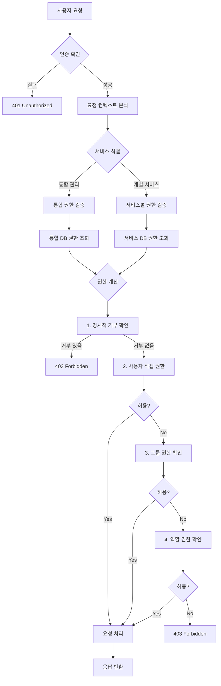

# 통합 CMS 고급 권한 시스템

## 📋 문서 정보

- **문서명**: 통합 CMS 고급 권한 시스템
- **버전**: 2.0.0
- **최종 수정일**: 2024-03-25
- **상태**: 최신

---

## 1. 시스템 개요

### 1.1 설계 목표

통합 CMS에서는 개별 사이트와 통합 관리 사이트 모두에서 유연하고 세분화된 관리자 권한 관리가 필요합니다. 이를 위해 **RBAC (Role-Based Access Control)** + **ABAC (Attribute-Based Access Control)** 하이브리드 모델을 채택합니다.

### 1.2 핵심 요구사항

#### 1.2.1 개별 사이트 관리자 관리

- ❌ **사이트 선택 불가능** (해당 사이트만 관리)
- ✅ **사용자 선택 가능**
- ✅ **메뉴 선택 가능**
- ✅ **메뉴 내 주요 기능 권한 지정 가능**

#### 1.2.2 통합 사이트 관리자 관리

- ✅ **사이트 선택 가능** (모든 개별 사이트 + 통합 관리 사이트)
- ✅ **사용자 선택 가능**
- ✅ **메뉴 선택 가능**
- ✅ **메뉴 내 주요 기능 권한 지정 가능**
- ✅ **개별 사이트 관리자의 권한까지 설정 가능**

### 1.3 권한 모델 구조

```
통합 관리자 (SUPER_ADMIN)
    ├── 개별 서비스 관리 권한
    ├── 통합 시스템 관리 권한
    └── 타 관리자 권한 설정 권한

개별 서비스 관리자 (SERVICE_ADMIN)
    ├── 해당 서비스만 관리 권한
    └── 서비스 내 사용자 권한 설정

일반 관리자 (OPERATOR)
    └── 할당된 메뉴/기능만 접근 권한
```

### 1.4 권한 검증 우선순위

1. **명시적 거부 권한** (DENY) - 최우선, 모든 다른 권한을 무효화
2. **개별 사용자 명시적 허용 권한** (USER ALLOW)
3. **그룹을 통한 허용 권한** (GROUP ALLOW)
4. **역할 기반 기본 권한** (ROLE PERMISSION)
5. **기본 거부** (권한 없음)

---

## 2. 메뉴 권한 관리

### 2.1 메뉴 권한 시스템

#### 권한 구조

1. **시스템 레벨**
   - `MENU_SYSTEM_MANAGE`: 전체 관리
   - `MENU_SERVICE_MANAGE`: 서비스별 관리
   - `MENU_SYNC_MANAGE`: 동기화 관리

2. **관리 레벨**
   - `MENU_MANAGE`: 전체 접근
   - `MENU_CREATE`: 생성
   - `MENU_READ`: 조회
   - `MENU_UPDATE`: 수정
   - `MENU_DELETE`: 삭제
   - `MENU_POSITION`: 위치 변경

3. **동적 권한**
   - `MENU_{CODE}_ACCESS`: 접근
   - `MENU_{CODE}_MANAGE`: 관리

#### 권한 데이터

```typescript
interface MenuPermission {
  // 접근 권한
  access: {
    type: 'ALLOW' | 'DENY';
    level: 'READ' | 'WRITE' | 'MANAGE';
  };
  
  // 기능 권한
  features?: {
    create?: boolean;
    update?: boolean;
    delete?: boolean;
  };
  
  // 범위
  scope?: {
    includeChildren: boolean;
    maxDepth?: number;
  };
}
```

#### 권한 평가 규칙

1. **우선순위**
   - 명시적 거부 (최우선)
   - 직접 허용
   - 그룹 허용
   - 역할 기반 허용
   - 기본 거부 (최후)

2. **상속 규칙**
   - 상위 메뉴 권한 상속
   - 서비스 레벨 권한 적용
   - 개별 메뉴 권한 적용

### 2.2 메뉴 권한 평가

```java
@Component
public class MenuPermissionEvaluator {
    
    public boolean hasMenuPermission(Authentication auth, Menu menu, String action) {
        // 1. 명시적 거부 확인
        if (hasExplicitDeny(auth, menu, action)) {
            return false;
        }

        // 2. 사용자 직접 권한 확인
        if (hasUserPermission(auth, menu, action)) {
            return true;
        }

        // 3. 그룹 권한 확인
        if (hasGroupPermission(auth, menu, action)) {
            return true;
        }

        // 4. 역할 기반 권한 확인
        if (hasRolePermission(auth, menu, action)) {
            return true;
        }

        // 5. 기본 거부
        return false;
    }

    private boolean hasExplicitDeny(Authentication auth, Menu menu, String action) {
        AdminUser user = (AdminUser) auth.getPrincipal();
        return user.getDeniedPermissions().stream()
            .anyMatch(p -> p.matches(menu.getServiceId(), menu.getMenuCode(), action));
    }

    private boolean hasUserPermission(Authentication auth, Menu menu, String action) {
        AdminUser user = (AdminUser) auth.getPrincipal();
        return user.getPermissions().stream()
            .anyMatch(p -> p.matches(menu.getServiceId(), menu.getMenuCode(), action));
    }

    private boolean hasGroupPermission(Authentication auth, Menu menu, String action) {
        AdminUser user = (AdminUser) auth.getPrincipal();
        return user.getGroups().stream()
            .flatMap(g -> g.getPermissions().stream())
            .anyMatch(p -> p.matches(menu.getServiceId(), menu.getMenuCode(), action));
    }

    private boolean hasRolePermission(Authentication auth, Menu menu, String action) {
        return auth.getAuthorities().stream()
            .map(GrantedAuthority::getAuthority)
            .anyMatch(role -> hasRoleBasedPermission(role, menu, action));
    }
}
```

### 2.3 메뉴 권한 설정 예시

```java
// 1. 메뉴 생성 시 권한 설정
Menu menu = Menu.builder()
    .serviceId(serviceId)
    .menuCode("BOARD_NOTICE")
    .name("공지사항")
    .type(MenuType.BOARD)
    .requiredPermissions(Arrays.asList(
        "MENU_BOARD_NOTICE_ACCESS",  // 접근 권한
        "BOARD_READ",                // 게시판 읽기 권한
        "BOARD_WRITE"                // 게시판 쓰기 권한
    ))
    .build();

// 2. 관리자에게 권한 할당
AdminUser admin = adminUserRepository.findById(adminId).get();
admin.addPermission(Permission.builder()
    .serviceId(serviceId)
    .permissionCode("MENU_BOARD_NOTICE_ACCESS")
    .build());

// 3. 그룹에 권한 할당
AdminGroup group = adminGroupRepository.findById(groupId).get();
group.addPermission(Permission.builder()
    .serviceId(serviceId)
    .permissionCode("MENU_BOARD_NOTICE_MANAGE")
    .build());
```

## 3. 권한 검증 흐름

### 2.1 통합 권한 검증 플로우



### 2.2 세부 권한 검증 알고리즘

### 2.3 게시판 권한 체계

#### 게시판 권한 구조

1. **게시판 관리 권한**
   - `READ_AUTH`: 게시판 읽기 권한
   - `WRITE_AUTH`: 게시판 쓰기 권한
   - `ADMIN_AUTH`: 게시판 관리 권한

2. **게시판 유형별 권한**
   - **BASIC**: 일반 게시판
     - 읽기: 일반 사용자
     - 쓰기: 로그인 사용자
     - 관리: 관리자
   - **FAQ**: 자주 묻는 질문
     - 읽기: 일반 사용자
     - 쓰기: 관리자
     - 관리: 관리자
   - **QNA**: 질문과 답변
     - 읽기: 로그인 사용자
     - 쓰기: 로그인 사용자
     - 관리: 관리자
   - **PRESS**: 보도자료
     - 읽기: 일반 사용자
     - 쓰기: 관리자
     - 관리: 관리자
   - **FORM**: 신청 양식
     - 읽기: 로그인 사용자
     - 쓰기: 로그인 사용자
     - 관리: 관리자

3. **권한 코드 체계**
   ```
   ROLE_ANONYMOUS  : 비로그인 사용자
   ROLE_USER      : 로그인 사용자
   ROLE_ADMIN     : 관리자
   ROLE_SUPER     : 최고 관리자
   ```

4. **권한 평가 로직**
   ```java
   public boolean hasPermission(String authCode, String requiredAuth) {
       // 권한 레벨 매핑
       Map<String, Integer> authLevels = Map.of(
           "ROLE_ANONYMOUS", 0,
           "ROLE_USER", 1,
           "ROLE_ADMIN", 2,
           "ROLE_SUPER", 3
       );
       
       // 현재 사용자 권한 레벨
       int userLevel = authLevels.getOrDefault(authCode, 0);
       // 필요 권한 레벨
       int requiredLevel = authLevels.getOrDefault(requiredAuth, 0);
       
       return userLevel >= requiredLevel;
   }
   ```

#### 권한 평가 로직

```typescript
interface MenuPermission {
  menuCode: string;
  permissionType: 'ACCESS' | 'MANAGE';
  granted: boolean;
  source: 'EXPLICIT' | 'GROUP' | 'ROLE' | 'DEFAULT';
}

function evaluateMenuPermission(
  user: AdminUser,
  menuCode: string,
  requiredPermission: 'ACCESS' | 'MANAGE'
): MenuPermission {
  // 1. 명시적 거부 확인
  if (hasExplicitDeny(user, menuCode, requiredPermission)) {
    return {
      menuCode,
      permissionType: requiredPermission,
      granted: false,
      source: 'EXPLICIT'
    };
  }

  // 2. 사용자 직접 권한 확인
  if (hasUserPermission(user, menuCode, requiredPermission)) {
    return {
      menuCode,
      permissionType: requiredPermission,
      granted: true,
      source: 'EXPLICIT'
    };
  }

  // 3. 그룹 권한 확인
  if (hasGroupPermission(user, menuCode, requiredPermission)) {
    return {
      menuCode,
      permissionType: requiredPermission,
      granted: true,
      source: 'GROUP'
    };
  }

  // 4. 역할 기반 권한 확인
  if (hasRolePermission(user, menuCode, requiredPermission)) {
    return {
      menuCode,
      permissionType: requiredPermission,
      granted: true,
      source: 'ROLE'
    };
  }

  // 5. 기본 거부
  return {
    menuCode,
    permissionType: requiredPermission,
    granted: false,
    source: 'DEFAULT'
  };
}

#### 2.2.1 권한 수집 단계

1. **사용자 직접 권한**: `ADMIN_MENU_PERMISSIONS` 테이블에서 해당 사용자의 직접 권한
2. **그룹 권한**: 사용자가 속한 모든 그룹의 권한 (상위 그룹 포함)
3. **역할 권한**: 사용자에게 할당된 역할의 기본 권한

#### 2.2.2 권한 평가 단계

```sql
-- 권한 검증 예시 SQL
WITH user_permissions AS (
    -- 1. 사용자 직접 권한
    SELECT 'USER' as source, permission_type, menu_id, specific_permissions
    FROM ADMIN_MENU_PERMISSIONS
    WHERE admin_id = #{userId} AND is_active = true

    UNION ALL

    -- 2. 그룹 권한 (계층 구조 포함)
    SELECT 'GROUP' as source, amp.permission_type, amp.menu_id, amp.specific_permissions
    FROM ADMIN_MENU_PERMISSIONS amp
    JOIN ADMIN_GROUP_MEMBERS agm ON amp.group_id = agm.group_id
    JOIN admin_group_hierarchy agh ON agm.group_id = agh.descendant_id
    WHERE agh.ancestor_id IN (
        SELECT group_id FROM ADMIN_GROUP_MEMBERS WHERE admin_id = #{userId} AND is_active = true
    ) AND amp.is_active = true

    UNION ALL

    -- 3. 역할 기본 권한
    SELECT 'ROLE' as source, 'ALLOW' as permission_type, m.menu_id, m.required_permissions
    FROM ADMIN_SERVICE_ROLES asr
    JOIN ROLES r ON asr.role_id = r.role_id
    JOIN MENUS m ON m.service_id = asr.service_id
    WHERE asr.admin_id = #{userId} AND asr.is_active = true
)
SELECT
    menu_id,
    CASE
        WHEN COUNT(CASE WHEN permission_type = 'DENY' THEN 1 END) > 0 THEN 'DENY'
        WHEN COUNT(CASE WHEN permission_type = 'ALLOW' THEN 1 END) > 0 THEN 'ALLOW'
        ELSE 'DENY'
    END as final_permission,
    GROUP_CONCAT(specific_permissions) as aggregated_permissions
FROM user_permissions
WHERE menu_id = #{menuId}
GROUP BY menu_id;
```

---

## 3. 데이터베이스 설계

### 3.1 핵심 테이블 구조

#### 3.1.1 관리자 사용자 (ADMIN_USERS)

```sql
CREATE TABLE ADMIN_USERS (
    ADMIN_ID BIGINT PRIMARY KEY AUTO_INCREMENT,
    USERNAME VARCHAR(50) UNIQUE NOT NULL,
    PASSWORD VARCHAR(255) NOT NULL,
    EMAIL VARCHAR(100),
    FULL_NAME VARCHAR(100),
    STATUS ENUM('ACTIVE', 'INACTIVE', 'LOCKED', 'PENDING_APPROVAL') DEFAULT 'PENDING_APPROVAL',
    LAST_LOGIN_AT TIMESTAMP NULL,
    FAILED_LOGIN_ATTEMPTS INT DEFAULT 0,
    CREATED_BY BIGINT NULL,
    CREATED_AT TIMESTAMP DEFAULT CURRENT_TIMESTAMP,
    UPDATED_BY BIGINT NULL,
    UPDATED_AT TIMESTAMP DEFAULT CURRENT_TIMESTAMP ON UPDATE CURRENT_TIMESTAMP
);
```

#### 3.1.2 관리자 그룹 (ADMIN_GROUPS)

```sql
CREATE TABLE ADMIN_GROUPS (
    GROUP_ID BIGINT PRIMARY KEY AUTO_INCREMENT,
    GROUP_NAME VARCHAR(100) NOT NULL,
    GROUP_CODE VARCHAR(50) UNIQUE NOT NULL,
    DESCRIPTION TEXT,
    GROUP_TYPE ENUM('SYSTEM', 'DEPARTMENT', 'PROJECT', 'CUSTOM') DEFAULT 'CUSTOM',
    PARENT_GROUP_ID BIGINT NULL,
    IS_ACTIVE BOOLEAN DEFAULT TRUE,
    CREATED_BY BIGINT NULL,
    CREATED_AT TIMESTAMP DEFAULT CURRENT_TIMESTAMP,
    FOREIGN KEY (PARENT_GROUP_ID) REFERENCES ADMIN_GROUPS(GROUP_ID) ON DELETE SET NULL
);
```

#### 3.1.3 역할 정의 (ROLES)

```sql
CREATE TABLE ROLES (
    ROLE_ID BIGINT PRIMARY KEY AUTO_INCREMENT,
    ROLE_NAME VARCHAR(100) NOT NULL,
    ROLE_CODE VARCHAR(50) UNIQUE NOT NULL,
    DESCRIPTION TEXT,
    ROLE_TYPE ENUM('SYSTEM', 'SERVICE', 'CUSTOM') DEFAULT 'CUSTOM',
    IS_SYSTEM_ROLE BOOLEAN DEFAULT FALSE,
    IS_ACTIVE BOOLEAN DEFAULT TRUE,
    CREATED_BY BIGINT NULL,
    CREATED_AT TIMESTAMP DEFAULT CURRENT_TIMESTAMP
);
```

#### 3.1.4 권한 정의 (PERMISSIONS)

```sql
CREATE TABLE PERMISSIONS (
    PERMISSION_ID BIGINT PRIMARY KEY AUTO_INCREMENT,
    PERMISSION_NAME VARCHAR(100) NOT NULL,
    PERMISSION_CODE VARCHAR(100) UNIQUE NOT NULL,
    DESCRIPTION TEXT,
    PERMISSION_CATEGORY VARCHAR(50) NOT NULL,
    RESOURCE_TYPE VARCHAR(50) NOT NULL,
    ACTION_TYPE VARCHAR(50) NOT NULL,
    IS_SYSTEM_PERMISSION BOOLEAN DEFAULT FALSE,
    IS_ACTIVE BOOLEAN DEFAULT TRUE
);
```

### 3.2 권한 매핑 테이블

#### 3.2.1 사용자-서비스-역할 매핑 (ADMIN_SERVICE_ROLES)

```sql
CREATE TABLE ADMIN_SERVICE_ROLES (
    ASSIGNMENT_ID BIGINT PRIMARY KEY AUTO_INCREMENT,
    ADMIN_ID BIGINT NULL,
    GROUP_ID BIGINT NULL,
    SERVICE_ID BIGINT NULL,
    ROLE_ID BIGINT NOT NULL,
    ASSIGNMENT_TYPE ENUM('USER', 'GROUP') NOT NULL,
    IS_ACTIVE BOOLEAN DEFAULT TRUE,
    GRANTED_AT TIMESTAMP DEFAULT CURRENT_TIMESTAMP,
    EXPIRES_AT TIMESTAMP NULL,
    GRANTED_BY BIGINT NULL,
    FOREIGN KEY (ADMIN_ID) REFERENCES ADMIN_USERS(ADMIN_ID) ON DELETE CASCADE,
    FOREIGN KEY (GROUP_ID) REFERENCES ADMIN_GROUPS(GROUP_ID) ON DELETE CASCADE,
    FOREIGN KEY (SERVICE_ID) REFERENCES SERVICES(SERVICE_ID) ON DELETE CASCADE,
    FOREIGN KEY (ROLE_ID) REFERENCES ROLES(ROLE_ID) ON DELETE CASCADE
);
```

#### 3.2.2 메뉴별 세부 권한 (ADMIN_MENU_PERMISSIONS)

```sql
CREATE TABLE ADMIN_MENU_PERMISSIONS (
    MENU_PERMISSION_ID BIGINT PRIMARY KEY AUTO_INCREMENT,
    ADMIN_ID BIGINT NULL,
    GROUP_ID BIGINT NULL,
    MENU_ID BIGINT NOT NULL,
    PERMISSION_TYPE ENUM('ALLOW', 'DENY') NOT NULL,
    ASSIGNMENT_TYPE ENUM('USER', 'GROUP') NOT NULL,
    SPECIFIC_PERMISSIONS JSON COMMENT '메뉴 내 세부 기능별 권한',
    IS_ACTIVE BOOLEAN DEFAULT TRUE,
    GRANTED_AT TIMESTAMP DEFAULT CURRENT_TIMESTAMP,
    EXPIRES_AT TIMESTAMP NULL,
    GRANTED_BY BIGINT NULL,
    FOREIGN KEY (ADMIN_ID) REFERENCES ADMIN_USERS(ADMIN_ID) ON DELETE CASCADE,
    FOREIGN KEY (GROUP_ID) REFERENCES ADMIN_GROUPS(GROUP_ID) ON DELETE CASCADE,
    FOREIGN KEY (MENU_ID) REFERENCES MENUS(MENU_ID) ON DELETE CASCADE
);
```

---

## 4. API 설계

### 4.1 권한 관리 API

#### 4.1.1 사용자 권한 조회

```http
GET /api/unified/admin/users/{userId}/permissions?serviceId={serviceId}

Response:
{
  "success": true,
  "data": {
    "userId": 1,
    "serviceId": 2,
    "permissions": [
      {
        "menuId": 1,
        "menuName": "게시판 관리",
        "menuPath": "/board",
        "permissions": {
          "access": true,
          "create": true,
          "read": true,
          "update": true,
          "delete": false,
          "publish": true
        },
        "source": "USER_DIRECT"
      }
    ]
  }
}
```

#### 4.1.2 권한 부여/변경

```http
POST /api/unified/admin/permissions/assign

Request:
{
  "targetType": "USER",
  "targetId": 1,
  "serviceId": 2,
  "menuId": 1,
  "permissionType": "ALLOW",
  "specificPermissions": {
    "create": true,
    "read": true,
    "update": true,
    "delete": false,
    "publish": true
  },
  "expiresAt": "2024-12-31T23:59:59Z"
}

Response:
{
  "success": true,
  "message": "권한이 성공적으로 부여되었습니다.",
  "data": {
    "permissionId": 123,
    "effectiveAt": "2024-03-25T10:00:00Z"
  }
}
```

### 4.2 그룹 관리 API

#### 4.2.1 그룹 생성

```http
POST /api/unified/admin/groups

Request:
{
  "groupName": "콘텐츠 관리팀",
  "groupCode": "CONTENT_TEAM",
  "description": "콘텐츠 관리 담당 팀",
  "groupType": "DEPARTMENT",
  "parentGroupId": 1
}

Response:
{
  "success": true,
  "data": {
    "groupId": 5,
    "groupName": "콘텐츠 관리팀",
    "groupCode": "CONTENT_TEAM",
    "createdAt": "2024-03-25T10:00:00Z"
  }
}
```

---

## 5. 프론트엔드 설계

### 5.1 권한 관리 인터페이스

#### 5.1.1 권한 매트릭스 컴포넌트

```tsx
interface PermissionMatrixProps {
  userId: number;
  serviceId?: number;
  onPermissionChange: (permission: Permission) => void;
}

const PermissionMatrix: React.FC<PermissionMatrixProps> = ({
  userId,
  serviceId,
  onPermissionChange,
}) => {
  const { data: permissions, isLoading } = useUserPermissions(
    userId,
    serviceId
  );
  const { data: menus } = useMenus(serviceId);

  return (
    <TableContainer>
      <Table variant="simple">
        <Thead>
          <Tr>
            <Th>메뉴</Th>
            <Th>접근</Th>
            <Th>조회</Th>
            <Th>생성</Th>
            <Th>수정</Th>
            <Th>삭제</Th>
            <Th>발행</Th>
            <Th>관리</Th>
          </Tr>
        </Thead>
        <Tbody>
          {menus?.map((menu) => (
            <PermissionRow
              key={menu.menuId}
              menu={menu}
              permissions={permissions}
              onPermissionChange={onPermissionChange}
            />
          ))}
        </Tbody>
      </Table>
    </TableContainer>
  );
};
```

#### 5.1.2 그룹 계층 트리 컴포넌트

```tsx
interface GroupTreeProps {
  groups: AdminGroup[];
  selectedGroupId?: number;
  onGroupSelect: (groupId: number) => void;
  onGroupCreate: (parentId: number) => void;
}

const GroupTree: React.FC<GroupTreeProps> = ({
  groups,
  selectedGroupId,
  onGroupSelect,
  onGroupCreate,
}) => {
  const renderGroup = (group: AdminGroup, level: number = 0) => (
    <Box key={group.groupId} ml={level * 4}>
      <HStack justify="space-between" p={2}>
        <HStack>
          <Icon as={FaUsers} />
          <Text
            fontWeight={selectedGroupId === group.groupId ? "bold" : "normal"}
            cursor="pointer"
            onClick={() => onGroupSelect(group.groupId)}
          >
            {group.groupName}
          </Text>
          <Badge colorScheme={getGroupTypeColor(group.groupType)}>
            {group.groupType}
          </Badge>
        </HStack>
        <IconButton
          aria-label="하위 그룹 추가"
          icon={<FaPlus />}
          size="sm"
          onClick={() => onGroupCreate(group.groupId)}
        />
      </HStack>
      {group.children?.map((child) => renderGroup(child, level + 1))}
    </Box>
  );

  const groupHierarchy = buildGroupHierarchy(groups);

  return (
    <VStack align="stretch" spacing={1}>
      {groupHierarchy.map((group) => renderGroup(group))}
    </VStack>
  );
};
```

---

## 6. 성능 최적화

### 6.1 권한 캐싱 전략

#### 6.1.1 Redis 캐싱

```typescript
// 권한 캐시 서비스
class PermissionCacheService {
  private readonly redis: Redis;
  private readonly DEFAULT_TTL = 300; // 5분

  async getUserPermissions(
    userId: number,
    serviceId?: number
  ): Promise<UserPermissions> {
    const cacheKey = `permissions:user:${userId}:service:${serviceId || "all"}`;
    const cached = await this.redis.get(cacheKey);

    if (cached) {
      return JSON.parse(cached);
    }

    const permissions = await this.permissionService.calculateUserPermissions(
      userId,
      serviceId
    );
    await this.redis.setex(
      cacheKey,
      this.DEFAULT_TTL,
      JSON.stringify(permissions)
    );

    return permissions;
  }

  async invalidateUserPermissions(userId: number): Promise<void> {
    const pattern = `permissions:user:${userId}:*`;
    const keys = await this.redis.keys(pattern);

    if (keys.length > 0) {
      await this.redis.del(...keys);
    }
  }
}
```

#### 6.1.2 메모리 캐싱

```typescript
// Caffeine 캐시 설정
@Configuration
public class CacheConfig {

    @Bean("permissionCache")
    public Cache<String, UserPermissions> permissionCache() {
        return Caffeine.newBuilder()
                .maximumSize(10000)
                .expireAfterWrite(5, TimeUnit.MINUTES)
                .recordStats()
                .build();
    }

    @Bean("menuCache")
    public Cache<String, List<Menu>> menuCache() {
        return Caffeine.newBuilder()
                .maximumSize(1000)
                .expireAfterWrite(30, TimeUnit.MINUTES)
                .build();
    }
}
```

### 6.2 데이터베이스 최적화

#### 6.2.1 인덱스 최적화

```sql
-- 권한 조회 최적화 인덱스
CREATE INDEX idx_admin_service_roles_lookup
ON ADMIN_SERVICE_ROLES (admin_id, service_id, is_active);

CREATE INDEX idx_admin_menu_permissions_lookup
ON ADMIN_MENU_PERMISSIONS (admin_id, menu_id, is_active);

CREATE INDEX idx_admin_group_members_active
ON ADMIN_GROUP_MEMBERS (admin_id, is_active);

-- 그룹 계층 조회 최적화
CREATE INDEX idx_admin_groups_hierarchy
ON ADMIN_GROUPS (parent_group_id, is_active);
```

#### 6.2.2 권한 계산 뷰

```sql
-- 사용자 유효 권한 뷰 (복잡한 권한 계산 사전 처리)
CREATE VIEW v_user_effective_permissions AS
WITH RECURSIVE group_hierarchy AS (
    -- 직접 소속 그룹
    SELECT agm.admin_id, ag.group_id, ag.parent_group_id, 0 as level
    FROM ADMIN_GROUP_MEMBERS agm
    JOIN ADMIN_GROUPS ag ON agm.group_id = ag.group_id
    WHERE agm.is_active = true AND ag.is_active = true

    UNION ALL

    -- 상위 그룹들 (권한 상속)
    SELECT gh.admin_id, ag.group_id, ag.parent_group_id, gh.level + 1
    FROM group_hierarchy gh
    JOIN ADMIN_GROUPS ag ON gh.parent_group_id = ag.group_id
    WHERE ag.is_active = true AND gh.level < 10
),
user_all_permissions AS (
    -- 사용자 직접 권한
    SELECT admin_id, menu_id, permission_type, 'USER' as source, 1 as priority
    FROM ADMIN_MENU_PERMISSIONS
    WHERE is_active = true

    UNION ALL

    -- 그룹 권한
    SELECT gh.admin_id, amp.menu_id, amp.permission_type, 'GROUP' as source, 2 as priority
    FROM group_hierarchy gh
    JOIN ADMIN_MENU_PERMISSIONS amp ON gh.group_id = amp.group_id
    WHERE amp.is_active = true
)
SELECT
    admin_id,
    menu_id,
    CASE
        WHEN MIN(CASE WHEN permission_type = 'DENY' THEN priority ELSE 999 END) <
             MIN(CASE WHEN permission_type = 'ALLOW' THEN priority ELSE 999 END)
        THEN 'DENY'
        ELSE 'ALLOW'
    END as effective_permission
FROM user_all_permissions
GROUP BY admin_id, menu_id;
```

---

## 7. 보안 고려사항

### 7.1 권한 상승 방지

#### 7.1.1 권한 부여 검증

```typescript
@Service
public class PermissionValidationService {

    public void validatePermissionAssignment(Long grantorId, PermissionAssignmentRequest request) {
        // 1. 부여자가 해당 권한을 가지고 있는지 확인
        if (!hasPermission(grantorId, request.getServiceId(), request.getMenuId(), "GRANT")) {
            throw new AccessDeniedException("권한을 부여할 수 있는 권한이 없습니다.");
        }

        // 2. 부여하려는 권한이 부여자의 권한을 초과하지 않는지 확인
        UserPermissions grantorPermissions = getUserPermissions(grantorId, request.getServiceId());
        if (!canGrantPermission(grantorPermissions, request.getSpecificPermissions())) {
            throw new AccessDeniedException("자신보다 높은 권한을 부여할 수 없습니다.");
        }

        // 3. 시스템 권한은 슈퍼 관리자만 부여 가능
        if (request.getSpecificPermissions().containsKey("SYSTEM_ADMIN")) {
            if (!hasRole(grantorId, "SUPER_ADMIN")) {
                throw new AccessDeniedException("시스템 관리자 권한은 슈퍼 관리자만 부여할 수 있습니다.");
            }
        }
    }
}
```

### 7.2 감사 로깅

#### 7.2.1 권한 변경 추적

```typescript
@Entity
@Table(name = "PERMISSION_AUDIT_LOG")
public class PermissionAuditLog {

    @Id
    @GeneratedValue(strategy = GenerationType.IDENTITY)
    private Long auditId;

    @Column(name = "ADMIN_ID")
    private Long adminId;

    @Column(name = "TARGET_TYPE")
    @Enumerated(EnumType.STRING)
    private TargetType targetType; // USER, GROUP

    @Column(name = "TARGET_ID")
    private Long targetId;

    @Column(name = "ACTION")
    @Enumerated(EnumType.STRING)
    private PermissionAction action; // GRANT, REVOKE, MODIFY

    @Column(name = "PERMISSION_BEFORE", columnDefinition = "JSON")
    private String permissionBefore;

    @Column(name = "PERMISSION_AFTER", columnDefinition = "JSON")
    private String permissionAfter;

    @Column(name = "GRANTED_BY")
    private Long grantedBy;

    @Column(name = "REASON")
    private String reason;

    @Column(name = "IP_ADDRESS")
    private String ipAddress;

    @Column(name = "USER_AGENT")
    private String userAgent;

    @CreationTimestamp
    @Column(name = "CREATED_AT")
    private LocalDateTime createdAt;
}
```

---

## 8. 테스트 전략

### 8.1 권한 시스템 테스트

#### 8.1.1 단위 테스트

```typescript
describe("PermissionService", () => {
  let permissionService: PermissionService;
  let userRepository: MockUserRepository;

  beforeEach(() => {
    // 테스트 설정
  });

  describe("calculateUserPermissions", () => {
    it("사용자 직접 권한이 그룹 권한보다 우선해야 함", async () => {
      // Given
      const userId = 1;
      const serviceId = 1;
      const menuId = 1;

      // 그룹 권한: DENY
      await createGroupPermission(userId, menuId, "DENY");
      // 사용자 직접 권한: ALLOW
      await createUserPermission(userId, menuId, "ALLOW");

      // When
      const permissions = await permissionService.calculateUserPermissions(
        userId,
        serviceId
      );

      // Then
      expect(permissions.getMenuPermission(menuId)).toBe("ALLOW");
    });

    it("명시적 거부 권한이 모든 허용 권한을 무효화해야 함", async () => {
      // Given
      const userId = 1;
      const serviceId = 1;
      const menuId = 1;

      // 여러 허용 권한
      await createUserPermission(userId, menuId, "ALLOW");
      await createGroupPermission(userId, menuId, "ALLOW");
      await createRolePermission(userId, serviceId, menuId, "ALLOW");

      // 명시적 거부
      await createUserPermission(userId, menuId, "DENY");

      // When
      const permissions = await permissionService.calculateUserPermissions(
        userId,
        serviceId
      );

      // Then
      expect(permissions.getMenuPermission(menuId)).toBe("DENY");
    });
  });
});
```

#### 8.1.2 통합 테스트

```typescript
@SpringBootTest
@TestPropertySource(locations = "classpath:application-test.yml")
class PermissionIntegrationTest {

    @Autowired
    private TestRestTemplate restTemplate;

    @Test
    @WithMockUser(username = "admin", roles = {"ADMIN"})
    void 권한_부여_통합_테스트() {
        // Given
        Long userId = 1L;
        Long serviceId = 1L;
        Long menuId = 1L;

        PermissionAssignmentRequest request = PermissionAssignmentRequest.builder()
                .targetType(TargetType.USER)
                .targetId(userId)
                .serviceId(serviceId)
                .menuId(menuId)
                .permissionType(PermissionType.ALLOW)
                .specificPermissions(Map.of("create", true, "read", true))
                .build();

        // When
        ResponseEntity<ApiResponse> response = restTemplate.postForEntity(
                "/api/unified/admin/permissions/assign",
                request,
                ApiResponse.class
        );

        // Then
        assertThat(response.getStatusCode()).isEqualTo(HttpStatus.OK);
        assertThat(response.getBody().isSuccess()).isTrue();

        // 권한이 실제로 부여되었는지 확인
        ResponseEntity<UserPermissionsResponse> permissionResponse = restTemplate.getForEntity(
                "/api/unified/admin/users/{userId}/permissions?serviceId={serviceId}",
                UserPermissionsResponse.class,
                userId, serviceId
        );

        assertThat(permissionResponse.getBody().getData().getPermissions())
                .extracting("menuId")
                .contains(menuId);
    }
}
```

---

## 9. 구현 가이드

### 9.1 단계별 구현 계획

#### Phase 1: 기본 권한 시스템 (2주)

1. **데이터베이스 스키마 구축**

   - 핵심 테이블 생성 (ADMIN_USERS, ADMIN_GROUPS, ROLES, PERMISSIONS)
   - 기본 인덱스 및 제약조건 설정

2. **기본 권한 검증 로직**
   - 사용자 인증 및 기본 권한 확인
   - 역할 기반 접근 제어 구현

#### Phase 2: 고급 권한 기능 (3주)

1. **그룹 기반 권한 관리**

   - 그룹 계층 구조 구현
   - 그룹 권한 상속 로직

2. **메뉴별 세부 권한**
   - 메뉴별 권한 매트릭스 구현
   - 기능별 세분화된 권한 제어

#### Phase 3: 성능 최적화 및 UI (2주)

1. **캐싱 시스템 구현**

   - Redis 기반 권한 캐싱
   - 권한 변경 시 캐시 무효화

2. **관리자 UI 개발**
   - 권한 관리 대시보드
   - 그룹 관리 인터페이스

---

## 10. 관련 문서

### 📚 연관 문서

- **[01-unified-cms-overview.md](./01-unified-cms-overview.md)** - 시스템 전체 개요
- **[03-unified-cms-database-design.md](./03-unified-cms-database-design.md)** - 데이터베이스 상세 설계
- **[04-unified-cms-api-specification.md](./04-unified-cms-api-specification.md)** - API 명세
- **[05-unified-cms-frontend-specification.md](./05-unified-cms-frontend-specification.md)** - 프론트엔드 설계

### 🔧 구현 참고

- **[07-unified-cms-implementation-guide.md](./07-unified-cms-implementation-guide.md)** - 구현 가이드
- **[10-unified-cms-testing-performance.md](./10-unified-cms-testing-performance.md)** - 테스트 전략

---

이 고급 권한 시스템을 통해 복잡한 다중 서비스 환경에서도 정교하고 안전한 권한 관리가 가능하며, 사용자 편의성과 보안성을 모두 만족하는 권한 시스템을 구축할 수 있습니다.
