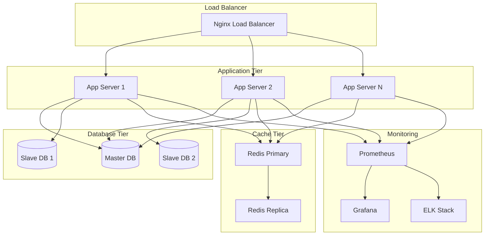

# 통합 CMS 배포 및 운영 가이드

## 1. 배포 아키텍처 개요

### 1.1 배포 전략

#### 🎯 배포 목표

- **무중단 배포**: Blue-Green 배포를 통한 서비스 연속성 보장
- **자동화**: CI/CD 파이프라인을 통한 자동 빌드/테스트/배포
- **확장성**: 컨테이너 기반 배포로 유연한 스케일링
- **모니터링**: 실시간 성능 및 상태 모니터링

#### 🏗️ 인프라 구성



### 1.2 환경 구성

#### 🌍 환경별 특성

| 환경            | 목적                | 특징                                  |
| --------------- | ------------------- | ------------------------------------- |
| **Development** | 개발 및 초기 테스트 | 단일 서버, 빠른 배포, 디버깅 도구     |
| **Staging**     | 통합 테스트 및 검증 | 프로덕션과 동일한 구성, 테스트 데이터 |
| **Production**  | 실제 서비스 운영    | 고가용성, 보안 강화, 모니터링         |

---

## 2. CI/CD 파이프라인

### 2.1 GitHub Actions 워크플로우

#### 🔄 메인 배포 파이프라인

```yaml
# .github/workflows/deploy.yml
name: Unified CMS Deploy Pipeline

on:
  push:
    branches: [main, develop, release/*]
  pull_request:
    branches: [main, develop]

env:
  REGISTRY: ghcr.io
  IMAGE_NAME: unified-cms

jobs:
  test:
    name: Run Tests
    runs-on: ubuntu-latest
    strategy:
      matrix:
        node-version: [18, 20]
        java-version: [17, 21]

    steps:
      - name: Checkout code
        uses: actions/checkout@v4

      - name: Setup Node.js ${{ matrix.node-version }}
        uses: actions/setup-node@v4
        with:
          node-version: ${{ matrix.node-version }}
          cache: "npm"
          cache-dependency-path: client/package-lock.json

      - name: Setup Java ${{ matrix.java-version }}
        uses: actions/setup-java@v4
        with:
          java-version: ${{ matrix.java-version }}
          distribution: "temurin"
          cache: "maven"

      - name: Install frontend dependencies
        run: |
          cd client
          npm ci

      - name: Run frontend tests
        run: |
          cd client
          npm run test:ci
          npm run test:e2e

      - name: Run backend tests
        run: |
          cd server
          mvn clean test

      - name: Generate test coverage
        run: |
          cd client && npm run coverage
          cd ../server && mvn jacoco:report

      - name: Upload coverage to Codecov
        uses: codecov/codecov-action@v3
        with:
          token: ${{ secrets.CODECOV_TOKEN }}

  security-scan:
    name: Security Scan
    runs-on: ubuntu-latest
    steps:
      - uses: actions/checkout@v4

      - name: Run Trivy vulnerability scanner
        uses: aquasecurity/trivy-action@master
        with:
          scan-type: "fs"
          scan-ref: "."
          format: "sarif"
          output: "trivy-results.sarif"

      - name: Upload Trivy scan results
        uses: github/codeql-action/upload-sarif@v2
        with:
          sarif_file: "trivy-results.sarif"

  build:
    name: Build and Push Images
    runs-on: ubuntu-latest
    needs: [test, security-scan]
    if: github.event_name == 'push'

    permissions:
      contents: read
      packages: write

    steps:
      - name: Checkout code
        uses: actions/checkout@v4

      - name: Set up Docker Buildx
        uses: docker/setup-buildx-action@v3

      - name: Log in to Container Registry
        uses: docker/login-action@v3
        with:
          registry: ${{ env.REGISTRY }}
          username: ${{ github.actor }}
          password: ${{ secrets.GITHUB_TOKEN }}

      - name: Extract metadata
        id: meta
        uses: docker/metadata-action@v5
        with:
          images: ${{ env.REGISTRY }}/${{ env.IMAGE_NAME }}
          tags: |
            type=ref,event=branch
            type=ref,event=pr
            type=sha,prefix={{branch}}-
            type=raw,value=latest,enable={{is_default_branch}}

      - name: Build and push frontend image
        uses: docker/build-push-action@v5
        with:
          context: ./client
          file: ./client/Dockerfile
          push: true
          tags: ${{ env.REGISTRY }}/${{ env.IMAGE_NAME }}-frontend:${{ steps.meta.outputs.tags }}
          labels: ${{ steps.meta.outputs.labels }}
          cache-from: type=gha
          cache-to: type=gha,mode=max

      - name: Build and push backend image
        uses: docker/build-push-action@v5
        with:
          context: ./server
          file: ./server/Dockerfile
          push: true
          tags: ${{ env.REGISTRY }}/${{ env.IMAGE_NAME }}-backend:${{ steps.meta.outputs.tags }}
          labels: ${{ steps.meta.outputs.labels }}
          cache-from: type=gha
          cache-to: type=gha,mode=max

  deploy-staging:
    name: Deploy to Staging
    runs-on: ubuntu-latest
    needs: build
    if: github.ref == 'refs/heads/develop'
    environment: staging

    steps:
      - name: Deploy to staging
        uses: azure/k8s-deploy@v1
        with:
          manifests: |
            k8s/staging/namespace.yaml
            k8s/staging/configmap.yaml
            k8s/staging/secret.yaml
            k8s/staging/deployment.yaml
            k8s/staging/service.yaml
            k8s/staging/ingress.yaml
          images: |
            ${{ env.REGISTRY }}/${{ env.IMAGE_NAME }}-frontend:develop
            ${{ env.REGISTRY }}/${{ env.IMAGE_NAME }}-backend:develop

      - name: Run smoke tests
        run: |
          ./scripts/smoke-tests.sh staging

      - name: Notify Slack
        uses: 8398a7/action-slack@v3
        with:
          status: ${{ job.status }}
          channel: "#deployments"
          webhook_url: ${{ secrets.SLACK_WEBHOOK }}

  deploy-production:
    name: Deploy to Production
    runs-on: ubuntu-latest
    needs: [build, deploy-staging]
    if: github.ref == 'refs/heads/main'
    environment: production

    steps:
      - name: Blue-Green Deployment
        uses: azure/k8s-deploy@v1
        with:
          strategy: blue-green
          traffic-split-method: pod
          percentage: 20
          manifests: |
            k8s/production/namespace.yaml
            k8s/production/configmap.yaml
            k8s/production/secret.yaml
            k8s/production/deployment.yaml
            k8s/production/service.yaml
            k8s/production/ingress.yaml
          images: |
            ${{ env.REGISTRY }}/${{ env.IMAGE_NAME }}-frontend:latest
            ${{ env.REGISTRY }}/${{ env.IMAGE_NAME }}-backend:latest

      - name: Health check
        run: |
          ./scripts/health-check.sh production

      - name: Complete deployment
        if: success()
        uses: azure/k8s-deploy@v1
        with:
          strategy: blue-green
          traffic-split-method: pod
          percentage: 100
          action: promote
```

### 2.2 Docker 설정

#### 🐳 Frontend Dockerfile

```dockerfile
# client/Dockerfile
# Multi-stage build for optimized production image
FROM node:18-alpine AS dependencies

WORKDIR /app
COPY package*.json ./
RUN npm ci --only=production && npm cache clean --force

FROM node:18-alpine AS builder

WORKDIR /app
COPY package*.json ./
RUN npm ci

COPY . .
RUN npm run build

FROM node:18-alpine AS runtime

# 보안을 위한 non-root 사용자 생성
RUN addgroup --system --gid 1001 nodejs
RUN adduser --system --uid 1001 nextjs

WORKDIR /app

# 필요한 파일만 복사
COPY --from=dependencies /app/node_modules ./node_modules
COPY --from=builder /app/.next/standalone ./
COPY --from=builder /app/.next/static ./.next/static
COPY --from=builder --chown=nextjs:nodejs /app/public ./public

USER nextjs

EXPOSE 3000

ENV PORT=3000
ENV NODE_ENV=production

# Health check 추가
HEALTHCHECK --interval=30s --timeout=3s --start-period=5s --retries=3 \
    CMD curl -f http://localhost:3000/api/health || exit 1

CMD ["node", "server.js"]
```

#### ☕ Backend Dockerfile

```dockerfile
# server/Dockerfile
FROM maven:3.9-openjdk-17-slim AS builder

WORKDIR /app
COPY pom.xml .
COPY src ./src

# Maven 의존성 캐싱을 위한 최적화
RUN mvn dependency:go-offline -B

RUN mvn clean package -DskipTests

FROM openjdk:17-jre-slim

# 보안을 위한 non-root 사용자 생성
RUN groupadd -r spring && useradd -r -g spring spring

WORKDIR /app

# APM 에이전트 설치
ADD https://github.com/elastic/apm-agent-java/releases/download/v1.x.x/elastic-apm-agent-1.x.x.jar elastic-apm-agent.jar

COPY --from=builder /app/target/*.jar app.jar
COPY --chown=spring:spring scripts/entrypoint.sh .

RUN chmod +x entrypoint.sh

USER spring

EXPOSE 8080

# Health check 추가
HEALTHCHECK --interval=30s --timeout=3s --start-period=40s --retries=3 \
    CMD curl -f http://localhost:8080/actuator/health || exit 1

ENTRYPOINT ["./entrypoint.sh"]
```

### 2.3 Kubernetes 배포 설정

#### ⚙️ Production Deployment

```yaml
# k8s/production/deployment.yaml
apiVersion: apps/v1
kind: Deployment
metadata:
  name: unified-cms-backend
  namespace: unified-cms-prod
  labels:
    app: unified-cms-backend
    version: "1.0"
spec:
  replicas: 3
  strategy:
    type: RollingUpdate
    rollingUpdate:
      maxSurge: 1
      maxUnavailable: 1
  selector:
    matchLabels:
      app: unified-cms-backend
  template:
    metadata:
      labels:
        app: unified-cms-backend
        version: "1.0"
    spec:
      serviceAccountName: unified-cms-sa
      securityContext:
        runAsNonRoot: true
        runAsUser: 1001
        fsGroup: 2000
      containers:
        - name: backend
          image: ghcr.io/unified-cms-backend:latest
          ports:
            - containerPort: 8080
              name: http
          env:
            - name: SPRING_PROFILES_ACTIVE
              value: "production"
            - name: DB_HOST
              valueFrom:
                secretKeyRef:
                  name: database-secret
                  key: host
            - name: DB_PASSWORD
              valueFrom:
                secretKeyRef:
                  name: database-secret
                  key: password
            - name: REDIS_HOST
              valueFrom:
                configMapKeyRef:
                  name: redis-config
                  key: host
          resources:
            requests:
              memory: "512Mi"
              cpu: "250m"
            limits:
              memory: "1Gi"
              cpu: "500m"
          livenessProbe:
            httpGet:
              path: /actuator/health/liveness
              port: 8080
            initialDelaySeconds: 40
            periodSeconds: 30
            timeoutSeconds: 5
            failureThreshold: 3
          readinessProbe:
            httpGet:
              path: /actuator/health/readiness
              port: 8080
            initialDelaySeconds: 20
            periodSeconds: 10
            timeoutSeconds: 5
            failureThreshold: 3
          volumeMounts:
            - name: config-volume
              mountPath: /app/config
              readOnly: true
            - name: logs-volume
              mountPath: /app/logs
      volumes:
        - name: config-volume
          configMap:
            name: app-config
        - name: logs-volume
          emptyDir: {}
---
apiVersion: v1
kind: Service
metadata:
  name: unified-cms-backend-service
  namespace: unified-cms-prod
spec:
  selector:
    app: unified-cms-backend
  ports:
    - port: 80
      targetPort: 8080
      name: http
  type: ClusterIP
```

#### 🔧 ConfigMap 및 Secret

```yaml
# k8s/production/configmap.yaml
apiVersion: v1
kind: ConfigMap
metadata:
  name: app-config
  namespace: unified-cms-prod
data:
  application.yml: |
    spring:
      application:
        name: unified-cms
      redis:
        host: ${REDIS_HOST}
        port: 6379
        timeout: 2000ms
        lettuce:
          pool:
            max-active: 8
            max-idle: 8
            min-idle: 0

    logging:
      level:
        com.unified.cms: INFO
        org.springframework.security: WARN
      pattern:
        console: "%d{yyyy-MM-dd HH:mm:ss} [%thread] %-5level %logger{36} - %msg%n"
        file: "%d{yyyy-MM-dd HH:mm:ss} [%thread] %-5level %logger{36} - %msg%n"

    management:
      endpoints:
        web:
          exposure:
            include: health,info,metrics,prometheus
      endpoint:
        health:
          show-details: when-authorized
      health:
        livenessstate:
          enabled: true
        readinessstate:
          enabled: true

---
apiVersion: v1
kind: Secret
metadata:
  name: database-secret
  namespace: unified-cms-prod
type: Opaque
data:
  host: <base64-encoded-db-host>
  username: <base64-encoded-username>
  password: <base64-encoded-password>
  unified-db-password: <base64-encoded-unified-db-password>
```

---

## 3. 환경별 설정 관리

### 3.1 환경 변수 관리

#### 📋 환경별 설정 파일

```yaml
# config/environments/development.yml
environment: development
debug: true

database:
  master:
    host: localhost
    port: 3306
    name: unified_cms_dev
    username: dev_user
    password: dev_password
    hikari:
      maximum-pool-size: 5
      connection-timeout: 20000

redis:
  host: localhost
  port: 6379
  database: 0
  timeout: 2000

logging:
  level: DEBUG
  path: ./logs/dev
  pattern: "%d{yyyy-MM-dd HH:mm:ss} [%thread] %-5level %logger{36} - %msg%n"

monitoring:
  enabled: false

security:
  jwt:
    secret: dev-secret-key-not-for-production
    expiration: 86400 # 24 hours

# config/environments/production.yml
environment: production
debug: false

database:
  master:
    host: ${DB_HOST}
    port: ${DB_PORT:3306}
    name: ${DB_NAME}
    username: ${DB_USERNAME}
    password: ${DB_PASSWORD}
    hikari:
      maximum-pool-size: 20
      connection-timeout: 30000
      idle-timeout: 600000
      max-lifetime: 1800000

redis:
  host: ${REDIS_HOST}
  port: ${REDIS_PORT:6379}
  database: ${REDIS_DB:0}
  timeout: 5000
  password: ${REDIS_PASSWORD}
  cluster:
    nodes: ${REDIS_CLUSTER_NODES}

logging:
  level: INFO
  path: /var/log/unified-cms
  pattern: "%d{yyyy-MM-dd HH:mm:ss} [%thread] %-5level %logger{36} - %msg%n"
  file:
    max-size: 100MB
    max-history: 30
    total-size-cap: 3GB

monitoring:
  enabled: true
  endpoint: ${MONITORING_ENDPOINT}
  metrics:
    export:
      prometheus:
        enabled: true
        step: 60s

security:
  jwt:
    secret: ${JWT_SECRET}
    expiration: ${JWT_EXPIRATION:3600} # 1 hour
  cors:
    allowed-origins: ${CORS_ALLOWED_ORIGINS}
    allowed-methods: GET,POST,PUT,DELETE,OPTIONS
    allowed-headers: "*"
    allow-credentials: true
```

### 3.2 설정 주입 전략

#### 🔧 Spring Boot Configuration

```java
// server/src/main/java/com/unified/cms/config/EnvironmentConfig.java
@Configuration
@ConfigurationProperties(prefix = "app")
@Data
public class EnvironmentConfig {

    private String environment;
    private boolean debug;

    private Database database = new Database();
    private Redis redis = new Redis();
    private Logging logging = new Logging();
    private Monitoring monitoring = new Monitoring();
    private Security security = new Security();

    @Data
    public static class Database {
        private Master master = new Master();

        @Data
        public static class Master {
            private String host;
            private int port = 3306;
            private String name;
            private String username;
            private String password;
            private Hikari hikari = new Hikari();

            @Data
            public static class Hikari {
                private int maximumPoolSize = 10;
                private long connectionTimeout = 30000;
                private long idleTimeout = 600000;
                private long maxLifetime = 1800000;
            }
        }
    }

    @Data
    public static class Redis {
        private String host;
        private int port = 6379;
        private int database = 0;
        private long timeout = 2000;
        private String password;
        private Cluster cluster = new Cluster();

        @Data
        public static class Cluster {
            private List<String> nodes = new ArrayList<>();
        }
    }

    @Data
    public static class Security {
        private Jwt jwt = new Jwt();
        private Cors cors = new Cors();

        @Data
        public static class Jwt {
            private String secret;
            private long expiration = 3600;
        }

        @Data
        public static class Cors {
            private List<String> allowedOrigins = new ArrayList<>();
            private List<String> allowedMethods = List.of("GET", "POST", "PUT", "DELETE");
            private List<String> allowedHeaders = List.of("*");
            private boolean allowCredentials = true;
        }
    }
}
```

#### 🔐 환경별 보안 설정

```java
// server/src/main/java/com/unified/cms/config/SecurityConfiguration.java
@Configuration
@EnableWebSecurity
@RequiredArgsConstructor
public class SecurityConfiguration {

    private final EnvironmentConfig envConfig;

    @Bean
    @Profile("development")
    public SecurityFilterChain developmentSecurityChain(HttpSecurity http) throws Exception {
        return http
            .csrf(csrf -> csrf.disable())
            .cors(cors -> cors.configurationSource(corsConfigurationSource()))
            .sessionManagement(session ->
                session.sessionCreationPolicy(SessionCreationPolicy.STATELESS))
            .authorizeHttpRequests(auth -> auth
                .requestMatchers("/api/unified/auth/**").permitAll()
                .requestMatchers("/actuator/**").permitAll()
                .requestMatchers("/swagger-ui/**", "/v3/api-docs/**").permitAll()
                .anyRequest().authenticated())
            .oauth2ResourceServer(oauth2 -> oauth2.jwt(withDefaults()))
            .build();
    }

    @Bean
    @Profile("production")
    public SecurityFilterChain productionSecurityChain(HttpSecurity http) throws Exception {
        return http
            .csrf(csrf -> csrf.disable())
            .cors(cors -> cors.configurationSource(corsConfigurationSource()))
            .sessionManagement(session ->
                session.sessionCreationPolicy(SessionCreationPolicy.STATELESS))
            .headers(headers -> headers
                .frameOptions().deny()
                .contentTypeOptions(withDefaults())
                .httpStrictTransportSecurity(hstsConfig -> hstsConfig
                    .maxAgeInSeconds(31536000)
                    .includeSubdomains(true)
                    .preload(true)))
            .authorizeHttpRequests(auth -> auth
                .requestMatchers("/api/unified/auth/login").permitAll()
                .requestMatchers("/actuator/health", "/actuator/info").permitAll()
                .anyRequest().authenticated())
            .oauth2ResourceServer(oauth2 -> oauth2.jwt(withDefaults()))
            .build();
    }

    @Bean
    public CorsConfigurationSource corsConfigurationSource() {
        CorsConfiguration configuration = new CorsConfiguration();
        configuration.setAllowedOrigins(envConfig.getSecurity().getCors().getAllowedOrigins());
        configuration.setAllowedMethods(envConfig.getSecurity().getCors().getAllowedMethods());
        configuration.setAllowedHeaders(envConfig.getSecurity().getCors().getAllowedHeaders());
        configuration.setAllowCredentials(envConfig.getSecurity().getCors().isAllowCredentials());

        UrlBasedCorsConfigurationSource source = new UrlBasedCorsConfigurationSource();
        source.registerCorsConfiguration("/**", configuration);
        return source;
    }
}
```

---

## 4. 모니터링 및 로깅

### 4.1 Application Performance Monitoring (APM)

#### 📊 Prometheus 설정

```yaml
# monitoring/prometheus/prometheus.yml
global:
  scrape_interval: 15s
  evaluation_interval: 15s

rule_files:
  - "alert_rules.yml"

alerting:
  alertmanagers:
    - static_configs:
        - targets:
            - "alertmanager:9093"

scrape_configs:
  - job_name: "unified-cms-backend"
    static_configs:
      - targets: ["unified-cms-backend:8080"]
    metrics_path: "/actuator/prometheus"
    scrape_interval: 30s

  - job_name: "unified-cms-frontend"
    static_configs:
      - targets: ["unified-cms-frontend:3000"]
    metrics_path: "/api/metrics"
    scrape_interval: 30s

  - job_name: "redis"
    static_configs:
      - targets: ["redis:6379"]

  - job_name: "mysql"
    static_configs:
      - targets: ["mysql-exporter:9104"]

  - job_name: "nginx"
    static_configs:
      - targets: ["nginx-exporter:9113"]

  - job_name: "node-exporter"
    static_configs:
      - targets: ["node-exporter:9100"]
```

#### 🚨 Alert Rules

```yaml
# monitoring/prometheus/alert_rules.yml
groups:
  - name: unified-cms-alerts
    rules:
      # 시스템 리소스 알림
      - alert: HighCPUUsage
        expr: 100 - (avg by(instance) (irate(node_cpu_seconds_total{mode="idle"}[5m])) * 100) > 80
        for: 5m
        labels:
          severity: warning
        annotations:
          summary: "High CPU usage detected"
          description: "CPU usage is above 80% for more than 5 minutes"

      - alert: HighMemoryUsage
        expr: (node_memory_MemTotal_bytes - node_memory_MemAvailable_bytes) / node_memory_MemTotal_bytes * 100 > 90
        for: 5m
        labels:
          severity: critical
        annotations:
          summary: "High memory usage detected"
          description: "Memory usage is above 90% for more than 5 minutes"

      # 애플리케이션 알림
      - alert: HighErrorRate
        expr: rate(http_requests_total{status=~"5.."}[5m]) / rate(http_requests_total[5m]) * 100 > 5
        for: 2m
        labels:
          severity: critical
        annotations:
          summary: "High error rate detected"
          description: "Error rate is above 5% for more than 2 minutes"

      - alert: SlowResponseTime
        expr: histogram_quantile(0.95, rate(http_request_duration_seconds_bucket[5m])) > 1
        for: 5m
        labels:
          severity: warning
        annotations:
          summary: "Slow response time detected"
          description: "95th percentile response time is above 1 second"

      # 데이터베이스 알림
      - alert: DatabaseConnectionHigh
        expr: mysql_global_status_threads_connected / mysql_global_variables_max_connections * 100 > 80
        for: 5m
        labels:
          severity: warning
        annotations:
          summary: "High database connection usage"
          description: "Database connection usage is above 80%"

      # 동기화 알림
      - alert: ContentSyncFailure
        expr: increase(content_sync_failures_total[5m]) > 10
        for: 1m
        labels:
          severity: critical
        annotations:
          summary: "High content sync failure rate"
          description: "More than 10 content sync failures in 5 minutes"
```

### 4.2 Grafana 대시보드

#### 📈 시스템 개요 대시보드

```json
{
  "dashboard": {
    "id": null,
    "title": "Unified CMS - System Overview",
    "tags": ["unified-cms", "overview"],
    "timezone": "browser",
    "panels": [
      {
        "id": 1,
        "title": "System Health",
        "type": "stat",
        "targets": [
          {
            "expr": "up{job=\"unified-cms-backend\"}",
            "legendFormat": "Backend Status"
          },
          {
            "expr": "up{job=\"unified-cms-frontend\"}",
            "legendFormat": "Frontend Status"
          }
        ],
        "fieldConfig": {
          "defaults": {
            "color": {
              "mode": "thresholds"
            },
            "thresholds": {
              "steps": [
                {
                  "color": "red",
                  "value": 0
                },
                {
                  "color": "green",
                  "value": 1
                }
              ]
            }
          }
        }
      },
      {
        "id": 2,
        "title": "Request Rate",
        "type": "graph",
        "targets": [
          {
            "expr": "rate(http_requests_total[5m])",
            "legendFormat": "{{instance}} - {{method}} {{status}}"
          }
        ]
      },
      {
        "id": 3,
        "title": "Response Time (95th percentile)",
        "type": "graph",
        "targets": [
          {
            "expr": "histogram_quantile(0.95, rate(http_request_duration_seconds_bucket[5m]))",
            "legendFormat": "95th percentile"
          }
        ]
      },
      {
        "id": 4,
        "title": "Error Rate",
        "type": "graph",
        "targets": [
          {
            "expr": "rate(http_requests_total{status=~\"5..\"}[5m]) / rate(http_requests_total[5m]) * 100",
            "legendFormat": "Error Rate %"
          }
        ]
      },
      {
        "id": 5,
        "title": "Database Connections",
        "type": "graph",
        "targets": [
          {
            "expr": "mysql_global_status_threads_connected",
            "legendFormat": "Active Connections"
          },
          {
            "expr": "mysql_global_variables_max_connections",
            "legendFormat": "Max Connections"
          }
        ]
      },
      {
        "id": 6,
        "title": "Redis Memory Usage",
        "type": "graph",
        "targets": [
          {
            "expr": "redis_memory_used_bytes",
            "legendFormat": "Used Memory"
          },
          {
            "expr": "redis_memory_max_bytes",
            "legendFormat": "Max Memory"
          }
        ]
      }
    ],
    "time": {
      "from": "now-1h",
      "to": "now"
    },
    "refresh": "30s"
  }
}
```

### 4.3 구조화된 로깅

#### 📝 Logback 설정

```xml
<!-- server/src/main/resources/logback-spring.xml -->
<?xml version="1.0" encoding="UTF-8"?>
<configuration>
    <springProfile name="!production">
        <appender name="CONSOLE" class="ch.qos.logback.core.ConsoleAppender">
            <encoder class="net.logstash.logback.encoder.LoggingEventCompositeJsonEncoder">
                <providers>
                    <timestamp/>
                    <logLevel/>
                    <loggerName/>
                    <message/>
                    <mdc/>
                    <arguments/>
                    <stackTrace/>
                </providers>
            </encoder>
        </appender>

        <root level="INFO">
            <appender-ref ref="CONSOLE"/>
        </root>
    </springProfile>

    <springProfile name="production">
        <appender name="FILE" class="ch.qos.logback.core.rolling.RollingFileAppender">
            <file>/var/log/unified-cms/application.log</file>
            <rollingPolicy class="ch.qos.logback.core.rolling.SizeAndTimeBasedRollingPolicy">
                <fileNamePattern>/var/log/unified-cms/application.%d{yyyy-MM-dd}.%i.log</fileNamePattern>
                <maxFileSize>100MB</maxFileSize>
                <maxHistory>30</maxHistory>
                <totalSizeCap>3GB</totalSizeCap>
            </rollingPolicy>
            <encoder class="net.logstash.logback.encoder.LoggingEventCompositeJsonEncoder">
                <providers>
                    <timestamp/>
                    <logLevel/>
                    <loggerName/>
                    <message/>
                    <mdc/>
                    <arguments/>
                    <stackTrace/>
                </providers>
            </encoder>
        </appender>

        <appender name="ASYNC_FILE" class="ch.qos.logback.classic.AsyncAppender">
            <appender-ref ref="FILE"/>
            <queueSize>512</queueSize>
            <discardingThreshold>0</discardingThreshold>
        </appender>

        <root level="INFO">
            <appender-ref ref="ASYNC_FILE"/>
        </root>
    </springProfile>

    <!-- 특정 패키지별 로그 레벨 설정 -->
    <logger name="com.unified.cms.security" level="WARN"/>
    <logger name="com.unified.cms.service" level="INFO"/>
    <logger name="com.unified.cms.controller" level="INFO"/>
    <logger name="org.springframework.security" level="WARN"/>
    <logger name="org.hibernate.SQL" level="DEBUG"/>
    <logger name="org.hibernate.type.descriptor.sql.BasicBinder" level="TRACE"/>
</configuration>
```

#### 🔍 구조화된 로그 포맷

```java
// server/src/main/java/com/unified/cms/logging/StructuredLogger.java
@Component
@Slf4j
public class StructuredLogger {

    private static final String REQUEST_ID_KEY = "requestId";
    private static final String USER_ID_KEY = "userId";
    private static final String SERVICE_ID_KEY = "serviceId";
    private static final String ACTION_KEY = "action";

    public void logApiRequest(String method, String path, String userId, String requestId) {
        MDC.put(REQUEST_ID_KEY, requestId);
        MDC.put(USER_ID_KEY, userId);
        MDC.put(ACTION_KEY, "API_REQUEST");

        log.info("API Request - {} {}", method, path);
    }

    public void logApiResponse(String method, String path, int status, long duration) {
        MDC.put(ACTION_KEY, "API_RESPONSE");

        log.info("API Response - {} {} - Status: {} Duration: {}ms",
                method, path, status, duration);

        MDC.clear();
    }

    public void logServiceAccess(String serviceCode, String action, String userId) {
        MDC.put(SERVICE_ID_KEY, serviceCode);
        MDC.put(USER_ID_KEY, userId);
        MDC.put(ACTION_KEY, "SERVICE_ACCESS");

        log.info("Service Access - Service: {} Action: {}", serviceCode, action);
    }

    public void logPermissionCheck(String userId, String permission, boolean granted) {
        MDC.put(USER_ID_KEY, userId);
        MDC.put(ACTION_KEY, "PERMISSION_CHECK");

        log.info("Permission Check - Permission: {} Granted: {}", permission, granted);
    }

    public void logContentSync(String serviceCode, String contentType, String status, String error) {
        MDC.put(SERVICE_ID_KEY, serviceCode);
        MDC.put(ACTION_KEY, "CONTENT_SYNC");

        if (error != null) {
            log.error("Content Sync Failed - Service: {} Type: {} Error: {}",
                     serviceCode, contentType, error);
        } else {
            log.info("Content Sync - Service: {} Type: {} Status: {}",
                    serviceCode, contentType, status);
        }
    }
}
```

---

## 5. 보안 및 백업

### 5.1 보안 설정

#### 🔐 SSL/TLS 설정

```nginx
# nginx/ssl.conf
server {
    listen 443 ssl http2;
    server_name unified-cms.example.com;

    # SSL 인증서 설정
    ssl_certificate /etc/ssl/certs/unified-cms.crt;
    ssl_certificate_key /etc/ssl/private/unified-cms.key;

    # SSL 보안 설정
    ssl_protocols TLSv1.2 TLSv1.3;
    ssl_ciphers ECDHE-RSA-AES256-GCM-SHA512:DHE-RSA-AES256-GCM-SHA512:ECDHE-RSA-AES256-GCM-SHA384:DHE-RSA-AES256-GCM-SHA384;
    ssl_prefer_server_ciphers off;
    ssl_session_cache shared:SSL:10m;
    ssl_session_timeout 10m;

    # HSTS 설정
    add_header Strict-Transport-Security "max-age=31536000; includeSubdomains; preload" always;

    # 보안 헤더
    add_header X-Frame-Options "SAMEORIGIN" always;
    add_header X-Content-Type-Options "nosniff" always;
    add_header X-XSS-Protection "1; mode=block" always;
    add_header Referrer-Policy "strict-origin-when-cross-origin" always;

    # CSP 헤더
    add_header Content-Security-Policy "
        default-src 'self';
        script-src 'self' 'unsafe-inline' 'unsafe-eval' https://cdn.example.com;
        style-src 'self' 'unsafe-inline' https://fonts.googleapis.com;
        font-src 'self' https://fonts.gstatic.com;
        img-src 'self' data: https:;
        connect-src 'self' https://api.unified-cms.com;
    " always;

    location / {
        proxy_pass http://unified-cms-frontend;
        proxy_set_header Host $host;
        proxy_set_header X-Real-IP $remote_addr;
        proxy_set_header X-Forwarded-For $proxy_add_x_forwarded_for;
        proxy_set_header X-Forwarded-Proto $scheme;
    }

    location /api/ {
        proxy_pass http://unified-cms-backend;
        proxy_set_header Host $host;
        proxy_set_header X-Real-IP $remote_addr;
        proxy_set_header X-Forwarded-For $proxy_add_x_forwarded_for;
        proxy_set_header X-Forwarded-Proto $scheme;

        # Rate limiting
        limit_req zone=api burst=20 nodelay;
    }
}

# HTTP to HTTPS 리다이렉트
server {
    listen 80;
    server_name unified-cms.example.com;
    return 301 https://$server_name$request_uri;
}
```

### 5.2 백업 및 복구 전략

#### 💾 데이터베이스 백업

```bash
#!/bin/bash
# scripts/backup-database.sh

set -euo pipefail

# 설정
DB_HOST="${DB_HOST:-localhost}"
DB_PORT="${DB_PORT:-3306}"
DB_USER="${DB_USER:-backup_user}"
DB_PASSWORD="${DB_PASSWORD}"
BACKUP_DIR="${BACKUP_DIR:-/var/backups/unified-cms}"
RETENTION_DAYS="${RETENTION_DAYS:-30}"
S3_BUCKET="${S3_BUCKET:-unified-cms-backups}"

# 백업 디렉토리 생성
mkdir -p "$BACKUP_DIR"

# 백업 파일명 생성
TIMESTAMP=$(date +"%Y%m%d_%H%M%S")
BACKUP_FILE="unified_cms_backup_${TIMESTAMP}.sql.gz"
BACKUP_PATH="$BACKUP_DIR/$BACKUP_FILE"

# 로그 함수
log() {
    echo "[$(date +'%Y-%m-%d %H:%M:%S')] $1"
}

# 데이터베이스 백업 실행
log "Starting database backup..."
mysqldump \
    --host="$DB_HOST" \
    --port="$DB_PORT" \
    --user="$DB_USER" \
    --password="$DB_PASSWORD" \
    --single-transaction \
    --routines \
    --triggers \
    --all-databases \
    --add-drop-database \
    --comments \
    --hex-blob \
    --tz-utc \
    | gzip > "$BACKUP_PATH"

if [ $? -eq 0 ]; then
    log "Database backup completed: $BACKUP_PATH"

    # 백업 파일 크기 확인
    BACKUP_SIZE=$(du -h "$BACKUP_PATH" | cut -f1)
    log "Backup size: $BACKUP_SIZE"

    # S3에 업로드
    if command -v aws &> /dev/null; then
        log "Uploading backup to S3..."
        aws s3 cp "$BACKUP_PATH" "s3://$S3_BUCKET/database/"

        if [ $? -eq 0 ]; then
            log "S3 upload completed"
        else
            log "S3 upload failed"
        fi
    fi

    # 오래된 백업 파일 정리
    log "Cleaning up old backups..."
    find "$BACKUP_DIR" -name "unified_cms_backup_*.sql.gz" -mtime +$RETENTION_DAYS -delete

    # S3에서도 오래된 백업 정리
    if command -v aws &> /dev/null; then
        aws s3 ls "s3://$S3_BUCKET/database/" | while read -r line; do
            createDate=$(echo "$line" | awk '{print $1" "$2}')
            createDate=$(date -d "$createDate" +%s)
            olderThan=$(date -d "$RETENTION_DAYS days ago" +%s)

            if [[ $createDate -lt $olderThan ]]; then
                fileName=$(echo "$line" | awk '{print $4}')
                aws s3 rm "s3://$S3_BUCKET/database/$fileName"
                log "Removed old backup from S3: $fileName"
            fi
        done
    fi

    log "Backup process completed successfully"
else
    log "Database backup failed"
    exit 1
fi
```

#### 🔄 백업 복구 스크립트

```bash
#!/bin/bash
# scripts/restore-database.sh

set -euo pipefail

# 설정
DB_HOST="${DB_HOST:-localhost}"
DB_PORT="${DB_PORT:-3306}"
DB_USER="${DB_USER:-root}"
DB_PASSWORD="${DB_PASSWORD}"
BACKUP_FILE="$1"

# 로그 함수
log() {
    echo "[$(date +'%Y-%m-%d %H:%M:%S')] $1"
}

# 백업 파일 확인
if [ -z "$BACKUP_FILE" ]; then
    log "Usage: $0 <backup_file>"
    exit 1
fi

if [ ! -f "$BACKUP_FILE" ]; then
    log "Backup file not found: $BACKUP_FILE"
    exit 1
fi

# 확인 메시지
log "WARNING: This will restore the database from backup file: $BACKUP_FILE"
log "This operation will overwrite existing data. Are you sure? (y/N)"
read -r CONFIRM

if [ "$CONFIRM" != "y" ] && [ "$CONFIRM" != "Y" ]; then
    log "Restore cancelled"
    exit 0
fi

# 데이터베이스 복구 실행
log "Starting database restore..."

if [[ "$BACKUP_FILE" == *.gz ]]; then
    zcat "$BACKUP_FILE" | mysql \
        --host="$DB_HOST" \
        --port="$DB_PORT" \
        --user="$DB_USER" \
        --password="$DB_PASSWORD"
else
    mysql \
        --host="$DB_HOST" \
        --port="$DB_PORT" \
        --user="$DB_USER" \
        --password="$DB_PASSWORD" \
        < "$BACKUP_FILE"
fi

if [ $? -eq 0 ]; then
    log "Database restore completed successfully"
else
    log "Database restore failed"
    exit 1
fi
```

---

## 6. 성능 최적화

### 6.1 애플리케이션 튜닝

#### ⚡ JVM 튜닝

```bash
# scripts/jvm-tuning.sh
#!/bin/bash

# JVM 메모리 설정
JAVA_OPTS="-Xms2g -Xmx4g"

# 가비지 컬렉터 설정 (G1GC)
JAVA_OPTS="$JAVA_OPTS -XX:+UseG1GC"
JAVA_OPTS="$JAVA_OPTS -XX:G1HeapRegionSize=16m"
JAVA_OPTS="$JAVA_OPTS -XX:G1ReservePercent=25"
JAVA_OPTS="$JAVA_OPTS -XX:G1NewSizePercent=10"
JAVA_OPTS="$JAVA_OPTS -XX:G1MaxNewSizePercent=25"
JAVA_OPTS="$JAVA_OPTS -XX:MaxGCPauseMillis=200"
JAVA_OPTS="$JAVA_OPTS -XX:G1HeapWastePercent=10"

# GC 로깅
JAVA_OPTS="$JAVA_OPTS -Xlog:gc*:gc.log:time,tags"
JAVA_OPTS="$JAVA_OPTS -XX:+UseStringDeduplication"

# 성능 모니터링
JAVA_OPTS="$JAVA_OPTS -XX:+FlightRecorder"
JAVA_OPTS="$JAVA_OPTS -XX:StartFlightRecording=duration=120s,filename=flight-recording.jfr"

# 메모리 덤프 설정
JAVA_OPTS="$JAVA_OPTS -XX:+HeapDumpOnOutOfMemoryError"
JAVA_OPTS="$JAVA_OPTS -XX:HeapDumpPath=/var/log/unified-cms/"

# APM 에이전트 설정
JAVA_OPTS="$JAVA_OPTS -javaagent:/app/elastic-apm-agent.jar"
JAVA_OPTS="$JAVA_OPTS -Delastic.apm.service_name=unified-cms"
JAVA_OPTS="$JAVA_OPTS -Delastic.apm.environment=production"
JAVA_OPTS="$JAVA_OPTS -Delastic.apm.server_urls=http://apm-server:8200"

export JAVA_OPTS
```

### 6.2 데이터베이스 최적화

#### 🗄️ MySQL 최적화 설정

```ini
# config/mysql/my.cnf
[mysqld]
# 기본 설정
character-set-server = utf8mb4
collation-server = utf8mb4_unicode_ci
default-time-zone = '+09:00'

# 성능 설정
innodb_buffer_pool_size = 4G
innodb_buffer_pool_instances = 4
innodb_log_file_size = 1G
innodb_log_buffer_size = 256M
innodb_flush_log_at_trx_commit = 1
innodb_flush_method = O_DIRECT

# 연결 설정
max_connections = 500
max_connect_errors = 1000
connect_timeout = 10
wait_timeout = 28800
interactive_timeout = 28800

# 쿼리 캐시 설정
query_cache_type = 1
query_cache_size = 512M
query_cache_limit = 2M

# 정렬 및 그룹화 최적화
sort_buffer_size = 4M
read_buffer_size = 2M
read_rnd_buffer_size = 8M
join_buffer_size = 4M

# 임시 테이블 설정
tmp_table_size = 256M
max_heap_table_size = 256M

# 느린 쿼리 로그
slow_query_log = 1
slow_query_log_file = /var/log/mysql/slow.log
long_query_time = 2
log_queries_not_using_indexes = 1

# 바이너리 로그
log-bin = mysql-bin
binlog_format = ROW
expire_logs_days = 7
max_binlog_size = 100M

# 보안 설정
sql_mode = STRICT_TRANS_TABLES,ERROR_FOR_DIVISION_BY_ZERO,NO_AUTO_CREATE_USER,NO_ENGINE_SUBSTITUTION
```

### 6.3 Redis 최적화

#### 🔴 Redis 설정

```bash
# config/redis/redis.conf
# 메모리 설정
maxmemory 2gb
maxmemory-policy allkeys-lru

# 지속성 설정
save 900 1
save 300 10
save 60 10000

# AOF 설정
appendonly yes
appendfsync everysec
no-appendfsync-on-rewrite no
auto-aof-rewrite-percentage 100
auto-aof-rewrite-min-size 64mb

# 네트워크 설정
tcp-keepalive 300
timeout 0

# 클라이언트 설정
tcp-backlog 511
maxclients 10000

# 로깅
loglevel notice
logfile /var/log/redis/redis-server.log

# 보안 설정
requirepass ${REDIS_PASSWORD}
rename-command FLUSHDB ""
rename-command FLUSHALL ""
rename-command DEBUG ""
```

---

## 7. 장애 대응 가이드

### 7.1 장애 대응 절차

#### 🚨 장애 대응 플레이북

````markdown
## 장애 대응 절차

### 1단계: 장애 인지 및 초기 대응 (0-5분)

1. **장애 알림 확인**

   - Slack/이메일 알림 확인
   - Grafana 대시보드 확인
   - 서비스 상태 페이지 확인

2. **장애 범위 파악**

   - 영향받는 서비스 식별
   - 사용자 영향도 평가
   - 장애 심각도 결정

3. **커뮤니케이션**
   - 장애 대응팀 소집
   - 상황실 채널 개설
   - 이해관계자 알림

### 2단계: 장애 원인 분석 (5-15분)

1. **로그 분석**

   ```bash
   # 최근 에러 로그 확인
   tail -n 1000 /var/log/unified-cms/application.log | grep ERROR

   # 특정 시간대 로그 확인
   grep "2024-01-15 14:0" /var/log/unified-cms/application.log
   ```
````

2. **시스템 리소스 확인**

   ```bash
   # CPU 사용률 확인
   top -p $(pgrep java)

   # 메모리 사용률 확인
   free -h

   # 디스크 사용률 확인
   df -h
   ```

3. **데이터베이스 상태 확인**

   ```sql
   -- 실행 중인 쿼리 확인
   SHOW PROCESSLIST;

   -- 느린 쿼리 확인
   SELECT * FROM mysql.slow_log ORDER BY start_time DESC LIMIT 10;

   -- 연결 수 확인
   SHOW STATUS LIKE 'Threads_connected';
   ```

### 3단계: 임시 복구 조치 (15-30분)

1. **서비스 재시작**

   ```bash
   # 애플리케이션 재시작
   kubectl rollout restart deployment/unified-cms-backend

   # 데이터베이스 재시작
   systemctl restart mysql

   # 캐시 재시작
   systemctl restart redis
   ```

2. **트래픽 제어**

   ```bash
   # Rate limiting 강화
   nginx -s reload

   # 특정 IP 차단
   iptables -A INPUT -s 192.168.1.100 -j DROP
   ```

### 4단계: 근본 원인 해결 (30분-2시간)

1. **코드 수정 및 배포**
2. **설정 변경**
3. **인프라 확장**

### 5단계: 사후 검토 (장애 해결 후)

1. **장애 보고서 작성**
2. **재발 방지 대책 수립**
3. **모니터링 개선**

````

### 7.2 자동 복구 시스템

#### 🔄 Self-Healing 스크립트

```bash
#!/bin/bash
# scripts/auto-recovery.sh

set -euo pipefail

# 설정
HEALTH_CHECK_URL="http://localhost:8080/actuator/health"
MAX_FAILURES=3
CHECK_INTERVAL=30
RESTART_COOLDOWN=300

# 상태 파일
STATE_FILE="/tmp/unified-cms-health-state"
LAST_RESTART_FILE="/tmp/unified-cms-last-restart"

# 로그 함수
log() {
    echo "[$(date +'%Y-%m-%d %H:%M:%S')] $1" | tee -a /var/log/unified-cms/auto-recovery.log
}

# 헬스 체크 함수
check_health() {
    local response
    response=$(curl -s -o /dev/null -w "%{http_code}" "$HEALTH_CHECK_URL" || echo "000")

    if [ "$response" = "200" ]; then
        return 0
    else
        return 1
    fi
}

# 서비스 재시작 함수
restart_service() {
    local now
    now=$(date +%s)

    # 마지막 재시작으로부터 충분한 시간이 지났는지 확인
    if [ -f "$LAST_RESTART_FILE" ]; then
        local last_restart
        last_restart=$(cat "$LAST_RESTART_FILE")
        local time_diff=$((now - last_restart))

        if [ $time_diff -lt $RESTART_COOLDOWN ]; then
            log "Restart cooldown period not elapsed. Skipping restart."
            return 1
        fi
    fi

    log "Attempting to restart the service..."

    # Kubernetes 환경에서의 재시작
    if command -v kubectl &> /dev/null; then
        kubectl rollout restart deployment/unified-cms-backend
    # Systemd 환경에서의 재시작
    elif command -v systemctl &> /dev/null; then
        systemctl restart unified-cms
    # Docker 환경에서의 재시작
    elif command -v docker &> /dev/null; then
        docker restart unified-cms-backend
    else
        log "No suitable restart method found"
        return 1
    fi

    # 재시작 시간 기록
    echo "$now" > "$LAST_RESTART_FILE"

    # 재시작 후 대기
    sleep 60

    # 재시작 후 헬스 체크
    if check_health; then
        log "Service restart successful"
        echo "0" > "$STATE_FILE"
        return 0
    else
        log "Service restart failed"
        return 1
    fi
}

# 알림 전송 함수
send_alert() {
    local message="$1"
    local severity="${2:-warning}"

    # Slack 알림
    if [ -n "${SLACK_WEBHOOK_URL:-}" ]; then
        curl -X POST -H 'Content-type: application/json' \
            --data "{\"text\":\"[$severity] Unified CMS Auto-Recovery: $message\"}" \
            "$SLACK_WEBHOOK_URL"
    fi

    # 이메일 알림
    if command -v mail &> /dev/null && [ -n "${ALERT_EMAIL:-}" ]; then
        echo "$message" | mail -s "[$severity] Unified CMS Auto-Recovery Alert" "$ALERT_EMAIL"
    fi

    log "Alert sent: $message"
}

# 메인 루프
main() {
    log "Starting auto-recovery monitoring..."

    local failure_count=0

    while true; do
        if check_health; then
            # 서비스가 정상이면 실패 카운트 리셋
            if [ $failure_count -gt 0 ]; then
                log "Service recovered. Resetting failure count."
                failure_count=0
                echo "0" > "$STATE_FILE"
            fi
        else
            # 서비스가 비정상이면 실패 카운트 증가
            failure_count=$((failure_count + 1))
            echo "$failure_count" > "$STATE_FILE"

            log "Health check failed. Failure count: $failure_count"

            if [ $failure_count -ge $MAX_FAILURES ]; then
                log "Maximum failures reached. Attempting recovery..."
                send_alert "Service health check failed $failure_count times. Attempting restart." "critical"

                if restart_service; then
                    send_alert "Service restart completed successfully." "info"
                    failure_count=0
                else
                    send_alert "Service restart failed. Manual intervention required." "critical"
                fi
            fi
        fi

        sleep $CHECK_INTERVAL
    done
}

# 스크립트 실행
main "$@"
````

---

## 8. 관련 문서

### 📚 연관 가이드

- **[시스템 개요](./unified-cms-system-overview.md)** - 전체 시스템 아키텍처
- **[API 설계 가이드](./unified-cms-api-guide.md)** - REST API 명세 및 인증
- **[프론트엔드 가이드](./unified-cms-frontend-guide.md)** - UI/UX 및 성능 최적화
- **[데이터베이스 스키마](./unified-cms-database-schema.md)** - 데이터 구조 설계
- **[마이그레이션 가이드](./unified-cms-migration-guide.md)** - 기존 코드 전환

### 🔗 운영 도구

- **[모니터링 및 로깅 가이드](./monitoring-logging-guide.md)** - 상세 모니터링 설정
- **[테스팅 및 성능 가이드](./testing-performance-guide.md)** - 테스트 전략
- **[구현 가이드](./implementation-guide.md)** - 단계별 구현 방법

### 🌐 외부 참조

- [Kubernetes Documentation](https://kubernetes.io/docs/)
- [Docker Best Practices](https://docs.docker.com/develop/best-practices/)
- [Prometheus Monitoring](https://prometheus.io/docs/)
- [Grafana Documentation](https://grafana.com/docs/)

---

이 배포 및 운영 가이드를 통해 안정적이고 확장 가능한 통합 CMS 환경을 구축하고 운영할 수 있습니다. 자동화된 CI/CD, 포괄적인 모니터링, 효과적인 장애 대응을 통해 고품질의 서비스를 제공할 수 있습니다.
